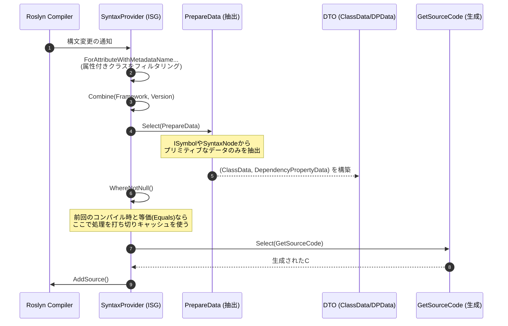

# 02. パイプラインとアーキテクチャ (Pipeline & Architecture)

## Ⅰ. インクリメンタル・パイプライン構造

Roslyn Incremental Source Generator (ISG) は、入力である構文ツリーから最終的なソースコード出力までを、LINQのようなパイプラインで処理します。本プロジェクトでは `H.Generators.Extensions` のヘルパーを利用してパイプラインを簡潔に定義しています。

### パイプライン・フロー (Mermaid シーケンス図)

### パイプラインの各フェーズ

1. **構文のフィルタリング (`ForAttributeWithMetadataName`)**
   - Roslyn 4.3.0+ の機能。指定した属性 (`DependencyPropertyAttribute` など) が付与されているクラス・レコードの構文のみを抽出します。
2. **データの抽出 (`PrepareData`)**
   - 抽出された `AttributeData` や `INamedTypeSymbol` から、生成に必要なすべてのメタデータ（型名、デフォルト値、フラグ類）を抽出します。
   - `PrepareData.cs` クラスが集約して担当しています。
3. **等価性評価とキャッシュ**
   - RoslynのISG基盤は、`Select` の出力が前回と同一（`Equals` が `true`）である場合、後続のパイプライン処理をスキップ（キャッシュ利用）します。
4. **ソースコードの生成 (`GetSourceCode`)**
   - キャッシュミスがあった場合のみ呼び出され、DTOをもとに最終的な `.g.cs` コード文字列を生成します。

---

## Ⅱ. モデルの等価性（キャッシュ）戦略

インクリメンタルジェネレーターにおいて**最も重要なパフォーマンス指標はキャッシュヒット率**です。
本プロジェクトでは、ジェネレーター内のデータモデル (`DependencyPropertyData`, `ClassData`, `EventData`) において以下の設計を徹底しています。

### `readonly record struct` による値の比較
すべてのモデルは `readonly record struct` として定義されています。これにより、C#のコンパイラがすべてのプロパティに対する `Equals()` メソッドと `GetHashCode()` を自動生成し、プロパティの「値」に基づく等価性比較が行われます。

### コレクションの等価性担保 (`EquatableArray<T>`)
Roslynパイプラインにおいて、標準の配列 `T[]` や `ImmutableArray<T>` は「参照」で比較されてしまうため、中身が同じでも `Equals` が `false` になりキャッシュが無効化されてしまいます。

これを防ぐため、コレクションデータ（`Methods` や `BindEvents`）は必ず `EquatableArray<T>` でラップしています。
- **実装箇所**: `Methods: methods.ToImmutableArray().AsEquatableArray()`
- **効果**: 配列の要素同士を深く比較 (SequenceEqual) し、要素が同じであれば等価とみなすことで、余計なコード再生成を抑制しています。
