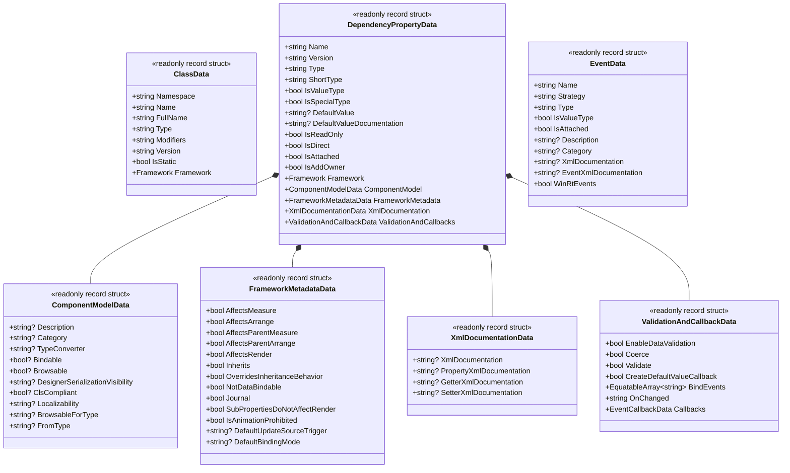

# 01. Foundation & Domain

[English](./01_foundation_and_domain.md) | [日本語](../ja/01_foundation_and_domain.md) | [Index (Intro)](./intro.md)

## I. Purpose & Philosophy

The primary objective of **DependencyPropertyGenerator** (`Kassyi.Generators.DependencyProperty`) is to **automate the declaration of boilerplate-heavy Dependency Properties, Routed Events, and Weak Events** across multiple .NET UI frameworks including WPF, UWP, WinUI, Uno, Avalonia, and MAUI.

### Modular Architecture
- **`Kassyi.Generators.DependencyProperty`**: The core Roslyn Incremental Source Generator. Extracts metadata during compilation and generates C# source code tailored for each UI framework.
- **`Kassyi.Generators.DependencyProperty.Attributes`**: Provides compile-time declaration attributes (`[DependencyProperty]`, `[AttachedDependencyProperty]`, `[RoutedEvent]`, `[WeakEvent]`, etc.) consumed by user code.
- **`Kassyi.Generators.Extensions`**: Core zero-allocation infrastructure library providing foundational utilities (`SourceWriter`, `EquatableArray<T>`, `HashCode`, etc.) shared across generators.

### Technical Constraints & Guidelines
- **Roslyn Incremental Source Generator**: Targets `.NET Standard 2.0` and must execute at ultra-low allocation rates with maximum incremental caching efficiency during live IDE typing.
- **Cross-Framework Abstraction**: Hides the API disparities across various UI frameworks (managed via the `Framework` enum) and generates framework-specific implementations from a single unified attribute (`[DependencyProperty]`).
- **`partial` Classes and Methods**: Generated code is appended as `partial` class definitions and provides hooks like `partial void On...Changed(...)` methods.

---

## II. Ubiquitous Language (Glossary)

Common terminology unified across the entire generator codebase.

| Name (Japanese) | Name (Code / English) | Description |
|---|---|---|
| UIフレームワーク | `Framework` | Enumeration identifying target platforms (WPF, Uno, MAUI, Avalonia, WinUI, etc.) |
| 依存関係プロパティ | `DependencyProperty` | Property system enabling data binding, styles, and animation in UI controls |
| 添付プロパティ | `AttachedDependencyProperty` | Property mechanism allowing child elements to set values on parent/other elements |
| クラスデータ | `ClassData` | Metadata representing the declaring target class/owner (type name, namespace, modifiers, etc.) |
| プロパティデータ | `DependencyPropertyData` | Root DTO consolidating all metadata for a generated dependency property |
| コンポーネントモデルデータ | `ComponentModelData` | UI/designer metadata such as `[Description]`, `[Category]`, `[TypeConverter]` |
| フレームワークメタデータ | `FrameworkMetadataData` | Framework property metadata options (e.g., `AffectsMeasure`, `AffectsRender`) |
| バリデーション＆コールバック | `ValidationAndCallbackData` | Validation, coercion, and change notification callback settings (`OnChanged`) |
| イベントデータ | `EventData` | Metadata for routed events (`RoutedEvent`) and weak events (`WeakEvent`) |

---

## III. Domain & Data Models

Pure Data Transfer Objects (DTOs) extracted from Roslyn `SyntaxNode` and `ISymbol` that traverse the incremental pipeline. **To maximize caching efficiency, all models are defined as `readonly record struct` with deep `IEquatable<T>` equality comparison.**

### Core Domain Model (Mermaid Class Diagram)

### Data Model Design Principles
- **Structured Decomposition**: Breaks down large metadata models into cohesive sub-models (component model, framework metadata, XML docs, validation & callbacks) for clear responsibility separation and maintainability.
- **Early Primitive Projection**: Storing Roslyn `INamedTypeSymbol` or `IPropertySymbol` in DTOs prevents GC of previous compilation states and invalidates generator caching. Metadata is strictly projected into primitive types (`string`, `bool`), enums, or `EquatableArray<T>`.
- **Structural Collection Equality**: Collections (e.g., `BindEvents`) use `EquatableArray<T>` instead of raw arrays or `List<T>` to guarantee value-based sequence equality.
