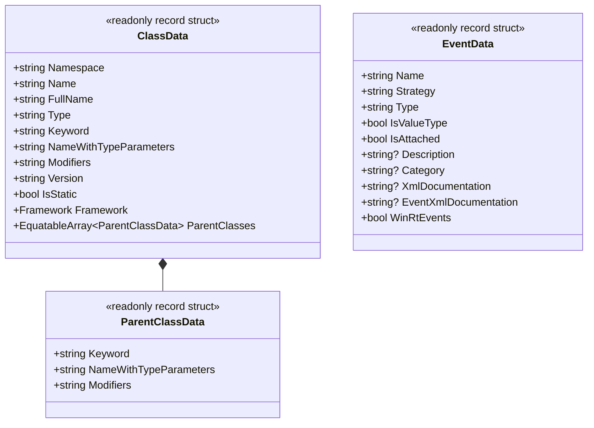
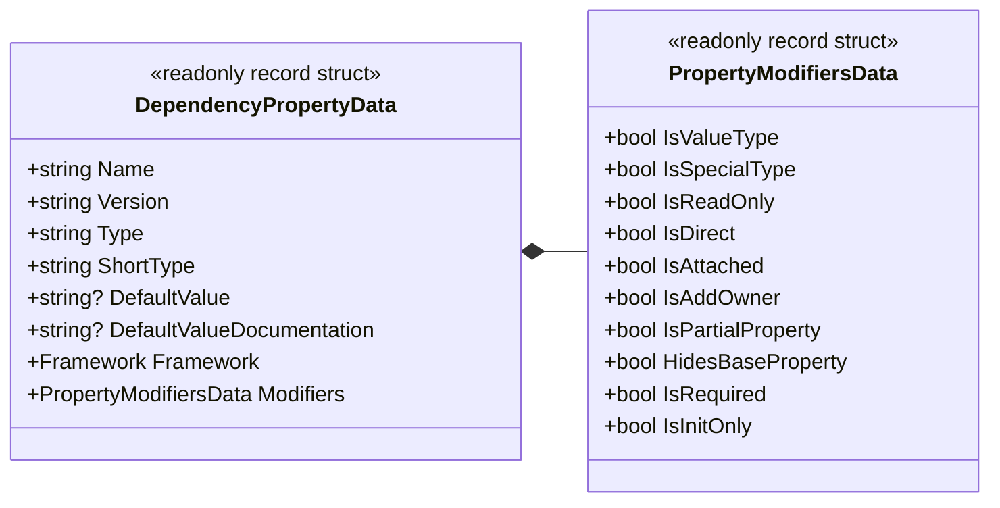
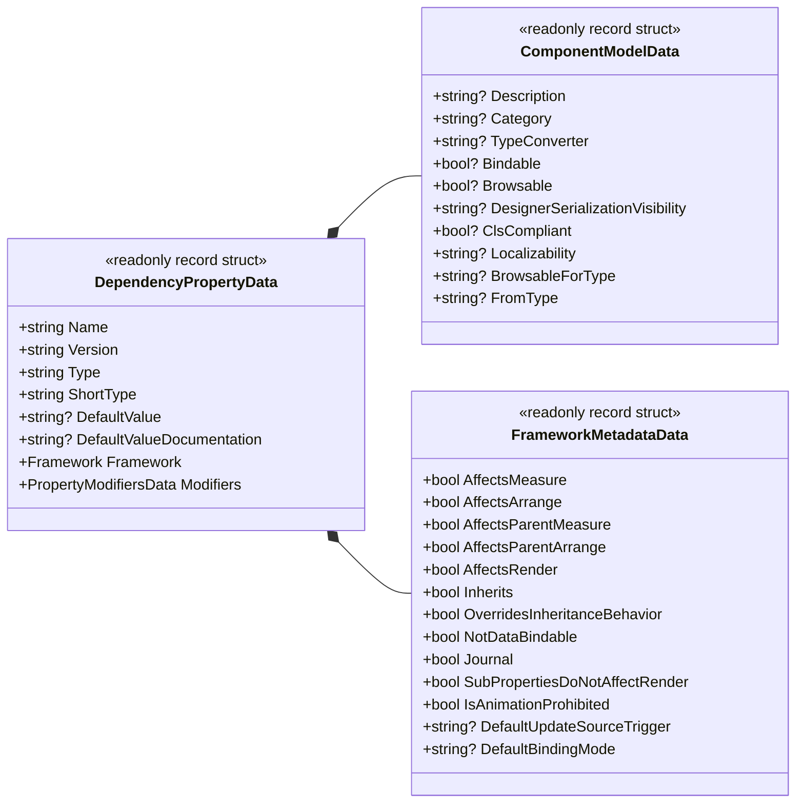
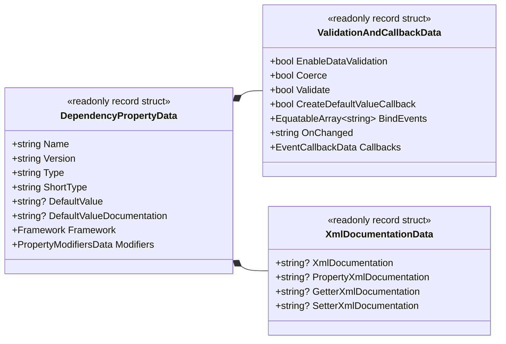

# 01. Foundation and Domain

[English](./01_foundation_and_domain.md) | [日本語](../ja/01_foundation_and_domain.md) | [Index (Intro)](./intro.md)

## I. Purpose and Architecture

The primary architectural objective of **DependencyPropertyGenerator** (`Kassyi.Generators.DependencyProperty`) is to autonomously synthesize boilerplate declaration code for DependencyProperties, RoutedEvents, and WeakEvents across multiple .NET UI frameworks. Supported platforms include WPF, UWP, WinUI, Uno, Avalonia, and MAUI.

### Module Topology

- **`Kassyi.Generators.DependencyProperty`**: The core Roslyn Incremental Source Generator. This module extracts metadata at compile time and emits framework-specific C# source code.
- **`Kassyi.Generators.DependencyProperty.Attributes`**: Supplies the declarative attributes (e.g., `[DependencyProperty]`, `[AttachedDependencyProperty]`, `[RoutedEvent]`) utilized by developers.
- **`Kassyi.Generators.Extensions`**: The core utility library providing a zero-allocation foundation. It exposes primitives such as `SourceWriter` and `EquatableArray<T>` shared across source generators.

### Technical Constraints and Policies

- **Incremental Evaluation:** The Roslyn Incremental Source Generator targets `.NET Standard 2.0`. It mandates high-speed execution and ultra-low memory allocation during incremental IDE evaluations.
- **Framework Abstraction:** The generator internally abstracts API discrepancies among UI frameworks. It synthesizes platform-compliant code derived from a single unified attribute (`[DependencyProperty]`).
- **Partial Class Composition:** The architecture dictates that generated code is appended via `partial` class modifiers. It exposes `partial void On...Changed(...)` methods exclusively for event hooking.

### Supported C# Language Versions and Runtime Requirements

| Category | Version | Description & Supported Features |
| :--- | :--- | :--- |
| **Generator Host Runtime** | **.NET Standard 2.0** | Executes within the Roslyn 4.3.0+ (.NET SDK 6.0 to 9.0+) compiler pipeline. |
| **Minimum Requirement (Base)** | **C# 8.0+** | Non-generic attribute declarations (`typeof(T)` argument), nullable reference types, standard property output. |
| **Expression Expansion** | **C# 9.0+** | Automatic expansion of Target-Typed new expressions via `DefaultValueExpression = "new(...)"`. |
| **Generic Attributes (Recommended)** | **C# 11.0+** | Generic attribute syntax such as `[DependencyProperty<T>]` and `[RoutedEvent<T>]`. |
| **Latest Syntax Support** | **C# 13.0 (Preview)** | Full support for `partial` property syntax (`public partial int Value { get; set; }`). |

---

## II. Ubiquitous Language Glossary

The following terminology strictly governs the generator's internal codebase.

| Term (English)        | Term (Code)                  | Description                                                                                  |
| --------------------- | ---------------------------- | -------------------------------------------------------------------------------------------- |
| UI Framework          | `Framework`                  | Enum identifying the target platform (e.g., WPF, Uno, MAUI, Avalonia, WinUI).                |
| Dependency Property   | `DependencyProperty`         | Extended property mechanism for UI controls to retain state and support data binding.        |
| Attached Property     | `AttachedDependencyProperty` | Property mechanism allowing child elements to set values on parent elements.                 |
| Class Data            | `ClassData`                  | Metadata of the target class (owner) decorated with the attribute.                           |
| Property Data         | `DependencyPropertyData`     | The root data model encapsulating complete metadata for the property to be generated.        |
| Component Model Data  | `ComponentModelData`         | UI/designer metadata such as `[Description]`, `[Category]`, and `[TypeConverter]`.           |
| Framework Metadata    | `FrameworkMetadataData`      | Settings for `FrameworkPropertyMetadataOptions` (e.g., `AffectsMeasure`) in WPF and others.  |
| Validation & Callback | `ValidationAndCallbackData`  | Configuration for behavior such as validation, coercion, and change callbacks (`OnChanged`). |
| Event Data            | `EventData`                  | Metadata for `RoutedEvent` and `WeakEvent`.                                                  |

---

## III. Domain Data Models

These pure data models (DTOs) are extracted from Roslyn's `SyntaxNode` and `ISymbol` structures to flow through the incremental pipeline.

> [!IMPORTANT]
> To maximize cache efficiency, all DTOs must be strictly defined as `readonly record struct`. They must support strict equality comparison via `IEquatable<T>`.

### Data Structure Design Guidelines

- **Structural Separation by Responsibility:** `DependencyPropertyData` encapsulates numerous properties. It is segmented into sub-models including component models, UI metadata, XML documentation, validation/callbacks, and property modifier flags (`PropertyModifiersData`). This segmentation enforces maintainability.
- **Early Primitive Projection:** Retaining Roslyn's `INamedTypeSymbol` or `IPropertySymbol` instances directly causes memory leaks and invalidates the generator cache. These instances must be projected into primitive types (e.g., `string`, `bool`) or `EquatableArray<T>` during the extraction phase.
- **Collection Equality:** Collection data (e.g., `BindEvents`, `ParentClasses`) must utilize `EquatableArray<T>`. This custom implementation guarantees structural equality, unlike standard arrays or `List<T>`.

### Main Data Models (DTOs)

#### 1. Class and Event Structure Models (`ClassData` / `EventData`)

#### 2. Core Dependency Property Structure (`DependencyPropertyData`)

#### 3. Framework Metadata & UI Component Models

#### 4. Validation, Callbacks, and XML Documentation

---

## IV. Agentic DTO Mapping Specification

This section documents the explicit mapping between C# attributes and their corresponding Data Transfer Object properties.

> [!TIP]
> Autonomous agents and AI assistants must utilize this specification as a structural ground truth when executing bug fixes or feature additions.

### `[DependencyProperty]` Attribute Mapping

Attributes defined within user code are parsed by `DependencyPropertyDataBuilder.cs` and `PrepareData.cs`. The extracted data is stored in the corresponding DTO fields.

#### 1. Root Properties (DependencyPropertyData & PropertyModifiersData)

| Attribute Argument / Property | DTO Target Field                      | Type      | Description                                                                  |
| ----------------------------- | ------------------------------------- | --------- | ---------------------------------------------------------------------------- |
| Type Argument `<T>`           | `DependencyPropertyData.Type`         | `string`  | The property type (fully qualified).                                         |
| 1st Argument (Constructor)    | `DependencyPropertyData.Name`         | `string`  | The name of the dependency property (e.g., `"Text"`).                        |
| `DefaultValue`                | `DependencyPropertyData.DefaultValue` | `string?` | The default value such as string literals.                                   |
| `DefaultValueExpression`      | `DependencyPropertyData.DefaultValue` | `string?` | The default value as a C# expression like `new()`.                           |
| `IsReadOnly`                  | `Modifiers.IsReadOnly`                | `bool`    | Generates a read-only property using `DependencyPropertyKey` if `true`.      |
| `IsDirect`                    | `Modifiers.IsDirect`                  | `bool`    | Avalonia-specific. Indicates if it should be generated as a direct property. |
| (Partial property modifier)   | `Modifiers.IsPartialProperty`         | `bool`    | Target of C# 13 partial property syntax.                                     |
| (`new` modifier)              | `Modifiers.HidesBaseProperty`         | `bool`    | Explicitly hides an inherited member (`new` keyword).                        |

#### 2. Mapping to ValidationAndCallbackData

| Attribute Argument / Property | DTO Target Field                    | Type                     | Description                                                         |
| ----------------------------- | ----------------------------------- | ------------------------ | ------------------------------------------------------------------- |
| `OnChanged`                   | `ValidationAndCallbacks.OnChanged`  | `string`                 | Custom change callback method name.                                 |
| `Coerce`                      | `ValidationAndCallbacks.Coerce`     | `bool`                   | Indicates whether to generate value coercion (CoerceValueCallback). |
| `Validate`                    | `ValidationAndCallbacks.Validate`   | `bool`                   | Indicates whether to generate validation (ValidateValueCallback).   |
| `BindEvents`                  | `ValidationAndCallbacks.BindEvents` | `EquatableArray<string>` | List of control events to wire up.                                  |

#### 3. Mapping to ComponentModelData

| Attribute Argument / Property | DTO Target Field               | Type      | Description                                        |
| ----------------------------- | ------------------------------ | --------- | -------------------------------------------------- |
| `Description`                 | `ComponentModel.Description`   | `string?` | Generated as the `[Description("...")]` attribute. |
| `Category`                    | `ComponentModel.Category`      | `string?` | Generated as the `[Category("...")]` attribute.    |
| `TypeConverter`               | `ComponentModel.TypeConverter` | `string?` | Converter type name in the `typeof(...)` format.   |

#### 4. Mapping to FrameworkMetadataData (For WPF)

| Attribute Argument / Property | DTO Target Field                       | Type      | Description                                |
| ----------------------------- | -------------------------------------- | --------- | ------------------------------------------ |
| `AffectsMeasure`              | `FrameworkMetadata.AffectsMeasure`     | `bool`    | Requests a layout update (Measure pass).   |
| `AffectsRender`               | `FrameworkMetadata.AffectsRender`      | `bool`    | Requests a redraw (Render pass).           |
| `BindsTwoWayByDefault`        | `FrameworkMetadata.DefaultBindingMode` | `string?` | The default binding mode (e.g., `TwoWay`). |

### Mapping to `ClassData` and `ParentClassData`

Information defining the parent class context is extracted into the `ClassData` and `ParentClasses` records.

| Target                     | DTO Target Field                   | Type                              | Description                                                    |
| -------------------------- | ---------------------------------- | --------------------------------- | -------------------------------------------------------------- |
| Enclosing Namespace        | `ClassData.Namespace`              | `string`                          | The outer `namespace` declaration.                             |
| Class Name                 | `ClassData.Name`                   | `string`                          | The name of the `partial class` or `partial record`.           |
| Type Keyword               | `ClassData.Keyword`                | `string`                          | Declaration keyword such as `class`, `struct`, `record class`. |
| Type Parameters            | `ClassData.NameWithTypeParameters` | `string`                          | Generic type signature like `MyControl<T>`.                    |
| Class Modifiers            | `ClassData.Modifiers`              | `string`                          | Modifiers such as `public`, `internal`, `sealed`.              |
| `[AvaloniaObject]` etc.    | `ClassData.Framework`              | `Framework`                       | The type of framework used (`WPF`, `Avalonia`, etc.).          |
| Enclosing Parent Hierarchy | `ClassData.ParentClasses`          | `EquatableArray<ParentClassData>` | Outer nesting parent classes list with keywords and modifiers. |
