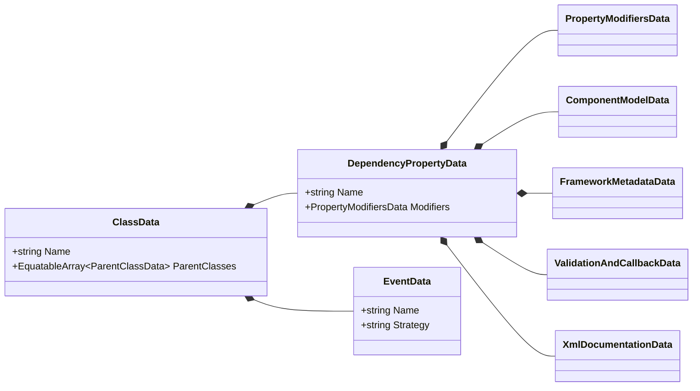
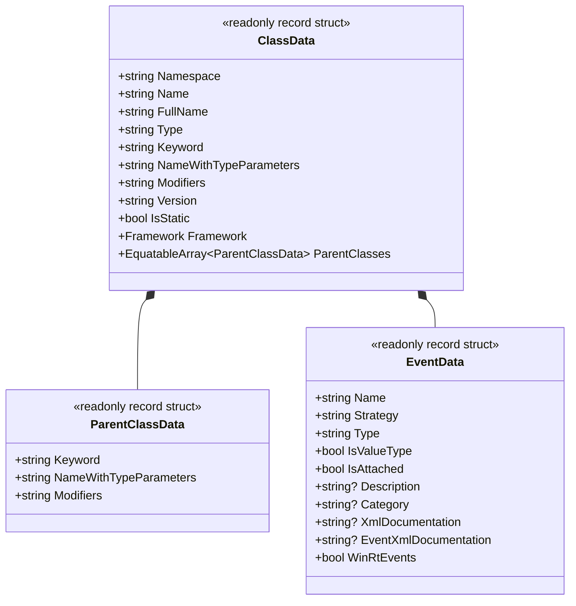
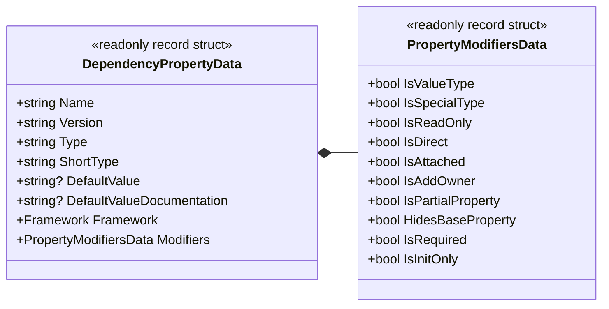
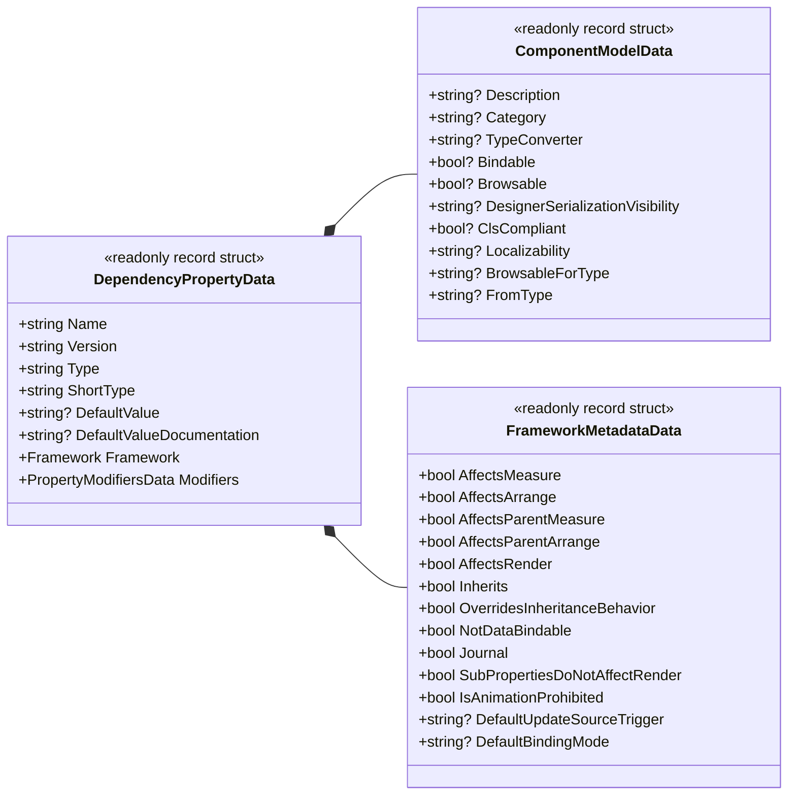
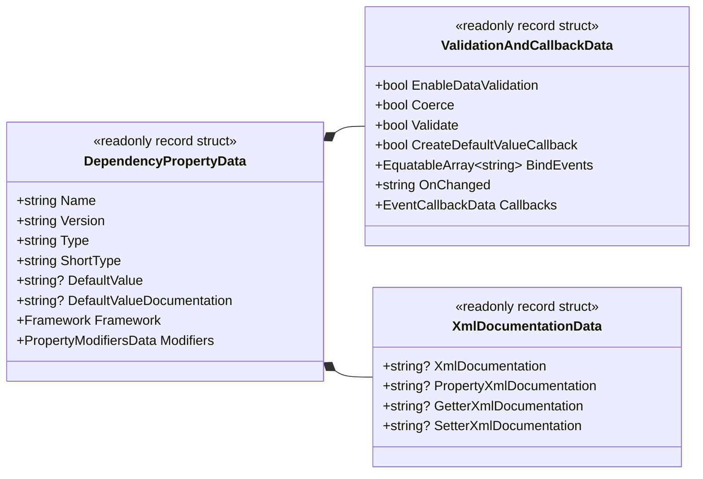

# 02. Foundation and domain architecture

## I. Purpose and architecture

**DependencyPropertyGenerator** (`Kassyi.Generators.DependencyProperty`) automatically generates boilerplate code for DependencyProperties, RoutedEvents, and WeakEvents across multiple .NET UI frameworks. Supported platforms include WPF, UWP, WinUI, Uno, Avalonia, and MAUI.

### Module topology

- **`Kassyi.Generators.DependencyProperty`**: The core Roslyn Incremental Source Generator. It extracts metadata at compile time and emits framework-specific C# source code.
- **`Kassyi.Generators.DependencyProperty.Attributes`**: Provides declarative attributes (for example, `[DependencyProperty]`, `[AttachedDependencyProperty]`, `[RoutedEvent]`) for developers.
- **`Kassyi.Generators.Extensions`**: The core utility library providing a zero-allocation foundation. It exposes primitives like `SourceWriter` and `EquatableArray<T>` shared across source generators.

### Technical constraints and policies

- **Incremental evaluation**: Targeting `.NET Standard 2.0`, the generator ensures high-speed execution and ultra-low memory allocation during incremental IDE evaluations.
- **Framework abstraction**: The generator internally abstracts API differences among UI frameworks, synthesizing platform-compliant code from a single unified attribute (`[DependencyProperty]`).
- **Partial class composition**: The generator appends code using `partial` classes. It provides `partial void On...Changed(...)` methods exclusively for event hooking.

### Supported C# language versions and runtime requirements

| Category                             | Version               | Description and supported features                                                                             |
| :----------------------------------- | :-------------------- | :------------------------------------------------------------------------------------------------------------- |
| **Generator host runtime**           | **.NET Standard 2.0** | Executes within the Roslyn 4.3.0+ (.NET SDK 6.0 to 9.0+) compiler pipeline.                                    |
| **Minimum requirement (base)**       | **C# 8.0+**           | Non-generic attribute declarations (`typeof(T)` argument), nullable reference types, standard property output. |
| **Expression expansion**             | **C# 9.0+**           | Automatic expansion of target-typed new expressions via `DefaultValueExpression = "new(...)"`.                 |
| **Generic attributes (recommended)** | **C# 11.0+**          | Generic attribute syntax such as `[DependencyProperty<T>]` and `[RoutedEvent<T>]`.                             |
| **Latest syntax support**            | **C# 13.0 (preview)** | Full support for `partial` property syntax (`public partial int Value { get; set; }`).                         |

---

## II. Ubiquitous language glossary

The following terminology governs the generator's internal codebase.

| Term (English)          | Term (Code)                  | Description                                                                                        |
| :---------------------- | :--------------------------- | :------------------------------------------------------------------------------------------------- |
| UI Framework            | `Framework`                  | Enum identifying the target platform (for example, WPF, Uno, MAUI, Avalonia, WinUI).               |
| Dependency Property     | `DependencyProperty`         | Extended property mechanism for UI controls to retain state and support data binding.              |
| Attached Property       | `AttachedDependencyProperty` | Property mechanism allowing child elements to set values on parent elements.                       |
| Class Data              | `ClassData`                  | Metadata of the target class (owner) decorated with the attribute.                                 |
| Property Data           | `DependencyPropertyData`     | The root data model containing complete metadata for the property to be generated.                 |
| Component Model Data    | `ComponentModelData`         | UI and designer metadata such as `[Description]`, `[Category]`, and `[TypeConverter]`.             |
| Framework Metadata      | `FrameworkMetadataData`      | Settings for `FrameworkPropertyMetadataOptions` (for example, `AffectsMeasure`) in WPF and others. |
| Validation and callback | `ValidationAndCallbackData`  | Configuration for behavior such as validation, coercion, and change callbacks (`OnChanged`).       |
| Event Data              | `EventData`                  | Metadata for `RoutedEvent` and `WeakEvent`.                                                        |

---

## III. Domain data models

The incremental pipeline uses pure data models (DTOs) extracted from Roslyn's `SyntaxNode` and `ISymbol` structures.

> [!IMPORTANT]
> To maximize cache efficiency, define all DTOs as `readonly record struct` and implement value-based equality comparison via `IEquatable<T>`.

### Data structure design guidelines

- **Separation of concerns**: `DependencyPropertyData` contains many properties. To maintain modularity, divide it into sub-models such as component models, UI metadata, XML documentation, validation and callbacks, and property modifiers (`PropertyModifiersData`).
- **Early primitive projection and collection equality**: To eliminate memory leaks and maximize cache hit ratios, project Roslyn type instances into primitive types or `EquatableArray<T>` rather than retaining them directly. For detailed performance rules, see **[05. Code synthesis and performance](./05_synthesis_and_performance.md#iv-performance-optimization-rules)**.

### Main data models (DTOs)

#### 0. Comprehensive architecture model

The following diagram illustrates the overall class dependencies of the generator. See the individual sections for details on specific models.

#### 1. Class and event structure models (`ClassData` / `EventData`)

#### 2. Core dependency property structure (`DependencyPropertyData`)

#### 3. Framework metadata and UI component models

#### 4. Validation, callbacks, and XML documentation

---

## IV. DTO mapping specification

This section details the explicit mapping between C# attributes and their corresponding Data Transfer Object (DTO) properties.

> [!TIP]
> Autonomous agents and AI assistants must use this specification as the ground truth when implementing bug fixes or feature additions.

### `[DependencyProperty]` attribute mapping

`DependencyPropertyDataBuilder.cs` and `PrepareData.cs` parse the attributes defined in user code. The generator stores the extracted data in the corresponding DTO fields.

#### 1. Root properties (DependencyPropertyData and PropertyModifiersData)

| Attribute argument or property | DTO target field                      | Type      | Description                                                                  |
| :----------------------------- | :------------------------------------ | :-------- | :--------------------------------------------------------------------------- |
| Type argument `<T>`            | `DependencyPropertyData.Type`         | `string`  | The property type (fully qualified).                                         |
| 1st argument (constructor)     | `DependencyPropertyData.Name`         | `string`  | The name of the dependency property (for example, `"Text"`).                 |
| `DefaultValue`                 | `DependencyPropertyData.DefaultValue` | `string?` | The default value such as string literals.                                   |
| `DefaultValueExpression`       | `DependencyPropertyData.DefaultValue` | `string?` | The default value as a C# expression like `new()`.                           |
| `IsReadOnly`                   | `Modifiers.IsReadOnly`                | `bool`    | Generates a read-only property using `DependencyPropertyKey` if `true`.      |
| `IsDirect`                     | `Modifiers.IsDirect`                  | `bool`    | Avalonia-specific. Indicates if it should be generated as a direct property. |
| (Partial property modifier)    | `Modifiers.IsPartialProperty`         | `bool`    | Target of C# 13 partial property syntax.                                     |
| (`new` modifier)               | `Modifiers.HidesBaseProperty`         | `bool`    | Explicitly hides an inherited member (`new` keyword).                        |

#### 2. Mapping to ValidationAndCallbackData

| Attribute argument or property | DTO target field                    | Type                     | Description                                                     |
| :----------------------------- | :---------------------------------- | :----------------------- | :-------------------------------------------------------------- |
| `OnChanged`                    | `ValidationAndCallbacks.OnChanged`  | `string`                 | Custom change callback method name.                             |
| `Coerce`                       | `ValidationAndCallbacks.Coerce`     | `bool`                   | Generates value coercion (`CoerceValueCallback`) if `true`.     |
| `Validate`                     | `ValidationAndCallbacks.Validate`   | `bool`                   | Generates value validation (`ValidateValueCallback`) if `true`. |
| `BindEvents`                   | `ValidationAndCallbacks.BindEvents` | `EquatableArray<string>` | List of control events to wire up.                              |

#### 3. Mapping to ComponentModelData

| Attribute argument or property | DTO target field               | Type      | Description                                        |
| :----------------------------- | :----------------------------- | :-------- | :------------------------------------------------- |
| `Description`                  | `ComponentModel.Description`   | `string?` | Generated as the `[Description("...")]` attribute. |
| `Category`                     | `ComponentModel.Category`      | `string?` | Generated as the `[Category("...")]` attribute.    |
| `TypeConverter`                | `ComponentModel.TypeConverter` | `string?` | Converter type name in the `typeof(...)` format.   |

#### 4. Mapping to FrameworkMetadataData (for WPF)

| Attribute argument or property | DTO target field                       | Type      | Description                                       |
| :----------------------------- | :------------------------------------- | :-------- | :------------------------------------------------ |
| `AffectsMeasure`               | `FrameworkMetadata.AffectsMeasure`     | `bool`    | Requests a layout update (Measure pass).          |
| `AffectsRender`                | `FrameworkMetadata.AffectsRender`      | `bool`    | Requests a redraw (Render pass).                  |
| `BindsTwoWayByDefault`         | `FrameworkMetadata.DefaultBindingMode` | `string?` | The default binding mode (for example, `TwoWay`). |

### Mapping to `ClassData` and `ParentClassData`

Information defining the parent class context is extracted into the `ClassData` and `ParentClasses` records.

| Target                     | DTO target field                   | Type                              | Description                                                       |
| :------------------------- | :--------------------------------- | :-------------------------------- | :---------------------------------------------------------------- |
| Enclosing namespace        | `ClassData.Namespace`              | `string`                          | The outer `namespace` declaration.                                |
| Class name                 | `ClassData.Name`                   | `string`                          | The name of the `partial class` or `partial record`.              |
| Type keyword               | `ClassData.Keyword`                | `string`                          | Declaration keyword such as `class`, `struct`, or `record class`. |
| Type parameters            | `ClassData.NameWithTypeParameters` | `string`                          | Generic type signature like `MyControl<T>`.                       |
| Class modifiers            | `ClassData.Modifiers`              | `string`                          | Modifiers such as `public`, `internal`, or `sealed`.              |
| `[AvaloniaObject]` etc.    | `ClassData.Framework`              | `Framework`                       | The type of framework used (`WPF`, `Avalonia`, etc.).             |
| Enclosing parent hierarchy | `ClassData.ParentClasses`          | `EquatableArray<ParentClassData>` | Outer nesting parent classes list with keywords and modifiers.    |
