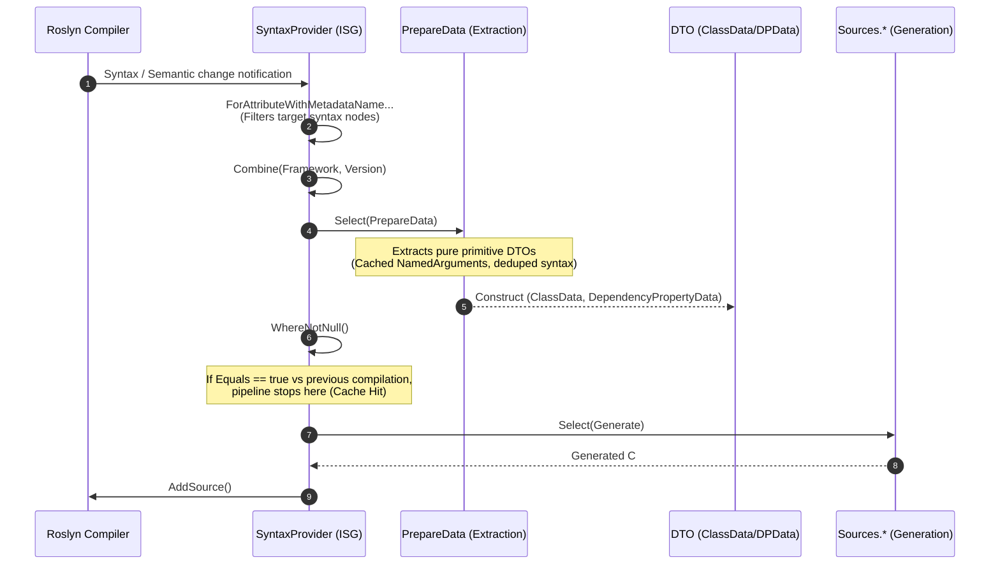
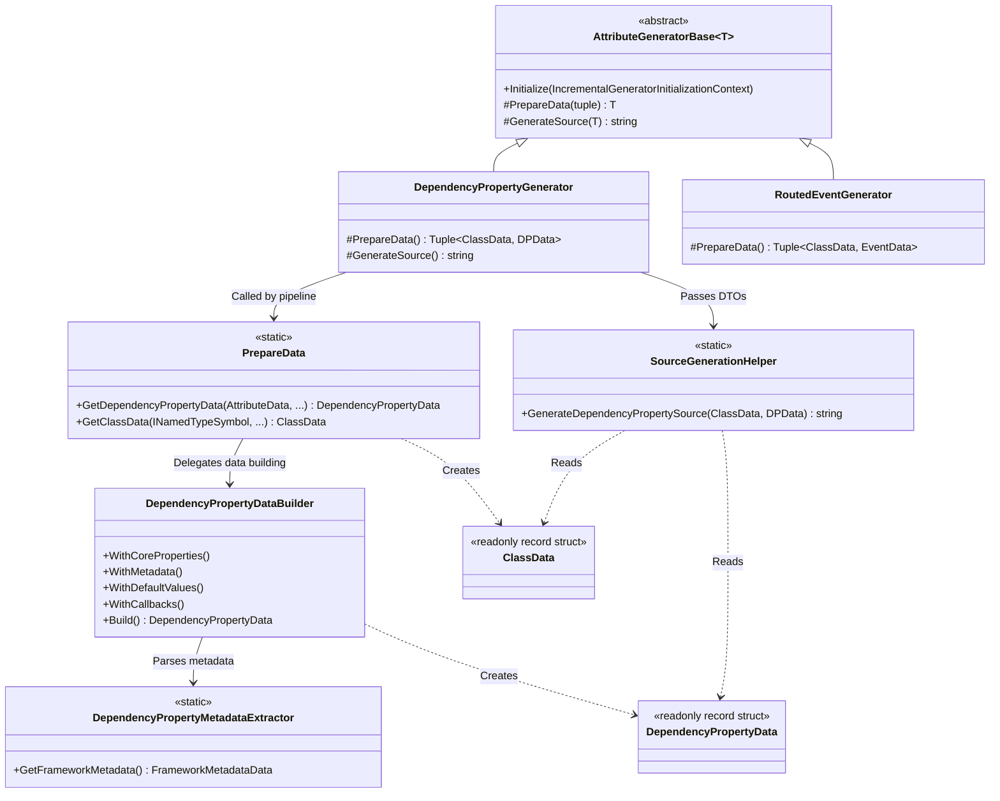
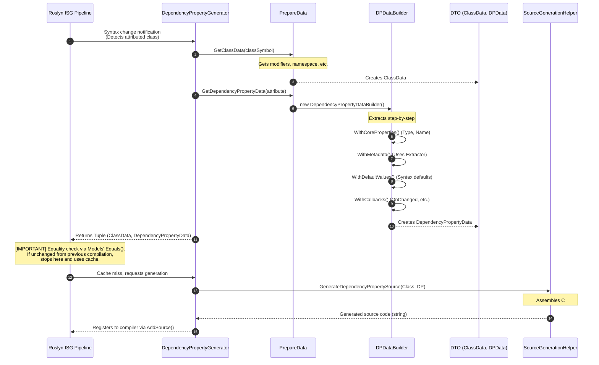

# 02. Pipeline and Architecture

[English](./02_pipeline_architecture.md) | [日本語](../ja/02_pipeline_architecture.md) | [Index (Intro)](./intro.md)

## I. Incremental Pipeline Architecture

The Roslyn Incremental Source Generator (ISG) processes compiler events through a LINQ-like pipeline, transforming syntax input into source code output. This project utilizes the `Kassyi.Generators.Extensions` pipeline helpers to construct lean, zero-allocation transformations.

### Overall Pipeline Flow

The following diagram illustrates the overall pipeline concept of the system. It shows how Roslyn's `IncrementalValuesProvider<T>` APIs are chained together in a LINQ-like manner. For a closer look at the internal class interactions and specific implementation details, please refer to "Chapter III. 2. Detailed Data Flow" later in this document.

### Pipeline Phases

The pipeline proceeds through the following phases:

1. **Syntax Filtering (`ForAttributeWithMetadataName`)**
   The pipeline leverages Roslyn 4.3.0+ APIs to filter candidate class and record declarations decorated with specific attributes (`[DependencyProperty]`, `[AttachedDependencyProperty]`, `[RoutedEvent]`, `[WeakEvent]`, etc.).
2. **Data Extraction (`PrepareData` / `DependencyPropertyDataBuilder`)**
   The pipeline projects raw `AttributeData` and `INamedTypeSymbol` instances into structured DTOs containing type names, default values, and behavior flags. The `PrepareData.cs` and `DependencyPropertyDataBuilder` components coordinate this process. It caches `NamedArguments` in dictionary lookups and deduplicates syntax searches to maximize extraction performance.
3. **Equality Evaluation and Incremental Caching**
   The Roslyn ISG driver evaluates the output of `Select`. If the output matches the previous compilation step (i.e., `Equals` returns `true`), it skips downstream source generation and uses the cache instead.
4. **Source Code Generation (`Sources.*`)**
   The generator invokes this phase only on cache misses, transforming DTOs into output `.g.cs` source strings. It uses the `SourceWriter` scope management to format the output with zero allocation.

---

## II. Model Equality and Caching Strategy

The most critical performance metric for an incremental generator is the incremental cache hit ratio.
The data models in this project (`DependencyPropertyData`, `ClassData`, `EventData`, and sub-records) enforce strict value equality semantics to optimize this ratio.

### Deep Value Comparison with `readonly record struct`
We declare all models as `readonly record struct`. This prompts the C# compiler to automatically generate value-based `Equals()` and `GetHashCode()` implementations that compare all underlying fields, ensuring strict value equality.

### Structural Collection Equality with `EquatableArray<T>`
In Roslyn pipelines, standard arrays `T[]` or `ImmutableArray<T>` evaluate equality by reference. If the pipeline creates a new array instance with identical items, the reference equality check fails, which invalidates the compiler cache.

To prevent this, we wrap collections (such as `BindEvents`) in `EquatableArray<T>`:
- **Usage**: `BindEvents: bindEvents.AsEquatableArray()`
- **Impact**: This enforces deep element-by-element equality (`SequenceEqual`). It suppresses redundant source regeneration when the underlying data is semantically identical.

---

## III. Detailed Class Relationships and Data Flow

This section explains the **specific responsibilities and relationships** of the classes in the generator, and **how data flows** through the Roslyn pipeline.

### 1. Overall Architecture and Class Relationships

The generator's main components are broadly divided into the following four layers:

1. **Generators**: Registered in the Roslyn pipeline, these control the overall execution flow.
2. **Data Extraction**: Extracts only the necessary metadata from the Syntax and Semantic models.
3. **Models (DTOs)**: Holds the extracted data. These are equatable value-type records.
4. **Sources**: Receives the DTOs and outputs the actual C# source code strings.

#### Roles of Major Classes in Each Layer

* **`AttributeGeneratorBase<T>`**: The foundation of the incremental generator. It encapsulates the common logic from syntax filtering via `ForAttributeWithMetadataName` to caching and source output.
* **`PrepareData`**: The entry point for the extraction process, called from the Generator layer. It provides extension methods to extract pure data from complex objects like Roslyn's `INamedTypeSymbol` and `AttributeData`.
* **`DependencyPropertyDataBuilder`**: A builder that performs the complex, step-by-step extraction specific to dependency properties (matching callback signatures, parsing default values, extracting XML documentation, etc.).
* **`ClassData` / `DependencyPropertyData`**: Models storing the extracted results. To maximize incremental caching performance, they are implemented as `readonly record struct` to guarantee value equality.
* **`SourceGenerationHelper`**: Static helpers that receive the data models and assemble the final C# source code (like `partial class` or `DependencyProperty.Register(...)`) using `SourceWriter`.

---

### 2. Detailed Data Flow and Internal Method Calls

While the conceptual diagram in Chapter I focuses on the Roslyn API chain, this diagram shifts the focus to the specific internal implementation of the generator. It traces the detailed sequence of events from detecting a `[DependencyProperty]` attribute on a class to generating the final C# code, highlighting exactly which classes are instantiated and which methods are invoked along the way.

### 3. Design Intent (Why this Data Flow?)

1. **Early Detachment of Roslyn Types (Symbol/Syntax)**
   Roslyn's syntax trees (`SyntaxNode`) and semantic models (`ISymbol`) are massive objects that can cause memory leaks and hinder the compiler's equality checks (caching). Therefore, the `PrepareData` and `Builder` layers **quickly convert them into pure C# primitive types (string, bool, etc. DTOs)** and detach from them.
2. **Zero-Allocation Considerations**
   Once the data is passed to `SourceGenerationHelper`, no Roslyn analysis occurs. It acts as a pure function that simply and rapidly outputs text via a `StringBuilder` (`SourceWriter`) based on the provided DTOs.
3. **Extensibility and Separation of Concerns**
   By separating the framework-specific mapping logic (inside `DependencyPropertyDataBuilder`) from the source generation logic (`SourceGenerationHelper`), either side can evolve without unnecessarily complicating the other.
