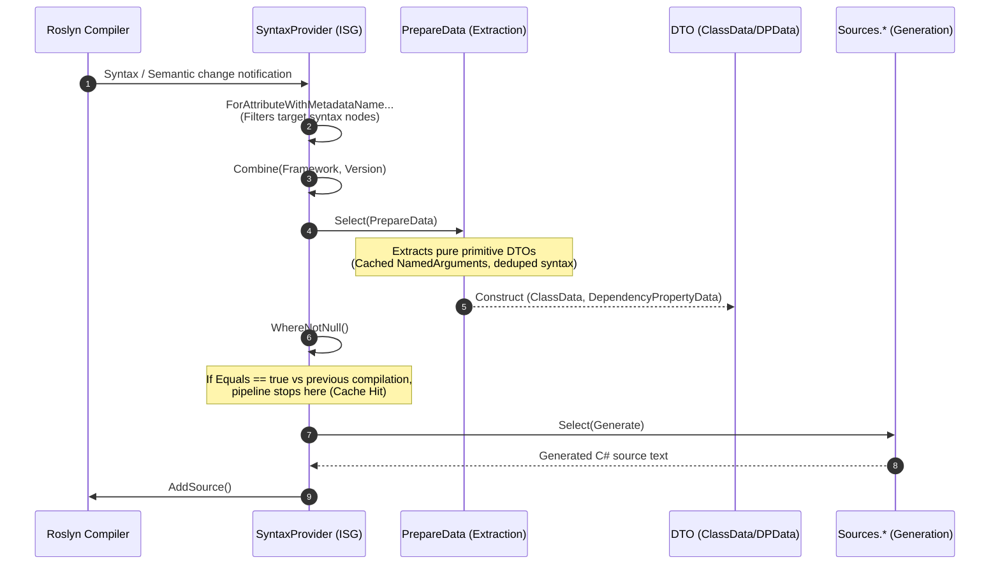
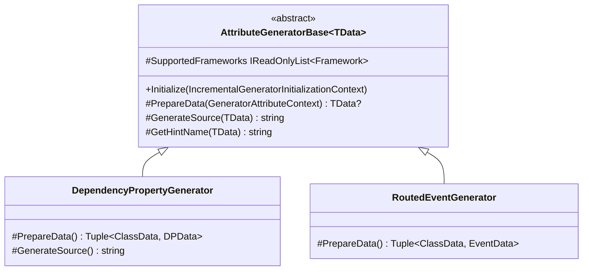
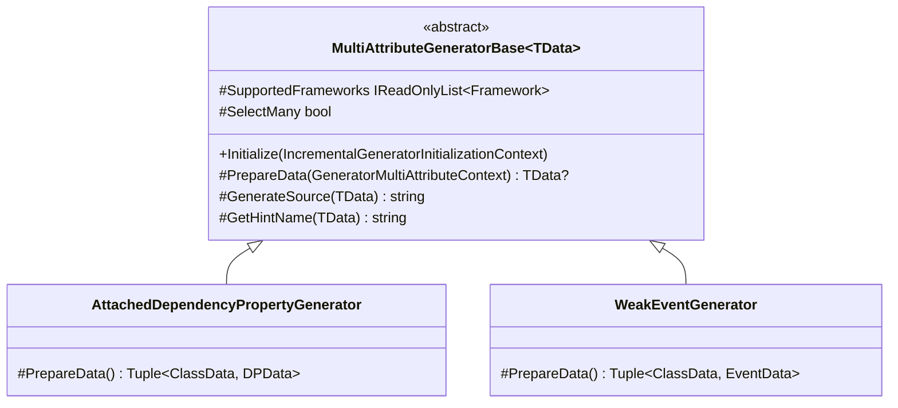
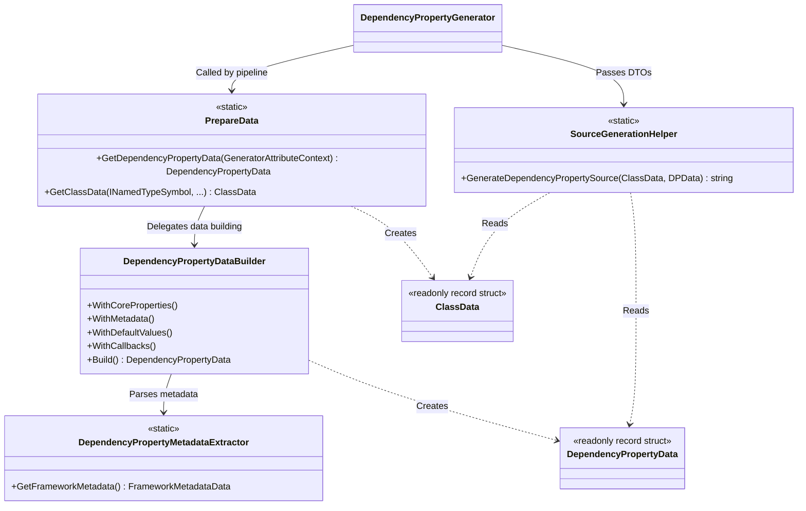
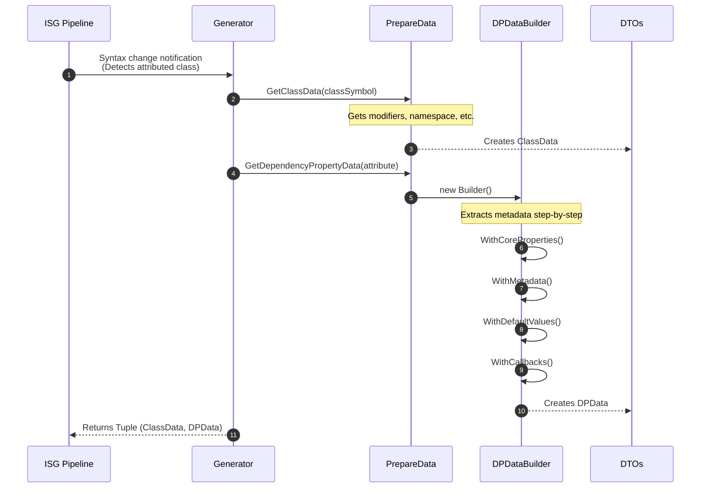
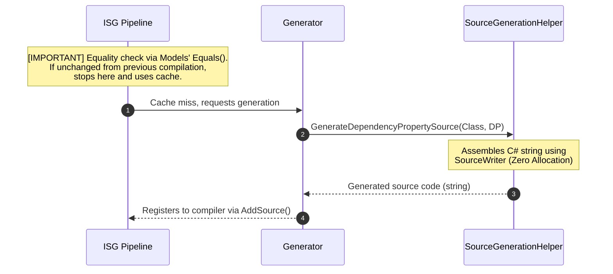

# 02. Pipeline and Architecture

[English](./02_pipeline_architecture.md) | [日本語](../ja/02_pipeline_architecture.md) | [Index (Intro)](./intro.md)

## I. Incremental Pipeline Architecture

The Roslyn Incremental Source Generator (ISG) processes compiler events through a LINQ-like pipeline, transforming syntax inputs into source code outputs. This architecture utilizes the `Kassyi.Generators.Extensions` pipeline helpers to enforce lean, zero-allocation transformations.

### Overall Pipeline Flow

The following sequence diagram illustrates the overall pipeline topology. It depicts the chaining of Roslyn's `IncrementalValuesProvider<T>` APIs. For detailed internal class interactions, refer to Section III.

### Pipeline Phases

The pipeline execution strictly adheres to the following ordered phases:

1. **Syntax Filtering:** The pipeline leverages Roslyn 4.3.0+ APIs (`ForAttributeWithMetadataName`) to strictly filter candidate class and record declarations decorated with specific attributes.
2. **Data Extraction:** The `PrepareData.cs` and `DependencyPropertyDataBuilder` components project raw `AttributeData` and `INamedTypeSymbol` instances into structured DTOs. This phase utilizes dictionary lookups to cache `NamedArguments` and deduplicates syntax searches to maximize extraction velocity.
3. **Equality Evaluation and Caching:** The Roslyn ISG driver evaluates the output of the `Select` phase. If the output strictly matches the previous compilation step (`Equals` returns `true`), it bypasses downstream source generation and relies on the incremental cache.
4. **Source Code Generation:** The generator invokes this phase exclusively on cache misses. It transforms DTOs into output `.g.cs` source strings utilizing `SourceWriter` scope management to enforce zero-allocation formatting.

---

## II. Model Equality and Caching Strategy

The most critical performance metric for an incremental generator is the incremental cache hit ratio. The data models (`DependencyPropertyData`, `ClassData`, `EventData`, and sub-records) enforce strict value equality semantics to optimize this ratio.

> [!IMPORTANT]
> **Deep Value Comparison with `readonly record struct`**
> All models are declared as `readonly record struct`. This mandates the C# compiler to automatically generate value-based `Equals()` and `GetHashCode()` implementations that compare all underlying fields, ensuring strict value equality.

> [!WARNING]
> **Structural Collection Equality with `EquatableArray<T>`**
> In Roslyn pipelines, standard arrays (`T[]`) or `ImmutableArray<T>` evaluate equality by reference. Constructing a new array instance with identical items causes reference equality checks to fail, which invalidates the compiler cache.

To mitigate cache invalidation, collections must be wrapped in `EquatableArray<T>`:
- **Usage**: `BindEvents: bindEvents.AsEquatableArray()`
- **Impact**: This wrapper enforces deep element-by-element equality (`SequenceEqual`). It completely suppresses redundant source regeneration when the underlying data is semantically identical.

---

## III. Detailed Class Relationships and Data Flow

This section dictates the specific responsibilities of the internal generator classes and enforces the data flow constraints through the Roslyn pipeline.

### 1. Overall Architecture and Class Relationships

The generator's internal architecture is segmented into four primary layers:

1. **Generators:** Registered within the Roslyn pipeline to orchestrate the execution flow.
2. **Data Extraction:** Responsible for extracting strictly necessary metadata from the Syntax and Semantic models.
3. **Models (DTOs):** Equatable value-type records that persist the extracted data.
4. **Sources:** Receives the DTOs and emits the synthesized C# source code strings.

#### 1. Single Attribute Generator Base and Implementations (`AttributeGeneratorBase`)

#### 2. Multi Attribute Generator Base and Implementations (`MultiAttributeGeneratorBase`)

#### 3. Data Extraction, Models (DTOs), and Source Generation Helpers

### Roles of Major Classes

- **`AttributeGeneratorBase<TData>` / `MultiAttributeGeneratorBase<TData>`:** The core foundation of the incremental generator. It encapsulates standard logic encompassing syntax filtering, target framework pre-validation (`SupportedFrameworks`), context encapsulation (`GeneratorAttributeContext`), and source output. 
- **`PrepareData`:** The entry point for the extraction process. It exposes extension methods to isolate pure data from complex Roslyn objects like `INamedTypeSymbol`.
- **`DependencyPropertyDataBuilder`:** An internal builder that executes the step-by-step extraction logic specific to dependency properties, such as matching callback signatures and extracting XML documentation.
- **`ClassData` / `DependencyPropertyData`:** Data models persisting extracted metadata. To maximize caching performance, they are structurally implemented as `readonly record struct`.
- **`SourceGenerationHelper`:** Static helpers that consume data models and assemble the final C# source code utilizing `SourceWriter`.

---

### 2. Detailed Data Flow and Internal Method Calls

The following diagram traces the specific internal execution flow. It illustrates the sequence from detecting a `[DependencyProperty]` attribute to generating the final C# code, explicitly detailing instantiated classes and invoked methods.

#### 1. Data Extraction Phase (Extraction)

#### 2. Caching and Source Generation Phase (Generation)

### 3. Architectural Design Intent

> [!CAUTION]
> **Early Detachment of Roslyn Types (Symbol/Syntax)**
> Roslyn's syntax trees (`SyntaxNode`) and semantic models (`ISymbol`) are massive objects. Retaining them causes severe memory leaks and fundamentally breaks the compiler's incremental caching. The `PrepareData` layer must forcefully convert them into primitive C# types (DTOs) and detach from them immediately.

> [!TIP]
> **Zero-Allocation Generation Phase**
> Once the extraction phase passes the data to `SourceGenerationHelper`, all Roslyn analysis must cease. The generation phase acts as a pure function that rapidly synthesizes text via `SourceWriter` based solely on the provided DTOs.

**Extensibility and Separation of Concerns**
By isolating the framework-specific mapping logic (within `DependencyPropertyDataBuilder`) from the source generation logic (`SourceGenerationHelper`), the architecture ensures that modifications to parsing logic do not contaminate the zero-allocation generation layer.
