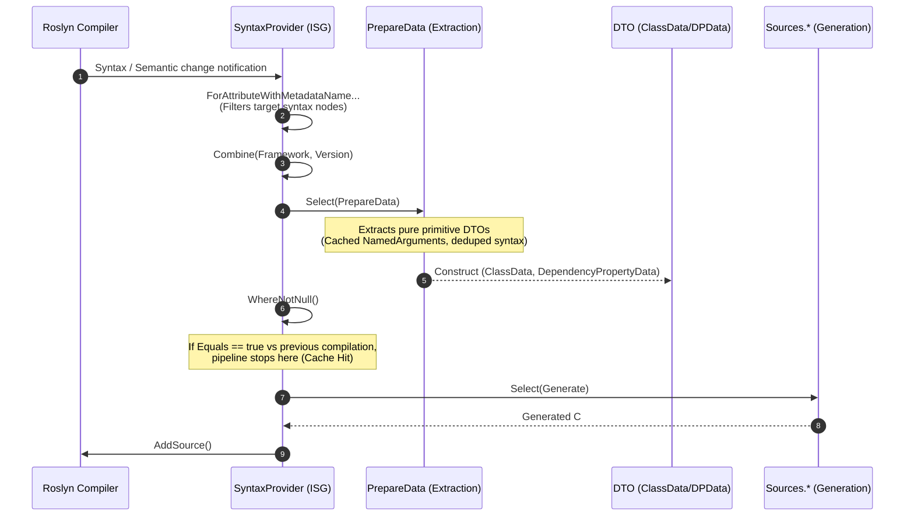

# 02. Pipeline & Architecture

[English](./02_pipeline_architecture.md) | [日本語](../ja/02_pipeline_architecture.md) | [Index (Intro)](./intro.md)

## I. Incremental Pipeline Architecture

The Roslyn Incremental Source Generator (ISG) processes compiler events through a LINQ-like pipeline from syntax input to code output. This project utilizes `Kassyi.Generators.Extensions` pipeline helpers to construct lean, zero-allocation transformations.

### Pipeline Execution Flow (Mermaid Sequence Diagram)

### Pipeline Phases

1. **Syntax Filtering (`ForAttributeWithMetadataName`)**
   - Leverages Roslyn 4.3.0+ APIs to filter candidate class and record declarations decorated with target attributes (`[DependencyProperty]`, `[AttachedDependencyProperty]`, `[RoutedEvent]`, `[WeakEvent]`, etc.).
2. **Data Extraction (`PrepareData` / `DependencyPropertyDataBuilder`)**
   - Projects raw `AttributeData` and `INamedTypeSymbol` instances into structured DTOs (type names, default values, behavior flags).
   - Coordinated by `PrepareData.cs` and `DependencyPropertyDataBuilder`.
   - Caches `NamedArguments` in dictionary lookups and deduplicates syntax searches to minimize extraction overhead.
3. **Equality Evaluation & Incremental Caching**
   - The Roslyn ISG driver skips downstream source generation if the output of `Select` matches the prior compilation step (`Equals` returns `true`).
4. **Source Code Generation (`Sources.*`)**
   - Invoked only on cache misses, transforming DTOs into output `.g.cs` source strings.
   - Guarded by `SourceWriter` scope management for zero-allocation formatting.

---

## II. Model Equality & Caching Strategy

The most critical performance metric for an incremental generator is the **incremental cache hit ratio**.
The data models in this project (`DependencyPropertyData`, `ClassData`, `EventData`, and sub-records) enforce strict value equality semantics.

### Deep Value Comparison with `readonly record struct`
All models are declared as `readonly record struct`. The C# compiler automatically generates value-based `Equals()` and `GetHashCode()` implementations that compare all underlying fields.

### Structural Collection Equality with `EquatableArray<T>`
In Roslyn pipelines, standard arrays `T[]` or `ImmutableArray<T>` evaluate equality by reference. If a new array instance is created with identical items, reference equality fails, invalidating the compiler cache.

To prevent this, collections (such as `BindEvents`) are wrapped in `EquatableArray<T>`:
- **Usage**: `BindEvents: bindEvents.AsEquatableArray()`
- **Impact**: Enforces deep element-by-element equality (`SequenceEqual`), suppressing redundant source regeneration when data is semantically unchanged.
