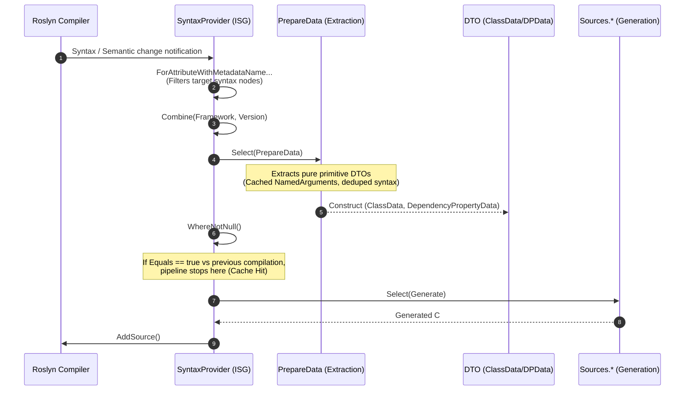

# 02. Pipeline and Architecture

[English](./02_pipeline_architecture.md) | [日本語](../ja/02_pipeline_architecture.md) | [Index (Intro)](./intro.md)

## I. Incremental Pipeline Architecture

The Roslyn Incremental Source Generator (ISG) processes compiler events through a LINQ-like pipeline, transforming syntax input into source code output. This project utilizes the `Kassyi.Generators.Extensions` pipeline helpers to construct lean, zero-allocation transformations.

### Pipeline Execution Flow

### Pipeline Phases

The pipeline proceeds through the following phases:

1. **Syntax Filtering (`ForAttributeWithMetadataName`)**
   The pipeline leverages Roslyn 4.3.0+ APIs to filter candidate class and record declarations decorated with specific attributes (`[DependencyProperty]`, `[AttachedDependencyProperty]`, `[RoutedEvent]`, `[WeakEvent]`, etc.).
2. **Data Extraction (`PrepareData` / `DependencyPropertyDataBuilder`)**
   The pipeline projects raw `AttributeData` and `INamedTypeSymbol` instances into structured DTOs containing type names, default values, and behavior flags. The `PrepareData.cs` and `DependencyPropertyDataBuilder` components coordinate this process. It caches `NamedArguments` in dictionary lookups and deduplicates syntax searches to maximize extraction performance.
3. **Equality Evaluation and Incremental Caching**
   The Roslyn ISG driver evaluates the output of `Select`. If the output matches the previous compilation step (i.e., `Equals` returns `true`), it skips downstream source generation and uses the cache instead.
4. **Source Code Generation (`Sources.*`)**
   The generator invokes this phase only on cache misses, transforming DTOs into output `.g.cs` source strings. It uses the `SourceWriter` scope management to format the output with zero allocation.

---

## II. Model Equality and Caching Strategy

The most critical performance metric for an incremental generator is the incremental cache hit ratio.
The data models in this project (`DependencyPropertyData`, `ClassData`, `EventData`, and sub-records) enforce strict value equality semantics to optimize this ratio.

### Deep Value Comparison with `readonly record struct`
We declare all models as `readonly record struct`. This prompts the C# compiler to automatically generate value-based `Equals()` and `GetHashCode()` implementations that compare all underlying fields, ensuring strict value equality.

### Structural Collection Equality with `EquatableArray<T>`
In Roslyn pipelines, standard arrays `T[]` or `ImmutableArray<T>` evaluate equality by reference. If the pipeline creates a new array instance with identical items, the reference equality check fails, which invalidates the compiler cache.

To prevent this, we wrap collections (such as `BindEvents`) in `EquatableArray<T>`:
- **Usage**: `BindEvents: bindEvents.AsEquatableArray()`
- **Impact**: This enforces deep element-by-element equality (`SequenceEqual`). It suppresses redundant source regeneration when the underlying data is semantically identical.
