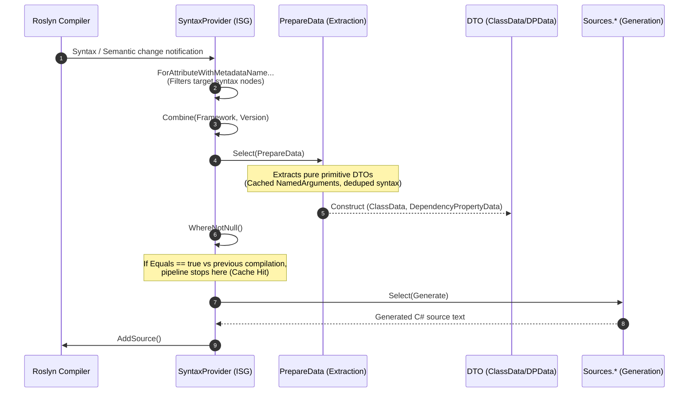
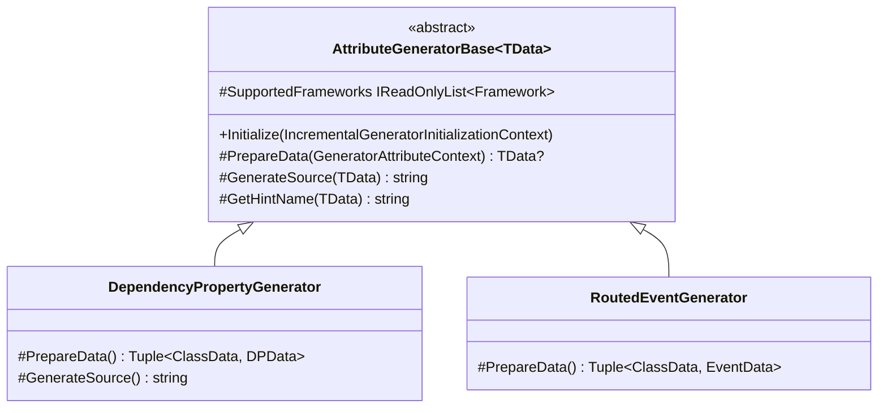
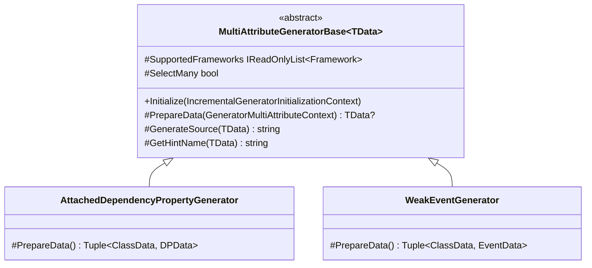
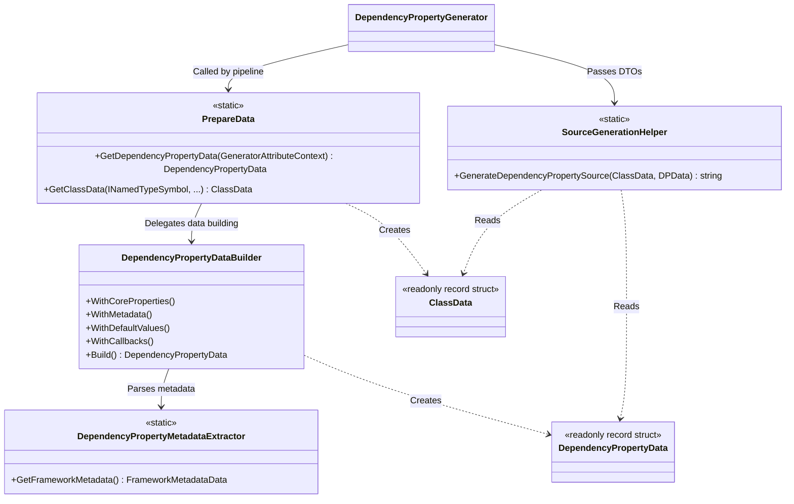
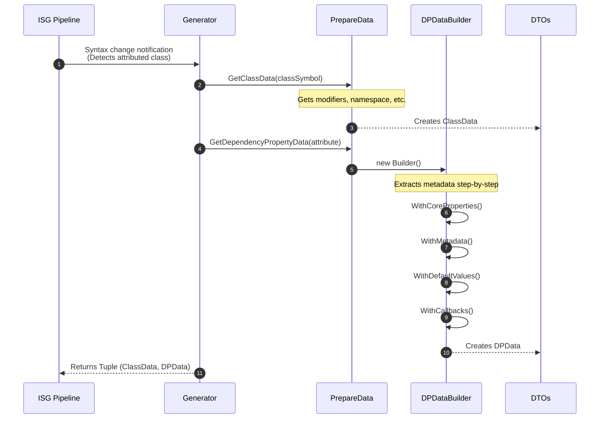
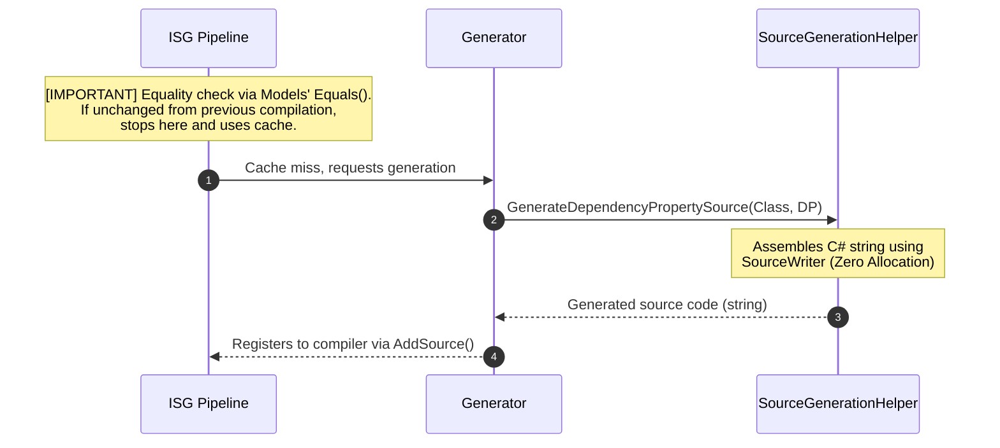

# 03. Pipeline Architecture

[English](./03_pipeline_architecture.md) | [日本語](../ja/03_pipeline_architecture.md)
Prev: [⬅ 02. Foundation & Domain Architecture](./02_foundation_and_domain.md) | [Index (Intro)](./intro.md) | Next: [04. Framework Generator Strategies ➡](./04_framework_strategies.md)

## I. Incremental Pipeline Architecture

The Roslyn Incremental Source Generator (ISG) processes compiler events using a LINQ-like pipeline to transform syntax inputs into source code. This architecture leverages the `Kassyi.Generators.Extensions` pipeline helpers to ensure lean, zero-allocation transformations.

### Overall Pipeline Flow

The following sequence diagram illustrates the pipeline topology, showing the chained Roslyn `IncrementalValuesProvider<T>` APIs. Section III details the internal class interactions.

### Pipeline Phases

The pipeline executes in the following strict order:

1. **Syntax Filtering:** The generator uses Roslyn 4.3.0+ APIs (`ForAttributeWithMetadataName`) to filter classes and records decorated with specific attributes.
2. **Data Extraction:** The `PrepareData.cs` and `DependencyPropertyDataBuilder` components project raw `AttributeData` and `INamedTypeSymbol` instances into structured DTOs. This phase uses dictionary lookups to cache `NamedArguments` and deduplicates syntax searches to maximize extraction speed.
3. **Equality Evaluation and Caching:** The Roslyn ISG driver evaluates the `Select` phase output. If the output matches the previous compilation step (`Equals` returns `true`), the pipeline bypasses source generation and uses the incremental cache.
4. **Source Code Generation:** The generator runs this phase only on cache misses. It transforms DTOs into `.g.cs` source strings, using `SourceWriter` scope management to guarantee zero-allocation formatting.

---

## II. Model Equality and Caching Strategy

The incremental cache hit ratio is the most critical performance metric for an ISG. The data models (`DependencyPropertyData`, `ClassData`, `EventData`, and sub-records) enforce strict value equality semantics (such as adopting `readonly record struct` and wrapping collections with `EquatableArray<T>`) to optimize this ratio.

> [!NOTE]
> For detailed architectural constraints regarding the equality caching strategy, zero-allocation generation, and early detachment of Roslyn syntax trees, see **[05. Code Synthesis and Performance (IV. Performance Optimization Rules)](./05_synthesis_and_performance.md#iv-performance-optimization-rules)**.

---

## III. Detailed Class Relationships and Data Flow

This section defines the responsibilities of internal generator classes and the data flow constraints within the Roslyn pipeline.

### 1. Overall Architecture and Class Relationships

The generator's internal architecture consists of four primary layers:

1. **Generators:** Registered in the Roslyn pipeline to orchestrate execution flow.
2. **Data Extraction:** Extracts necessary metadata from the Syntax and Semantic models.
3. **Models (DTOs):** Equatable value-type records that store extracted data.
4. **Sources:** Receives DTOs and emits synthesized C# source code strings.

#### 1. Single Attribute Generator Base and Implementations (`AttributeGeneratorBase`)

#### 2. Multi Attribute Generator Base and Implementations (`MultiAttributeGeneratorBase`)

#### 3. Data Extraction, Models (DTOs), and Source Generation Helpers

### Roles of Major Classes

- **`AttributeGeneratorBase<TData>` / `MultiAttributeGeneratorBase<TData>`:** The core foundation of the generator. It encapsulates standard logic for syntax filtering, target framework validation (`SupportedFrameworks`), context encapsulation (`GeneratorAttributeContext`), and source output. 
- **`PrepareData`:** The extraction process entry point. It provides extension methods to isolate pure data from complex Roslyn objects like `INamedTypeSymbol`.
- **`DependencyPropertyDataBuilder`:** An internal builder executing step-by-step extraction logic for dependency properties, such as matching callback signatures and extracting XML documentation.
- **`ClassData` / `DependencyPropertyData`:** Data models storing extracted metadata. They are implemented as `readonly record struct` to maximize caching performance.
- **`SourceGenerationHelper`:** Static helpers that consume data models and assemble the final C# source code using `SourceWriter`.

---

### 2. Detailed Data Flow and Internal Method Calls

The following diagram traces the internal execution flow, illustrating the sequence from detecting a `[DependencyProperty]` attribute to generating the final C# code, and detailing instantiated classes and invoked methods.

#### 1. Data Extraction Phase (Extraction)

#### 2. Caching and Source Generation Phase (Generation)

### 3. Architectural Design Intent

> [!NOTE]
> **Consolidation of Performance Optimization Principles**
> For detailed prohibitions and best practices regarding early detachment of Roslyn types (Symbol/Syntax) and the zero-allocation generation phase, see **[05. Code Synthesis and Performance (IV. Performance Optimization Rules)](./05_synthesis_and_performance.md#iv-performance-optimization-rules)**.

**Extensibility and Separation of Concerns**
By isolating framework-specific mapping logic (in `DependencyPropertyDataBuilder`) from source generation logic (`SourceGenerationHelper`), the architecture ensures that parsing modifications do not affect the zero-allocation generation layer.

---

Prev: [← 02. Foundation & Domain Architecture](./02_foundation_and_domain.md) | [Index (Intro)](./intro.md) | Next: [04. Framework Generator Strategies →](./04_framework_strategies.md)

