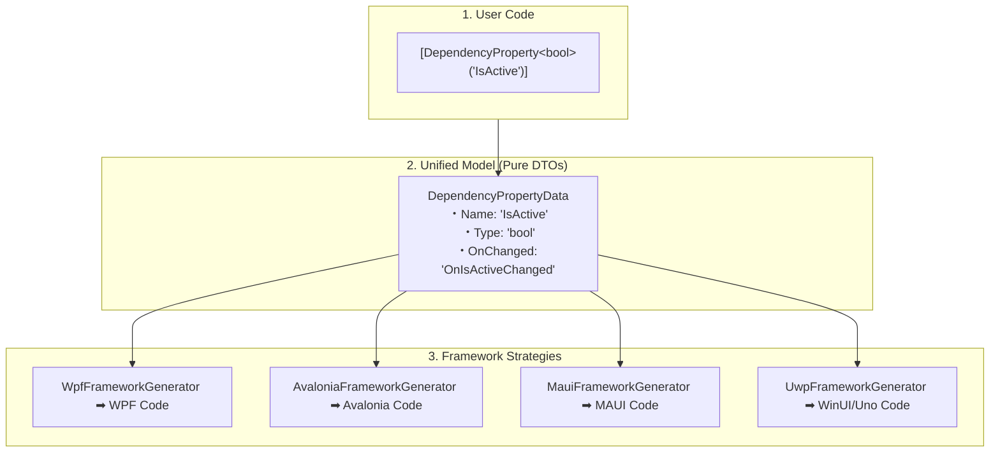

# 04. Framework generator strategies

The `DependencyPropertyGenerator` generates framework-specific boilerplate code for WPF, UWP, WinUI, Uno, Avalonia, and MAUI based on a single `[DependencyProperty]` attribute.

Use this document as the API mapping dictionary when you implement framework-specific bug fixes or feature extensions. The `IFrameworkGeneratorStrategy` implementation classes in the `Sources/Strategies/` directory abstract away all architectural differences between platforms.

---

## I. Unified DTO & Strategy Architecture

The core value of this generator is the ability to write a single C# syntax `[DependencyProperty]` and deploy it natively across any XAML UI framework. This "Write Once, Run Everywhere" capability is achieved by strictly separating data extraction from code emission:

1. **Extraction (Model)**: The Roslyn pipeline parses attributes into pure value-type DTOs (e.g., `DependencyPropertyData`).
2. **Emission (Strategy)**: The `IFrameworkGeneratorStrategy` classes read the unified DTOs and synthesize native boilerplate for the detected target platform.

---

## II. Property registration API mapping

### WPF (`WpfFrameworkGenerator`)

WPF uses `System.Windows.DependencyProperty` and `DependencyPropertyKey` as the foundation for its property system.

- **Registration**: Calls `DependencyProperty.Register` or `RegisterAttached`.
- **Read-Only**: Uses `RegisterReadOnly` and `RegisterAttachedReadOnly`.
- **Metadata**: Manages metadata via `System.Windows.FrameworkPropertyMetadata` or `PropertyMetadata`.
- **Callbacks**: Wires callbacks using dedicated delegate types (`PropertyChangedCallback`, `CoerceValueCallback`, `ValidateValueCallback`).

> [!NOTE]
> The WPF `FrameworkPropertyMetadata` contains an extensive set of layout and data binding flags (for example, `AffectsMeasure`, `BindsTwoWayByDefault`). The generator relies on the `FrameworkMetadataData` fields to securely emit these WPF-specific flags.

### Avalonia (`AvaloniaFrameworkGenerator`)

Avalonia builds upon `Avalonia.AvaloniaProperty`, typically defining properties as `StyledProperty<T>`, `AttachedProperty<T>`, or `DirectProperty<T>`.

- **Registration**: Calls `AvaloniaProperty.Register` or `RegisterAttached`.
- **Direct Properties**: When you enable the `IsDirect` flag, the generator emits the specialized `RegisterDirect` generic method for fast, field-backed access.
- **Metadata**: Passes metadata directly as arguments or manages it via Avalonia's native metadata classes.
- **Callbacks**: Routes callbacks through Observables or event-based subscription models like `AvaloniaPropertyChanged`.

### MAUI (`MauiFrameworkGenerator`)

MAUI uses a distinct type system based on `Microsoft.Maui.Controls.BindableProperty` and `BindablePropertyKey`.

- **Registration**: Calls `BindableProperty.Create` or `CreateAttached`.
- **Read-Only**: Uses `CreateReadOnly` or `CreateAttachedReadOnly`.
- **Metadata**: Passes metadata as flat arguments to the API rather than encapsulating it in a dedicated class.
- **Callbacks**: Maps callbacks to specific delegates (`BindingPropertyChangedDelegate`, `CoerceValueDelegate`, `ValidateValueDelegate`).

### UWP, WinUI, and Uno (`UwpFrameworkGenerator`)

UWP and Uno rely on `Windows.UI.Xaml.DependencyProperty`, while WinUI 3 relies on `Microsoft.UI.Xaml.DependencyProperty`.

- **Registration**: Limits registration strictly to `DependencyProperty.Register` and `RegisterAttached`.
- **Metadata**: Handles metadata using `PropertyMetadata`.
- **Callbacks**: Natively provides only the `PropertyChangedCallback`.

> [!WARNING]
> These platforms lack native API support for coercion and validation. The generator emits fallback implementations that manually clamp or correct values inside the property's getter and setter, or within the PropertyChanged event itself.

---

## II. Strategy extension guidelines

Follow these architectural principles when you add support for new UI frameworks or address breaking API changes (for example, Avalonia v12):

> [!IMPORTANT]
> **1. Preserve the DTOs**
> Never mutate the shared DTO models (for example, `DependencyPropertyData`). You must isolate all platform-specific differences by overriding methods in the corresponding generator class (for example, `XxxFrameworkGenerator.cs`) under the `Sources/Strategies/` directory.

> [!TIP]
> **2. Method extraction for signature variances**
> Extract methods to resolve API signature differences. For example, use the `GenerateRegisterMethodArguments` method to construct the exact argument string passed to the `Register` method, gracefully accommodating varying parameter configurations.

> [!NOTE]
> **3. Zero-allocation generation rules**
> For strict performance optimization rules, including the prohibition of LINQ or unnecessary `string.Join` calls within string generation paths (`SourceWriter`), see **[05. Code synthesis and performance](./05_synthesis_and_performance.md#iv-performance-optimization-rules)**.

---

## III. Automatic framework detection and fallback

During Roslyn pipeline initialization, the generator automatically resolves the target UI framework using the following priority cascade:

1. **High-precision symbol inspection (`Compilation.TryRecognizeFramework`)**
   The generator inspects the compilation context for core framework type symbols:
    - `Microsoft.Maui.Controls.BindableObject` $\rightarrow$ `Framework.Maui`
    - `Avalonia.AvaloniaObject` $\rightarrow$ `Framework.Avalonia`
    - `Uno.UI.FeatureConfiguration` $\rightarrow$ `Framework.Uno` or `Framework.UnoWinUi`
    - `Microsoft.UI.Xaml.DependencyObject` $\rightarrow$ `Framework.WinUi`
    - `Windows.UI.Xaml.DependencyObject` $\rightarrow$ `Framework.Uwp`
    - `System.Windows.DependencyObject` $\rightarrow$ `Framework.Wpf`

2. **MSBuild property and compilation constant fallback (`AnalyzerConfigOptionsProvider`)**
   If the generator cannot resolve symbols, it inspects `DefineConstants` (`HAS_WPF`, `HAS_WINUI`, `HAS_UWP`, `HAS_UNO`, `HAS_UNO_WINUI`, `HAS_AVALONIA`, `HAS_MAUI`) or the `UseMaui` property in project files.

3. **Unrecognized framework fallback (`Framework.None`)**
   If no framework matches, the generator assigns `Framework.None`. In this state, it emits the `DPG0000` (Framework is not recognized) diagnostic and skips platform-specific `using` imports and registrations. It safely emits only the raw attribute definitions to prevent compilation failure.
   For detailed causes and project configuration remedies for `DPG0000`, see **[08. Diagnostics reference](./08_diagnostics_reference.md#dpg0000-framework-is-not-recognized)**.
