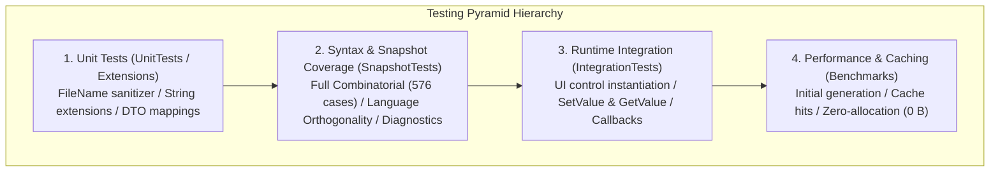

# 05. Test Specification

This document provides the formal test specification for the DependencyPropertyGenerator (`Kassyi.Generators.DependencyProperty`). It details the multi-tier testing strategy, quality targets, combinatorial matrix parameters, test case catalogs, execution environments, and verification criteria in accordance with software testing standards. All test IDs map directly to the C# `TestCategoryNames` constants.

---

## 1. Test Strategy and Architecture

To thoroughly validate this Roslyn Source Generator across compile-time metaprogramming, cross-platform environments, incremental caching, and runtime execution, this repository employs a 4-tier test pyramid.



### 1.1 Test Project Directory

| Tier | Project Name | Responsibilities | Primary Technologies |
| :--- | :--- | :--- | :--- |
| **Unit Tests** | `Tests.Extensions` / Unit | Validates utility logic, file sanitization, and boundary string extensions. | MSTest |
| **Syntax & Generation** | `SnapshotTests` | Verifies C# language orthogonality, full combinatorial matrix, and Roslyn diagnostics. | MSTest, Verify.MSTest, Roslyn Testing |
| **Runtime Integration** | `IntegrationTests` | Tests runtime execution and state transitions on actual UI controls. | MSTest, Avalonia (Headless / Real instances) |
| **Performance & Cache** | `Benchmarks` | Measures initial throughput, incremental pipeline cache hits, and memory allocations. | BenchmarkDotNet, MemoryDiagnoser |

---

## 2. Test Environment and Preconditions

Because Source Generators are sensitive to environment variations such as operating systems, path separators, and line endings, all tests are designed and validated against specific conditions.

### 2.1 Target Platforms and Runtimes
Tests run on multiple host operating systems including Windows (Windows Server / Windows 11 with `CRLF` and `\` path separators), Linux (Ubuntu Latest with `LF` and `/`), and macOS (macOS Latest with `LF` and `/`).
The build uses the .NET 9.0 SDK, which includes C# 13.0 Preview language features.
The generator supports multiple target UI frameworks, including WPF (.NET Framework 4.8 / .NET Core 3.1 / .NET 5–9), Uno Platform (UWP and WinUI modes), .NET MAUI (.NET 7.0+), and Avalonia UI (StyledProperty and DirectProperty, 11.0+).

### 2.2 Test Isolation and Concurrency
All compilation tests execute purely in-memory using `CSharpCompilation` without relying on disk states or shared mutable statics. Generator instances and syntax trees are created and torn down independently per test case. This ensures complete thread safety under the MSTest `[Parallelize]` configuration.

---

## 3. Quantitative Quality Targets and Pass Criteria

| Metric | Target | Pass Criteria / Remarks |
| :--- | :--- | :--- |
| **Line Coverage** | **>= 90%** | Measures the coverage of the generator core engine (`Kassyi.Generators.DependencyProperty`). |
| **Branch Coverage** | **>= 85%** | Evaluates coverage across attribute parsing, type inference, and syntax branches. |
| **Full Matrix Coverage** | **100% (576/576)** | Validates all valid permutations of parameters and modifiers. |
| **Compilation Errors** | **0 Errors** | Ensures a `Severity = Error` count of zero across all generated code. |
| **Incremental Latency** | **<= 0.5 ms** | Measures pipeline cache-hit execution latency during non-structural edits. |
| **Cache Heap Allocations** | **0 Bytes** | Prevents GC heap allocation during incremental cache hits. |

---

## 4. Full Combinatorial Matrix Specification (`CombinatorialMatrixTests`)

The test suite validates all valid permutations of dependency property attributes and class definitions. It executes **576 independent test cases** via MSTest `[DynamicData]`. The category is `Matrix` and the test ID is `Matrix-001`.

### 4.1 Factors and Levels
* **Framework (5)**: `Wpf`, `Uno`, `UnoWinUi`, `Maui`, `Avalonia`
* **AttrType (2)**: `Normal` (standard DP), `Attached` (attached DP)
* **ClassMode (4)**: `PublicClass`, `InternalGenericClass`, `PublicRecord`, `StaticClass`
* **PropType (4)**: `Int` (value), `NullableInt` (nullable value), `String` (reference), `GenericList` (collection)
* **ReadOnlyMode (2)**: `False` (read-write), `True` (read-only)
* **DefaultMode (3)**: `None`, `Literal`, `Expression`
* **DirectMode (2)**: `False`, `True` (Avalonia DirectProperty only)

### 4.2 Exclusion Constraints
Certain permutations are excluded due to framework limitations. `DirectMode.True` is only valid when combined with `Framework.Avalonia` and `AttrType.Normal`. Since `PublicRecord` and `StaticClass` cannot inherit from UI control base classes, they are only valid with `AttrType.Attached`.
To prevent instance-sharing bugs (`DPG0004`), `PropType.GenericList` requires `DefaultMode.None`. Plain value types such as `PropType.Int` exclude `DefaultMode.Expression`.

---

## 5. Language Feature Orthogonality Specification (`LanguageFeatureTests`)

The suite verifies zero interference between C# language features (C# 8.0 through C# 13.0) and the generator output. The test category is `Language`.

| Test ID | Category | Input Syntax Condition | Expected Verification Result |
| :--- | :--- | :--- | :--- |
| **Language-001** | Basic Declaration | Block-scoped namespace × `public partial class` | Generates standard property declarations and registrations. |
| **Language-002** | Namespace | File-scoped namespace × `internal` modifier | Wraps cleanly in a file-scoped namespace as an `internal partial class`. |
| **Language-003** | Record Type | `public partial record` × generic `<T>` | Maintains `partial record` syntax in generated code. |
| **Language-004** | Global Scope | Global namespace × multiple type parameters `<T1, T2>` | Declares correctly in the global scope with all type arguments. |
| **Language-005** | Generics | Type constraints (`where T : class, new()`) | Propagates all `where` clauses faithfully to the partial class. |
| **Language-006** | C# 13 Feature | Anti-constraint (`where T : allows ref struct`) | Preserves the C# 13 `allows ref struct` constraint. |
| **Language-007** | Arity Collision | Same-name classes with different arity (`TestClass` & `TestClass<T>`) | Separates output files without naming collisions. |
| **Language-008** | Nested Scope | Non-generic outer class × generic inner class | Reconstructs multi-tier `partial class` structures. |
| **Language-009** | Nested Scope | Generic outer class × non-generic inner class | Attaches outer generic parameters correctly. |
| **Language-010** | Nested Scope | Generic record outer × generic class inner | Preserves nested `partial record` and `partial class` structures. |
| **Language-011** | Deep Nesting | 3-level deep nesting in global namespace | Preserves all 3 enclosing `partial class` scopes. |
| **Language-012** | C# 12 Feature | Primary constructor `class MyControl(int id)` | Prevents signature collisions with constructor parameters. |
| **Language-013** | C# 13 Feature | User-defined `public partial string MyProp { get; set; }` | Merges implementations cleanly without partial property conflicts. |
| **Language-014** | C# 11 Feature | `required` modifier and `init` accessors | Prevents interference with required init rules in generated properties. |
| **Language-015** | C# 12 Feature | `DefaultValueExpression = "[]"` (Collection expression) | Emits the `[]` literal without modification. |
| **Language-016** | C# 9 Feature | `DefaultValueExpression = "new()"` (Target-typed new) | Evaluates target-typed `new()` expressions properly. |
| **Language-017** | Type System | Value tuple `(int Id, string Name)?` | Preserves tuple element names and nullability fully. |
| **Language-018** | Type System | Complex array `List<int?>?[]` | Emits multilevel nested nullable array types accurately. |
| **Language-019** | Identifier Escaping | Reserved keyword names (`@event`, `@class`) | Preserves and handles the `@` prefix correctly. |
| **Language-020** | Syntax Variance | Modifier ordering (`sealed public partial class`) | Normalizes class declarations independent of modifier order. |
| **Language-021** | Metadata Propagation | `[Category]`, `[Description]`, `[TypeConverter]` | Copies ComponentModel attributes cleanly to the property proxy. |
| **Language-022** | Inheritance Edge | Shadowing base property with `new` modifier | Generates safe `new` property registrations. |
| **Language-023** | Callbacks | `Validate = true`, `Coerce = true` coexistence | Generates validation and coercion methods properly. |
| **Language-024** | Attached Callbacks | `Validate = true`, `Coerce = true` on attached properties | Generates validation and coercion signatures for attached properties properly. |
| **Language-025** | Avalonia Flags | `AffectsRender`, `AffectsMeasure`, `AffectsArrange` | Registers static constructor invalidation hooks. |
| **Language-026** | Event Binding | `BindEvents` with static handler wiring | Wires UI events and property callbacks automatically. |
| **Language-027** | Multidimensional | `int[,,]` multidimensional array property | Preserves multidimensional array signatures. |
| **Language-028** | Nullable Context | Nullable-enabled record classes | Preserves nullable annotations correctly. |
| **Language-029** | Static Class | Attached properties on static classes | Preserves static class modifiers without duplicates. |
| **Language-030** | Namespaces | Same-name classes in different namespaces | Isolates generation to prevent collisions across namespaces. |
| **Language-031** | Partial Property | `required partial` property with `init` | Integrates directly with C# 13 partial property implementations. |
| **Language-032** | Function Pointer | Function pointer (`delegate* unmanaged<int, void>`) | Generates unmanaged function pointer types correctly as property types. |

---

## 6. Feature-Specific Component Specifications (`SnapshotTests`)

### 6.1 Attached Properties (`Attached`)
Tests validate attached property generation including type constraints and callback wiring.
* **Attached-001**: Generates enum-typed attached properties and typed callbacks (`OnModeChanged`).
* **Attached-002**: Restricts the `Set` accessor visibility to `internal/private` when `IsReadOnly = true`.
* **Attached-003**: Constrains target parameter typing in `Set[Name](TargetType element, ...)` based on `BrowsableForType`.
* **Attached-004**: Generates UI event subscriptions and handler wiring when `BindEvent` is specified.
* **Attached-005**: Defaults the target to `DependencyObject` when the second type parameter is omitted.
* **Attached-006**: Emits multiline XML documentation and descriptions without string literal syntax errors.
* **Attached-007**: Generates custom `OnChanged` method wiring and static constructors.
* **Attached-008**: Avoids circular references when passing the same class as a type parameter.
* **Attached-009**: Generates attached properties correctly on inherited classes.
* **Attached-010**: Wires event argument callbacks using `DependencyPropertyChangedEventArgs`.

### 6.2 Routed Events (`Routed`)
Tests validate event generation based on routing infrastructure such as WPF.
* **Routed-001**: Generates standard bubbling routed event registrations (`EventManager.RegisterRoutedEvent`) and wrappers.
* **Routed-002**: Generates attached routed events (`IsAttached = true`) with static `Add/RemoveHandler` methods.
* **Routed-003**: Prevents duplicate `public static partial class` modifiers on static classes.
* **Routed-004**: Prevents duplicate `global::` namespace prefixes on custom generic delegate handlers.
* **Routed-006**: Selectively suppresses `CS0436` conflicts for generated attributes.

### 6.3 Weak Events (`Weak`)
Tests validate weak event manager code generation to prevent memory leaks.
* **Weak-001**: Generates standard `EventHandler` weak event managers and subscription pipelines.
* **Weak-002**: Generates type-safe `EventHandler<T>` weak events.
* **Weak-003**: Generates static weak event managers and registrations when `IsStatic = true`.
* **Weak-004**: Generates static type-safe `EventHandler<T>` weak events.
* **Weak-005**: Generates weak events using `System.EventArgs`.

### 6.4 Metadata Overrides and Property Sharing (`Metadata`)
Tests validate metadata rewriting and shared property behavior across the inheritance tree.
* **Metadata-001**: Generates default value overrides (`OverrideMetadata` on WPF, `RegisterPropertyChangedCallback` elsewhere).
* **Metadata-002**: Generates metadata overrides for read-only properties.
* **Metadata-003**: Registers property sharing via `AddOwner` calls.
* **Metadata-004**: Shares properties across different types using `AddOwner`.

### 6.5 Documentation Consistency (`Doc`)
Tests ensure that code snippets provided in user-facing documentation work correctly.
* **Doc-001**: Compiles and generates code cleanly for all code blocks listed in `README.md`.
* **Doc-002**: Propagates XML documentation comment tags (such as `<see cref="..."/>`) cleanly into the generated code.

---

## 7. Negative and Diagnostic Specification (`Error`)

The generator must ensure that invalid user input triggers clean compile-time diagnostics without crashing the generator pipeline. The test category is `Error`.

| Test ID | Diagnostic ID | Severity | Trigger Condition | Expected Diagnostic Message Format |
| :--- | :--- | :--- | :--- | :--- |
| **Error-001** | `DPG0001` | Error | Non-existent or invalid signature for `OnChanged` callback | `The specified OnChanged method '{0}' was not found or has an unsupported signature on '{1}'.` |
| **Error-002** | `DPG0001` | Error | Non-existent callback method in attached property | `The specified OnChanged method '{0}' was not found or has an unsupported signature on '{1}'.` |
| **Error-003** | `DPG0002` | Error | Applying attributes to a `file`-scoped local class | `The file-local class '{0}' cannot be used for source generation.` |
| **Error-004** | `DPG0003` | Error | Using `ref struct` type as a property type | `The type '{0}' is a ref struct and cannot be used as a DependencyProperty type.` |
| **Error-005** | `DPG0004` | Error | Reference type default value without callback or expression | `Reference type '{0}' cannot have a DefaultValue without CreateDefaultValueCallback = true or DefaultValueExpression.` |
| **Error-007** | `DPG0005` | Error | Unsupported `OldAndNewValue` callback in non-WPF/Avalonia frameworks | `OverrideMetadata with OldAndNewValue callback is only supported on WPF and Avalonia.` |
| **Error-008** | `DPG0006` | Error | Invalid expression syntax in `DefaultValueExpression` | Handles syntax errors gracefully. |
| **Error-009** | - | Info | Fallback behavior when `Framework.None` is specified | Generates proper fallback code. |
| **Error-010** | `DPG0007` | Error | Invalid signature for callback methods (e.g. `OnChanged`) | `The partial method '{0}' has an unsupported signature...` |

---

## 8. Runtime Integration Specification (`Integration`)

Tests verify that the generated code builds into real assemblies and behaves correctly at runtime within Avalonia and WinUI (Uno) environments. The test category is `Integration`.

* **Integration-001 (GetValue / SetValue Validation)**: Setting a value updates the `GetValue(...)` return value correctly.
* **Integration-002 (OnChanged Callback Execution)**: Value modifications invoke the partial method `partial void OnIsSpinningChanged(...)` and update the internal state.
* **Integration-003 (Attached Property Accessors)**: `SetSelectedItem` and `GetSelectedItem` store and retrieve values correctly.
* **Integration-004 (WinUI Runtime Coerce Validation)**: Verifies that values are correctly clamped and infinite loops or re-entrancy are prevented.

---

## 9. Performance and Incremental Cache Specification (`Benchmarks`)

Validates sub-millisecond responsiveness during IDE keystrokes using `BenchmarkDotNet`.

* **Perf-001 (Incremental Latency)**: Execution latency remains <= 0.5 ms during incremental cache hits on non-structural edits.
* **Perf-002 (Zero Allocation)**: Generator maintains 0 Bytes GC heap allocation during incremental cache hits.

---

## 10. Unit Tests and Utilities Specification (`UnitTests`)

* **Unit-001 (FileName Sanitization)**: Converts invalid filesystem characters in class or generic type names (`<`, `>`, `,`, `?`) safely to `_`.
* **Unit-002 (Type Extensions)**: Handles edge cases such as empty strings and special symbols safely during `global::` namespace prefix injection and string replacements.

---

## 11. Quality Assurance and CI Protocol

Defines the automated testing pipeline and regression prevention rules for the CI environment.

### 11.1 CI Pipeline Automation
The CI pipeline executes all tests across Windows, Ubuntu, and macOS to guarantee release quality. It filters tests by category, measures code coverage, and detects snapshot differences.

```powershell
# 1. Execute all tests across Windows, Ubuntu, and macOS
dotnet test Kassyi.Generators.DependencyProperty.sln --configuration Release

# 2. Filter test execution by category (e.g. Error category only)
dotnet test --filter TestCategory=Error
```

### 11.2 Pull Request Standards
All PRs must pass `CombinatorialMatrixTests` (576 cases), `LanguageFeatureTests`, and all `IntegrationTests`. Any changes resulting in `.verified.cs` snapshot diffs require mandatory reviewer inspection and explicit approval.

## 12. Troubleshooting and Testing Guide for Agents (Agentic Ground Truth)

When autonomous agents (AI assistants) modify or add tests, they must follow these boundaries and procedures to ensure the integrity of the test suite.

When you fix a bug, the nature of the bug dictates where you should add a test to guarantee the fix. If the symptom is a compilation error, malformed generated code, or an incorrect method signature, you must verify the exact string output correctness of the generator. In this scenario, add a test case to the appropriate file in `Kassyi.Generators.DependencyProperty.SnapshotTests` (such as `AttachedTests.cs` or `RoutedTests.cs`) and update the `.verified.cs` snapshot.

Conversely, if the code generates correctly and compiles fine, but events fail to fire, bindings fail, or runtime exceptions occur when running the application, you must verify the actual runtime behavior against real frameworks like WPF or Avalonia. In this case, add a test in `Kassyi.Generators.DependencyProperty.IntegrationTests`. You should instantiate the actual UI control and assert the `GetValue`/`SetValue` behaviors or callback invocations directly.

When adding support for a completely new language feature (like C# 14 syntaxes) or a new attribute, you must expand the combinatorial test matrix to prove that the existing code generation logic suffers no side effects. You do this by expanding the factor enums in `tests/Kassyi.Generators.DependencyProperty.SnapshotTests/CombinatorialMatrixTests.cs`. If this change causes the number of combinatorial tests to explode, you must add constraint logic (using `yield break`, for example) to filter out meaningless combinations. Additionally, to pinpoint whether a new language feature breaks the parser, you should add a minimal class definition test specific to that feature in `LanguageFeatureTests.cs`.

Finally, if you modify or add generator error notifications (Diagnostics) like `DPG0001`, you must always add a corresponding test to `ErrorTests.cs`. Because the generator is designed to safely skip generation (producing no source code) when emitting errors, your test should only verify the number and content of the emitted `Diagnostic`. You must not assert the generated source code result in these cases.
