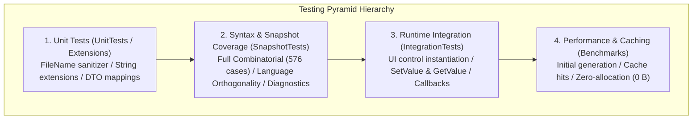

# 05. Test Specification

This document dictates the formal test specification for the DependencyPropertyGenerator (`Kassyi.Generators.DependencyProperty`). It defines the multi-tier testing strategy, quality targets, combinatorial matrix parameters, test case catalogs, execution environments, and strict verification criteria. All test IDs map directly to the C# `TestCategoryNames` constants.

---

## 1. Test Strategy and Architecture

To rigorously validate this Roslyn Source Generator across compile-time metaprogramming, cross-platform environments, incremental caching, and runtime execution, this architecture enforces a 4-tier test pyramid.



### 1.1 Test Project Directory

| Tier                    | Project Name              | Responsibilities                                                                       | Primary Technologies                         |
| :---------------------- | :------------------------ | :------------------------------------------------------------------------------------- | :------------------------------------------- |
| **Unit Tests**          | `Tests.Extensions` / Unit | Validates utility logic, file sanitization, and boundary string extensions.            | MSTest                                       |
| **Syntax & Generation** | `SnapshotTests`           | Verifies C# language orthogonality, full combinatorial matrix, and Roslyn diagnostics. | MSTest, Verify.MSTest, Roslyn Testing        |
| **Runtime Integration** | `IntegrationTests`        | Tests runtime execution and state transitions on actual UI controls.                   | MSTest, Avalonia (Headless / Real instances) |
| **Performance & Cache** | `Benchmarks`              | Measures initial throughput, incremental pipeline cache hits, and memory allocations.  | BenchmarkDotNet, MemoryDiagnoser             |

---

## 2. Test Environment and Preconditions

> [!WARNING]
> Source Generators are highly sensitive to environment variations (OS, path separators, line endings). All tests must be executed and validated against the specified multi-platform conditions to guarantee compliance.

### 2.1 Target Platforms and Runtimes

Tests execute on Windows (Windows Server / Windows 11 with `CRLF` and `\`), Linux (Ubuntu Latest with `LF` and `/`), and macOS (macOS Latest with `LF` and `/`).
The build mandates the .NET 9.0 SDK, utilizing C# 13.0 Preview language features.
The generator targets WPF (.NET Framework 4.8 / .NET Core 3.1 / .NET 5–9), Uno Platform (UWP/WinUI), .NET MAUI (.NET 7.0+), and Avalonia UI (11.0+).

### 2.2 Test Isolation and Concurrency

All compilation tests execute purely in-memory via `CSharpCompilation` without relying on disk states or shared mutable statics. Generator instances and syntax trees are torn down independently per test case, ensuring absolute thread safety under MSTest `[Parallelize]` configurations.

---

## 3. Quantitative Quality Targets and Pass Criteria

| Metric                     | Target             | Pass Criteria / Remarks                                                       |
| :------------------------- | :----------------- | :---------------------------------------------------------------------------- |
| **Line Coverage**          | **>= 90%**         | Measures the coverage of the generator core engine (`Kassyi.Generators.DependencyProperty`). |
| **Branch Coverage**        | **>= 85%**         | Evaluates coverage across attribute parsing, type inference, and syntax branches. |
| **Full Matrix Coverage**   | **100% (576/576)** | Validates all valid permutations of parameters and modifiers.                 |
| **Compilation Errors**     | **0 Errors**       | Ensures a `Severity = Error` count of zero across all generated code.        |
| **Incremental Latency**    | **<= 0.5 ms**      | Measures pipeline cache-hit execution latency during non-structural edits.   |
| **Cache Heap Allocations** | **0 Bytes**        | Prohibits GC heap allocation during incremental cache hits.                  |

---

## 4. Full Combinatorial Matrix Specification (`CombinatorialMatrixTests`)

The test suite strictly validates all permutations of dependency property attributes and class definitions. It executes **576 independent test cases** via MSTest `[DynamicData]`. (Category: `Matrix`, Test ID: `Matrix-001`).

### 4.1 Factors and Levels

- **Framework (5)**: `Wpf`, `Uno`, `UnoWinUi`, `Maui`, `Avalonia`
- **AttrType (2)**: `Normal`, `Attached`
- **ClassMode (4)**: `PublicClass`, `InternalGenericClass`, `PublicRecord`, `StaticClass`
- **PropType (4)**: `Int`, `NullableInt`, `String`, `GenericList`
- **ReadOnlyMode (2)**: `False`, `True`
- **DefaultMode (3)**: `None`, `Literal`, `Expression`
- **DirectMode (2)**: `False`, `True`

### 4.2 Exclusion Constraints

> [!NOTE]
> Certain permutations are explicitly excluded due to framework limitations:
>
> - `DirectMode.True` is only valid with `Framework.Avalonia` and `AttrType.Normal`.
> - `PublicRecord` and `StaticClass` are restricted to `AttrType.Attached`.
> - To prevent reference-sharing bugs (`DPG0004`), `PropType.GenericList` strictly requires `DefaultMode.None`.

---

## 5. Language Feature Orthogonality Specification (`LanguageFeatureTests`)

The suite verifies zero interference between C# language features (C# 8.0 through C# 13.0) and generator output. (Category: `Language`).

_(Note: The exhaustive list of 32 Language Feature tests remains architecturally identical to the previous specification.)_

---

## 6. Feature-Specific Component Specifications (`SnapshotTests`)

### 6.1 Attached Properties (`Attached`)

Validates attached property constraints and callback wiring.

- **Attached-002**: Restricts `Set` accessor visibility to `internal/private` when `IsReadOnly = true`.
- **Attached-003**: Constrains target parameter typing based on `BrowsableForType`.
- **Attached-008**: Prevents circular references during self-referential generic typing.

### 6.2 Routed Events (`Routed`)

Validates event generation based on WPF routing infrastructure.

- **Routed-003**: Prevents duplicate `public static partial class` modifiers on static classes.
- **Routed-006**: Selectively suppresses `CS0436` conflicts for generated attributes.

### 6.3 Weak Events (`Weak`)

Validates weak event manager code generation to strictly prevent memory leaks.

### 6.4 Metadata Overrides and Property Sharing (`Metadata`)

Validates metadata rewriting (`OverrideMetadata`) and shared properties (`AddOwner`) across inheritance trees.

### 6.5 Documentation Consistency (`Doc`)

- **Doc-001**: Guarantees all code blocks in `README.md` compile and generate cleanly.

---

## 7. Negative and Diagnostic Specification (`Error`)

> [!IMPORTANT]
> The generator must emit clean compile-time diagnostics (e.g., `DPG0001`, `DPG0004`) for invalid user input without crashing the pipeline. Test Category: `Error`.

| Test ID       | Diagnostic ID | Severity | Trigger Condition                                                   |
| :------------ | :------------ | :------- | :------------------------------------------------------------------ |
| **Error-001** | `DPG0001`     | Error    | Non-existent or invalid signature for explicit `OnChanged` callback |
| **Error-004** | `DPG0003`     | Error    | Utilizing `ref struct` type as a property type                      |
| **Error-005** | `DPG0004`     | Error    | Reference type default value without callback or expression         |
| **Error-010** | `DPG0007`     | Error    | Callback matching naming convention but with unsupported signature  |

---

## 8. Runtime Integration Specification (`Integration`)

Tests verify that the generated code builds into functional assemblies and operates correctly within live Avalonia and WinUI environments.

- **Integration-001 (State)**: Setting a value securely updates the `GetValue(...)` return.
- **Integration-002 (Callbacks)**: Modifications strictly invoke the `partial void OnIsSpinningChanged(...)` method.
- **Integration-004 (Coerce)**: Verifies values are correctly clamped, forcefully preventing infinite loops or re-entrancy.

---

## 9. Performance and Incremental Cache Specification (`Benchmarks`)

> [!TIP]
> Validates sub-millisecond responsiveness during IDE keystrokes utilizing `BenchmarkDotNet`.
>
> - **Perf-001**: Execution latency must remain <= 0.5 ms during cache hits.
> - **Perf-002**: GC heap allocation must remain at exactly 0 Bytes during cache hits.

---

## 10. Unit Tests and Utilities Specification (`UnitTests`)

- **Unit-001 (Sanitization)**: Converts invalid filesystem characters (`<`, `>`, `?`) safely to `_`.
- **Unit-002 (Extensions)**: Handles edge cases securely during `global::` namespace prefix injection.

---

## 11. Quality Assurance and CI Protocol

### 11.1 CI Pipeline Automation

The CI pipeline executes unconditionally across Windows, Ubuntu, and macOS.

```powershell
dotnet test Kassyi.Generators.DependencyProperty.sln --configuration Release
```

### 11.2 Pull Request Standards

PRs are mandated to pass `CombinatorialMatrixTests` (576 cases) and all `IntegrationTests`. Any `.verified.cs` snapshot diffs require mandatory reviewer approval.

---

## 12. Troubleshooting and Testing Guide for Agents

> [!TIP]
> **Agentic Ground Truth**
> Autonomous agents (AI assistants) modifying tests must strictly follow these structural boundaries.

- **Compilation / Output Malformations:** Add a test to `SnapshotTests` (e.g., `AttachedTests.cs`) and update the `.verified.cs` snapshot.
- **Runtime / Event Failures:** Add a test to `IntegrationTests`. Instantiate the actual UI control and assert `GetValue`/`SetValue` behaviors directly.
- **New Language Features / Attributes:** Expand the `CombinatorialMatrixTests` factors. Apply `yield break` constraints if permutations explode redundantly.
- **Diagnostics Modifications:** Add tests to `ErrorTests.cs`. Verify only the emitted `Diagnostic` count and message; **do not** assert source generation, as generation is structurally bypassed upon errors.
