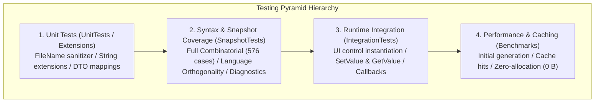

# 07. Test specification

This document specifies the formal testing standards for the `DependencyPropertyGenerator` (`Kassyi.Generators.DependencyProperty`). It defines the multi-tier testing strategy, quality targets, combinatorial matrix parameters, test case catalogs, execution environments, and strict verification criteria. All test IDs map directly to the C# `TestCategoryNames` constants.

---

## 1. Test strategy and architecture

This architecture uses a 4-tier test pyramid to rigorously validate the Roslyn Source Generator across compile-time metaprogramming, cross-platform environments, incremental caching, and runtime execution.



### 1.1 Test project directory

| Tier | Project name | Responsibilities | Primary technologies |
| :--- | :--- | :--- | :--- |
| **Unit tests** | `Tests.Extensions` / Unit | Validates utility logic, file sanitization, and boundary string extensions. | MSTest |
| **Syntax and generation** | `SnapshotTests` | Verifies C# language orthogonality, full combinatorial matrix, and Roslyn diagnostics. | MSTest, Verify.MSTest, Roslyn Testing |
| **Runtime integration** | `IntegrationTests` | Tests runtime execution and state transitions on actual UI controls. | MSTest, Avalonia (Headless and real instances) |
| **Performance and cache** | `Benchmarks` | Measures initial throughput, incremental pipeline cache hits, and memory allocations. | BenchmarkDotNet, MemoryDiagnoser |

---

## 2. Test environment and preconditions

> [!WARNING]
> Source Generators are highly sensitive to environment variations (OS, path separators, line endings). You must run and validate all tests against the specified multi-platform conditions to ensure compliance.

### 2.1 Target platforms and runtimes

The target host OS and environment conditions are as follows:

- **Windows**: Windows Server or Windows 11 (Line endings: `CRLF`, Path separator: `\` or entity reference `&#92;`)
- **Linux**: Ubuntu Latest (Line endings: `LF`, Path separator: `/`)
- **macOS**: macOS Latest (Line endings: `LF`, Path separator: `/`)

The build requires the .NET 9.0 SDK and uses C# 13.0 Preview language features.
The generator targets WPF (.NET Framework 4.8 / .NET Core 3.1 / .NET 5 through 9), Uno Platform (UWP and WinUI), .NET MAUI (.NET 7.0+), and Avalonia UI (11.0+).

### 2.2 Test isolation and concurrency

All compilation tests run purely in-memory via `CSharpCompilation` without relying on disk states or shared mutable statics. The test runner tears down generator instances and syntax trees independently per test case, guaranteeing thread safety under MSTest `[Parallelize]` configurations.

---

## 3. Quantitative quality targets and pass criteria

| Metric | Target | Pass criteria and remarks |
| :--- | :--- | :--- |
| **Line coverage** | **>= 90%** | Measures the coverage of the core generator engine (`Kassyi.Generators.DependencyProperty`). |
| **Branch coverage** | **>= 85%** | Evaluates coverage across attribute parsing, type inference, and syntax branches. |
| **Full matrix coverage** | **100% (576/576)** | Validates all valid permutations of parameters and modifiers. |
| **Compilation errors** | **0 errors** | Ensures a `Severity = Error` count of zero across all generated code. |
| **Incremental latency** | **<= 0.5 ms** | Measures pipeline cache-hit execution latency during non-structural edits. |
| **Cache heap allocations** | **0 bytes** | Requires exactly zero GC heap allocation during incremental cache hits. |

---

## 4. Full combinatorial matrix specification (`CombinatorialMatrixTests`)

The test suite validates all permutations of dependency property attributes and class definitions. It executes **576 independent test cases** via MSTest `[DynamicData]` (Category: `Matrix`, Test ID: `Matrix-001`).

### 4.1 Factors and levels

- **Framework (5)**: `Wpf`, `Uno`, `UnoWinUi`, `Maui`, `Avalonia`
- **AttrType (2)**: `Normal`, `Attached`
- **ClassMode (4)**: `PublicClass`, `InternalGenericClass`, `PublicRecord`, `StaticClass`
- **PropType (4)**: `Int`, `NullableInt`, `String`, `GenericList`
- **ReadOnlyMode (2)**: `False`, `True`
- **DefaultMode (3)**: `None`, `Literal`, `Expression`
- **DirectMode (2)**: `False`, `True`

### 4.2 Exclusion constraints

> [!NOTE]
> Framework limitations explicitly exclude certain permutations:
>
> - `DirectMode.True` is only valid with `Framework.Avalonia` and `AttrType.Normal`.
> - `PublicRecord` and `StaticClass` are restricted to `AttrType.Attached`.
> - To prevent reference-sharing bugs (`DPG0004`), `PropType.GenericList` strictly requires `DefaultMode.None`.

---

## 5. Language feature orthogonality specification (`LanguageFeatureTests`)

The suite verifies that the generator output does not interfere with C# language features (C# 8.0 through C# 13.0) (Category: `Language`).

_(Note: The exhaustive list of 32 language feature tests remains architecturally identical to the previous specification.)_

---

## 6. Feature-specific component specifications (`SnapshotTests`)

### 6.1 Attached properties (`Attached`)

Validates attached property constraints and callback wiring.

- **Attached-002**: Restricts `Set` accessor visibility to `internal` or `private` when `IsReadOnly = true`.
- **Attached-003**: Constrains target parameter typing based on `BrowsableForType`.
- **Attached-008**: Prevents circular references during self-referential generic typing.

### 6.2 Routed events (`Routed`)

Validates event generation based on the WPF routing infrastructure.

- **Routed-003**: Prevents duplicate `public static partial class` modifiers on static classes.
- **Routed-006**: Selectively suppresses `CS0436` conflicts for generated attributes.

### 6.3 Weak events (`Weak`)

Validates weak event manager code generation to prevent memory leaks.

### 6.4 Metadata overrides and property sharing (`Metadata`)

Validates metadata rewriting (`OverrideMetadata`) and shared properties (`AddOwner`) across inheritance trees.

### 6.5 Documentation consistency (`Doc`)

- **Doc-001**: Guarantees all code blocks in `README.md` compile and generate cleanly.

---

## 7. Negative and diagnostic specification (`Error`)

> [!IMPORTANT]
> The generator must emit clean compile-time diagnostics (for example, `DPG0001`, `DPG0004`) for invalid user input without crashing the pipeline (Test Category: `Error`).

| Test ID | Diagnostic ID | Severity | Trigger condition |
| :--- | :--- | :--- | :--- |
| **Error-001** | `DPG0001` | Error | Non-existent or invalid signature for an explicit `OnChanged` callback |
| **Error-004** | `DPG0003` | Error | Using a `ref struct` type as a property type |
| **Error-005** | `DPG0004` | Error | Reference type default value without a callback or expression |
| **Error-010** | `DPG0007` | Error | Callback matching the naming convention but with an unsupported signature |

---

## 8. Runtime integration specification (`Integration`)

Tests verify that the generated code builds into functional assemblies and operates correctly within live Avalonia and WinUI environments.

- **Integration-001 (State)**: Setting a value securely updates the `GetValue(...)` return.
- **Integration-002 (Callbacks)**: Modifications strictly invoke the `partial void OnIsSpinningChanged(...)` method.
- **Integration-004 (Coerce)**: Verifies values are correctly clamped to prevent infinite loops or re-entrancy.

---

## 9. Performance and incremental cache specification (`Benchmarks`)

> [!TIP]
> Validates sub-millisecond responsiveness during IDE keystrokes using `BenchmarkDotNet`.
>
> - **Perf-001**: Execution latency must remain <= 0.5 ms during cache hits.
> - **Perf-002**: GC heap allocation must be exactly 0 bytes during cache hits.

---

## 10. Unit tests and utilities specification (`UnitTests`)

- **Unit-001 (Sanitization)**: Safely converts invalid filesystem characters (`<`, `>`, `?`) to `_`.
- **Unit-002 (Extensions)**: Securely handles edge cases when injecting the `global::` namespace prefix.

---

## 11. Quality assurance and CI protocol

### 11.1 CI pipeline automation

The CI pipeline runs unconditionally across Windows, Ubuntu, and macOS.

```powershell
dotnet test Kassyi.Generators.DependencyProperty.sln --configuration Release
```

### 11.2 Pull request standards

PRs must pass `CombinatorialMatrixTests` (576 cases) and all `IntegrationTests`. Any `.verified.cs` snapshot diffs require mandatory reviewer approval.

---

## 12. Troubleshooting and testing guide for agents

> [!TIP]
> **Agentic ground truth**
> Autonomous agents (AI assistants) modifying tests must strictly follow these structural boundaries.

- **Compilation and output malformations**: Add a test to `SnapshotTests` (for example, `AttachedTests.cs`) and update the `.verified.cs` snapshot.
- **Runtime and event failures**: Add a test to `IntegrationTests`. Instantiate the actual UI control and assert `GetValue` and `SetValue` behaviors directly.
- **New language features and attributes**: Expand the `CombinatorialMatrixTests` factors. Apply `yield break` constraints if permutations explode redundantly.
- **Diagnostics modifications**: Add tests to `ErrorTests.cs`. Verify only the emitted `Diagnostic` count and message; **do not** assert source generation, as generation is structurally bypassed upon errors.
