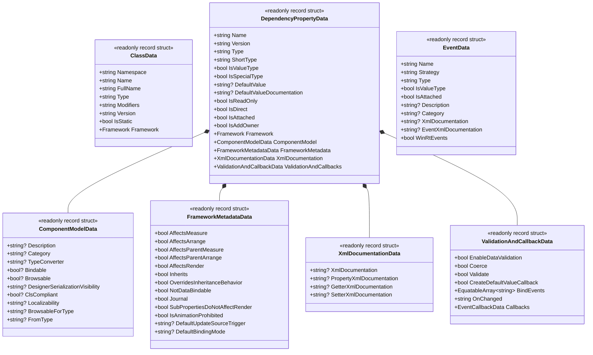

# 01. 基盤とドメイン (Foundation & Domain)

[English](../en/01_foundation_and_domain.md) | [日本語](./01_foundation_and_domain.md) | [目次 (Intro)](./intro.md)

## Ⅰ. 目的と設計思想 (Purpose & Philosophy)

**DependencyPropertyGenerator** (`Kassyi.Generators.DependencyProperty`) の主な目的は、WPF, UWP, WinUI, Uno, Avalonia, MAUI といった複数の .NET UI フレームワーク向けに、**ボイラープレート（定型コード）が多くなりがちな依存関係プロパティ (DependencyProperty) やルーティングイベント (RoutedEvent)、弱イベント (WeakEvent) の宣言コードを自動生成** することです。

### モジュール構成
- **`Kassyi.Generators.DependencyProperty`**: Roslyn Incremental Source Generator 本体。コンパイル時にメタデータを抽出し、各UIフレームワーク向けのソースコードを生成します。
- **`Kassyi.Generators.DependencyProperty.Attributes`**: 開発者がコード上で付与する宣言属性 (`[DependencyProperty]`, `[AttachedDependencyProperty]`, `[RoutedEvent]`, `[WeakEvent]` 等) を提供します。
- **`Kassyi.Generators.Extensions`**: ソースジェネレーター共通のゼロアロケーション基盤（`SourceWriter`, `EquatableArray<T>`, `HashCode` 等）を提供するコアライブラリです。

### 技術的制約と方針
- **Roslyn Incremental Source Generator**: `.NET Standard 2.0` をターゲットとし、インクリメンタルな変更（タイピング中の差分評価）に対して高速かつ超低アロケーションで動作することが求められます。
- **ターゲットUIフレームワークの吸収**: 複数のUIフレームワーク（`Framework` enum等で管理）ごとのAPI差異をジェネレーター内部で吸収し、単一の属性 (`[DependencyProperty]`) から適切なコードを生成します。
- **`partial` クラスとメソッドの活用**: 生成されるコードは `partial` クラスとして追加され、イベントフック用の `partial void On...Changed(...)` メソッドなどを提供します。

---

## Ⅱ. ユビキタス言語辞書 (Glossary)

ジェネレーターのコードベース全体で統一されている用語定義です。

| 日本語名 | 英語名 (Code) | 説明 |
|---|---|---|
| UIフレームワーク | `Framework` | WPF, Uno, MAUI, Avalonia, WinUI などの対象プラットフォームを識別する列挙型 |
| 依存関係プロパティ | `DependencyProperty` | UIコントロールが状態を保持・データバインディングするための拡張プロパティ機構 |
| 添付プロパティ | `AttachedDependencyProperty` | 子要素から親要素などに値を設定するためのプロパティ機構 |
| クラスデータ | `ClassData` | 属性が付与された対象クラス（オーナー）のメタデータ（型名、名前空間、修飾子等） |
| プロパティデータ | `DependencyPropertyData` | 生成するプロパティ固有の完全なメタデータを統括するルートデータモデル |
| コンポーネントモデルデータ | `ComponentModelData` | `[Description]`, `[Category]`, `[TypeConverter]` などのUI/デザイナ向けメタデータ |
| フレームワークメタデータ | `FrameworkMetadataData` | WPF等の `FrameworkPropertyMetadataOptions`（`AffectsMeasure` 等）の設定 |
| バリデーション＆コールバック | `ValidationAndCallbackData` | 検証、型強制 (Coerce)、変更コールバック (`OnChanged`) などの振る舞い設定 |
| イベントデータ | `EventData` | ルーティングイベント (`RoutedEvent`) や弱イベント (`WeakEvent`) のメタデータ |

---

## Ⅲ. ドメイン & データ構造仕様 (Domain & Data Models)

Roslynの `SyntaxNode` や `ISymbol` から情報を抽出し、インクリメンタル・パイプラインを流れる純粋なデータモデル (DTO) です。これらは **キャッシュ効率を高めるため、すべて `readonly record struct` で定義され、`IEquatable<T>` による厳密な等価性比較をサポート** します。

### メインデータモデル (Mermaid クラス図)

### データ構造の設計方針
- **責務ごとの構造化分割**: 多数のプロパティを持つ `DependencyPropertyData` を、コンポーネントモデル、UIメタデータ、XMLドキュメント、バリデーション＆コールバックといったサブモデルに構造化し、保守性と見通しを向上させています。
- **プリミティブ型への早期変換**: Roslynの `INamedTypeSymbol` や `IPropertySymbol` をそのまま保持するとメモリリークを引き起こし、ジェネレーターのキャッシュが無効化されます。そのため、抽出フェーズで必ず `string` や `bool` などのプリミティブ型、または `EquatableArray<T>` に変換します。
- **コレクションの等価性**: コレクションデータ（例: `BindEvents`）は標準の配列や `List<T>` ではなく、構造的な等価性を保証する `EquatableArray<T>` (カスタム実装) を使用します。
