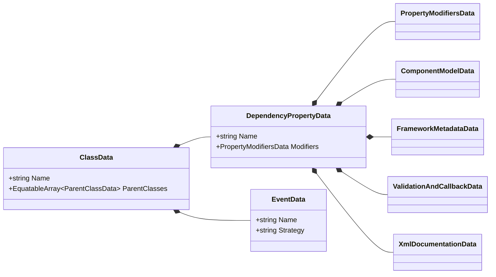
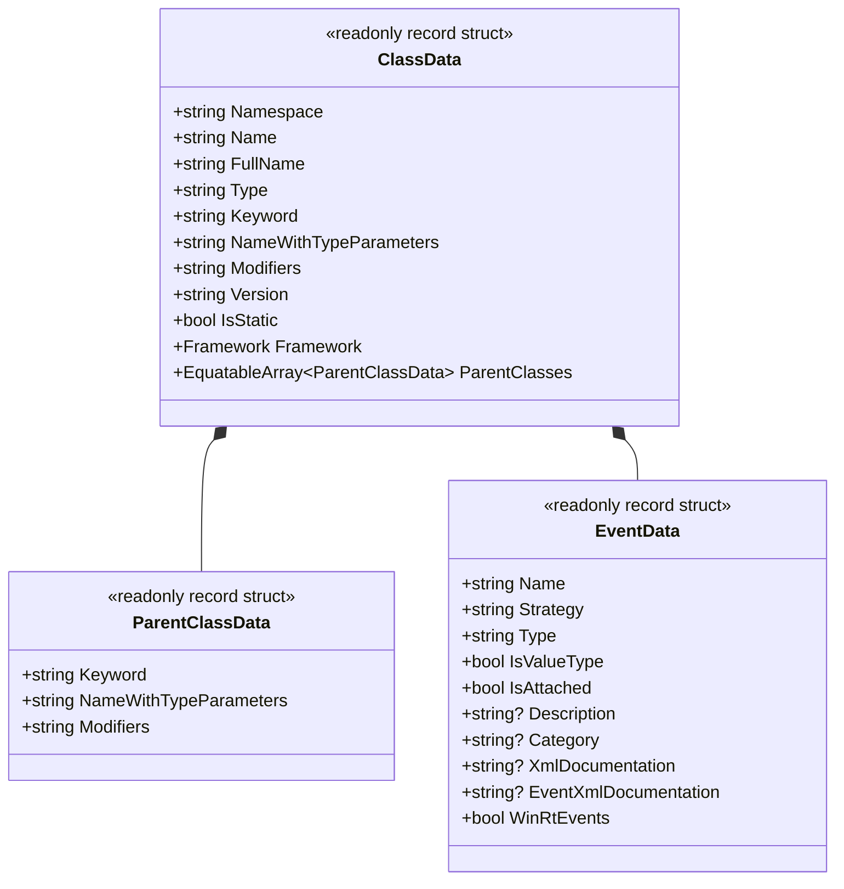
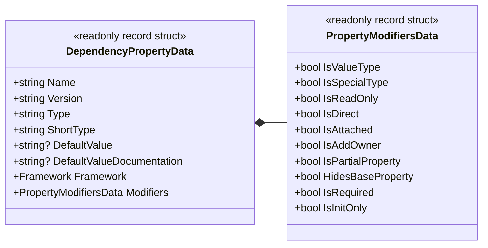
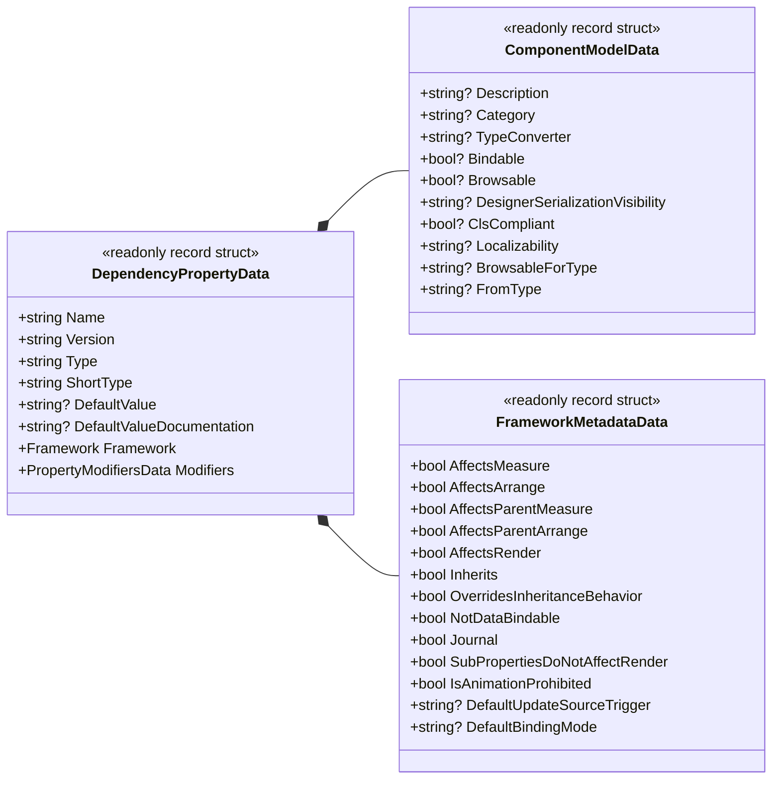
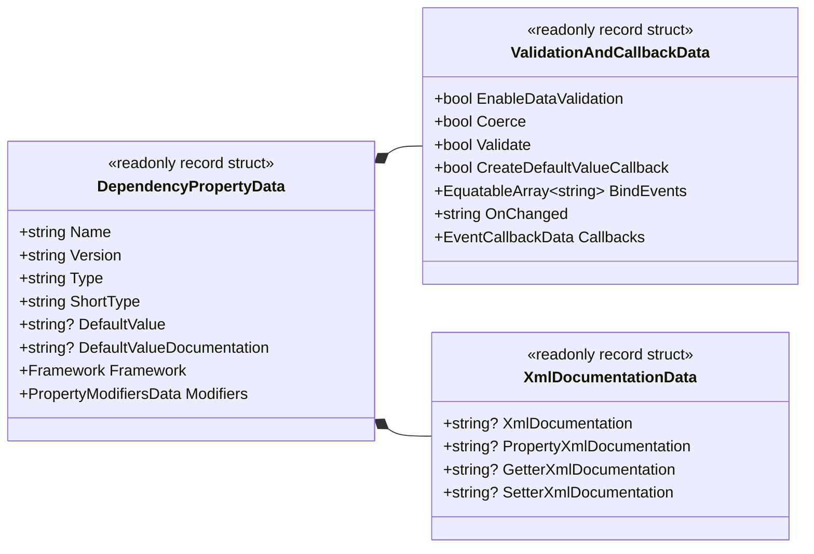

# 02. 基盤とドメイン

[English](../en/02_foundation_and_domain.md) | [日本語](./02_foundation_and_domain.md)
前へ: [⬅ 01. 建築設計思想と FAQ](./01_faq_and_rationale.md) | [目次 (Intro)](./intro.md) | 次へ: [03. パイプライン構造 ➡](./03_pipeline_architecture.md)

## Ⅰ. 目的とアーキテクチャ

**DependencyPropertyGenerator** (`Kassyi.Generators.DependencyProperty`) の主要なアーキテクチャ目標は、複数の .NET UI フレームワーク間で、依存関係プロパティ (DependencyProperty)、ルーティングイベント (RoutedEvent)、および弱イベント (WeakEvent) の宣言に関わるボイラープレートコードを自律的に合成することである。サポート対象のプラットフォームには、WPF、UWP、WinUI、Uno、Avalonia、および MAUI が含まれる。

### モジュールトポロジー

- **`Kassyi.Generators.DependencyProperty`**: Roslyn Incremental Source Generator のコア。このモジュールはコンパイル時にメタデータを抽出し、フレームワーク固有の C# ソースコードを出力する。
- **`Kassyi.Generators.DependencyProperty.Attributes`**: 開発者が利用する宣言属性（`[DependencyProperty]`, `[AttachedDependencyProperty]`, `[RoutedEvent]` 等）を提供する。
- **`Kassyi.Generators.Extensions`**: ゼロアロケーション基盤を提供するコアユーティリティライブラリ。ソースジェネレーター間で共有される `SourceWriter` や `EquatableArray<T>` などのプリミティブを公開する。

### 技術的制約とポリシー

- **インクリメンタル評価:** Roslyn Incremental Source Generator は `.NET Standard 2.0` をターゲットとする。IDE 内でのインクリメンタルな評価時には、高速な実行と超低メモリ割り当てが強制される。
- **フレームワークの抽象化:** ジェネレーターは、UI フレームワーク間の API の差異を内部で抽象化する。単一の統合された属性 (`[DependencyProperty]`) から、プラットフォームに準拠したコードを合成する。
- **Partial クラスによる合成:** 生成されたコードは `partial` クラス修飾子を介して追加されるようアーキテクチャで規定されている。イベントフック専用として `partial void On...Changed(...)` メソッドを公開する。

### 対応 C# 言語バージョンおよびランタイム要件

| 区分                        | バージョン            | 概要およびサポート機能                                                               |
| :-------------------------- | :-------------------- | :----------------------------------------------------------------------------------- |
| **ジェネレーター実行基盤**  | **.NET Standard 2.0** | Roslyn 4.3.0 以降（.NET SDK 6.0 ～ 9.0+）環境のコンパイラパイプラインで動作。        |
| **最小サポート (Base)**     | **C# 8.0+**           | 非ジェネリック属性宣言（`typeof(T)` 引数）、null 許容参照型、標準プロパティの出力。  |
| **式展開サポート**          | **C# 9.0+**           | `DefaultValueExpression = "new(...)"` による Target-Typed new 式の自動展開。         |
| **ジェネリック属性 (推奨)** | **C# 11.0+**          | `[DependencyProperty<T>]`, `[RoutedEvent<T>]` などのジェネリック属性構文。           |
| **最新機能サポート**        | **C# 13.0 (Preview)** | `partial` プロパティ構文 (`public partial int Value { get; set; }`) の完全サポート。 |

---

## Ⅱ. ユビキタス言語辞書

以下の用語は、ジェネレーターの内部コードベースを厳格に管理する。

| 日本語名                     | 英語名 (Code)                | 説明                                                                               |
| ---------------------------- | ---------------------------- | ---------------------------------------------------------------------------------- |
| UIフレームワーク             | `Framework`                  | WPF, Uno, MAUI, Avalonia, WinUI などの対象プラットフォームを識別する列挙型。       |
| 依存関係プロパティ           | `DependencyProperty`         | UIコントロールが状態を保持・データバインディングするための拡張プロパティ機構。     |
| 添付プロパティ               | `AttachedDependencyProperty` | 子要素から親要素などに値を設定するためのプロパティ機構。                           |
| クラスデータ                 | `ClassData`                  | 属性が付与された対象クラス（オーナー）のメタデータ。                               |
| プロパティデータ             | `DependencyPropertyData`     | 生成対象プロパティの完全なメタデータをカプセル化するルートデータモデル。           |
| コンポーネントモデルデータ   | `ComponentModelData`         | `[Description]`, `[Category]`, `[TypeConverter]` などのUI/デザイナ向けメタデータ。 |
| フレームワークメタデータ     | `FrameworkMetadataData`      | WPF等の `FrameworkPropertyMetadataOptions`（`AffectsMeasure` 等）の設定。          |
| バリデーション＆コールバック | `ValidationAndCallbackData`  | 検証、型強制 (Coerce)、変更コールバック (`OnChanged`) などの振る舞い構成。         |
| イベントデータ               | `EventData`                  | ルーティングイベント (`RoutedEvent`) や弱イベント (`WeakEvent`) のメタデータ。     |

---

## Ⅲ. ドメインデータモデル

これらの純粋なデータモデル (DTO) は、Roslyn の `SyntaxNode` および `ISymbol` 構造体から抽出され、インクリメンタルパイプラインを流れる。

> [!IMPORTANT]
> キャッシュ効率を最大化するため、すべての DTO は厳密に `readonly record struct` として定義されなければならない。また、`IEquatable<T>` を介した厳密な等価性比較をサポートする必要がある。

### データ構造の設計方針

- **責務による構造的分離:** `DependencyPropertyData` は多数のプロパティをカプセル化する。これは、コンポーネントモデル、UI メタデータ、XML ドキュメント、バリデーション/コールバック、およびプロパティ修飾子フラグ (`PropertyModifiersData`) を含むサブモデルに分割される。この分割により保守性が強制される。
- **早期プリミティブ投影とコレクション等価性:** メモリリーク防止とキャッシュヒット率最大化のため、Roslyn 型を直接保持せずプリミティブ型や `EquatableArray<T>` へ投影する。詳細なパフォーマンス要件は **[05. コード生成とパフォーマンス最適化 (Ⅳ. パフォーマンス最適化ルール)](./05_synthesis_and_performance.md#ⅳ-パフォーマンス最適化ルール)** を参照のこと。

### メインデータモデル (DTO)

#### 0. 全体アーキテクチャモデル (Comprehensive Architecture Model)

ジェネレーターを構成する全体的なクラスの依存関係を示す。個別のモデルの詳細は後述のサブセクションを参照。

#### 1. クラスおよびイベント構造モデル (`ClassData` / `EventData`)

#### 2. 依存関係プロパティのコア構造 (`DependencyPropertyData`)

#### 3. フレームワークメタデータと UI コンポーネントモデル

#### 4. バリデーション、コールバック、XML ドキュメント

---

## Ⅳ. エージェント向け DTO マッピング仕様

本セクションでは、C# 属性と対応する Data Transfer Object プロパティ間の明示的なマッピングを文書化する。

> [!TIP]
> 自律型エージェントおよび AI アシスタントは、バグ修正や機能追加を実行する際、この仕様を正とすべき構造的な基準として利用しなければならない。

### `[DependencyProperty]` 属性マッピング

ユーザーコード内で定義された属性は、`DependencyPropertyDataBuilder.cs` および `PrepareData.cs` によってパースされる。抽出されたデータは対応する DTO フィールドに格納される。

#### 1. ルート属性 (DependencyPropertyData & PropertyModifiersData)

| 属性引数 / プロパティ       | DTO の格納先フィールド                | 型        | 説明                                                                                 |
| --------------------------- | ------------------------------------- | --------- | ------------------------------------------------------------------------------------ |
| 型引数 `<T>`                | `DependencyPropertyData.Type`         | `string`  | プロパティの型（完全修飾名展開済み）。                                               |
| 第1引数 (コンストラクタ)    | `DependencyPropertyData.Name`         | `string`  | 依存関係プロパティの名称 (例: `"Text"`)。                                            |
| `DefaultValue`              | `DependencyPropertyData.DefaultValue` | `string?` | 文字列リテラル等のデフォルト値。                                                     |
| `DefaultValueExpression`    | `DependencyPropertyData.DefaultValue` | `string?` | `new()` 等のC#式によるデフォルト値。                                                 |
| `IsReadOnly`                | `Modifiers.IsReadOnly`                | `bool`    | `true` の場合 `DependencyPropertyKey` を使って読み取り専用プロパティとして生成する。 |
| `IsDirect`                  | `Modifiers.IsDirect`                  | `bool`    | Avalonia固有。直接プロパティとして生成するかを示す。                                 |
| (プロパティの partial 修飾) | `Modifiers.IsPartialProperty`         | `bool`    | C# 13 partial プロパティ構文のターゲットであるかを示す。                             |
| (new 修飾の付与)            | `Modifiers.HidesBaseProperty`         | `bool`    | 基本クラスのメンバーを明示的に隠蔽する (`new` キーワード)。                          |

#### 2. ValidationAndCallbackData へのマッピング

| 属性引数 / プロパティ | DTO の格納先フィールド              | 型                       | 説明                                                  |
| --------------------- | ----------------------------------- | ------------------------ | ----------------------------------------------------- |
| `OnChanged`           | `ValidationAndCallbacks.OnChanged`  | `string`                 | カスタム変更コールバックメソッド名。                  |
| `Coerce`              | `ValidationAndCallbacks.Coerce`     | `bool`                   | 強制値補正 (CoerceValueCallback) を生成するかを示す。 |
| `Validate`            | `ValidationAndCallbacks.Validate`   | `bool`                   | 検証 (ValidateValueCallback) を生成するかを示す。     |
| `BindEvents`          | `ValidationAndCallbacks.BindEvents` | `EquatableArray<string>` | 結線するコントロールイベントのリスト。                |

#### 3. ComponentModelData へのマッピング

| 属性引数 / プロパティ | DTO の格納先フィールド         | 型        | 説明                                          |
| --------------------- | ------------------------------ | --------- | --------------------------------------------- |
| `Description`         | `ComponentModel.Description`   | `string?` | `[Description("...")]` 属性として生成される。 |
| `Category`            | `ComponentModel.Category`      | `string?` | `[Category("...")]` 属性として生成される。    |
| `TypeConverter`       | `ComponentModel.TypeConverter` | `string?` | `typeof(...)` 形式のコンバータ型名。          |

#### 4. FrameworkMetadataData へのマッピング (WPF用)

| 属性引数 / プロパティ  | DTO の格納先フィールド                 | 型        | 説明                                            |
| ---------------------- | -------------------------------------- | --------- | ----------------------------------------------- |
| `AffectsMeasure`       | `FrameworkMetadata.AffectsMeasure`     | `bool`    | メジャーパス（再レイアウト）を要求する。        |
| `AffectsRender`        | `FrameworkMetadata.AffectsRender`      | `bool`    | レンダリングパス（再描画）を要求する。          |
| `BindsTwoWayByDefault` | `FrameworkMetadata.DefaultBindingMode` | `string?` | デフォルトのバインディングモード (`TwoWay`等)。 |

### `ClassData` および `ParentClassData` へのマッピング

親クラスのコンテキストを定義する情報は、`ClassData` および `ParentClasses` レコードに抽出される。

| 抽出対象                 | DTO の格納先フィールド             | 型                                | 説明                                                     |
| ------------------------ | ---------------------------------- | --------------------------------- | -------------------------------------------------------- |
| 所属する名前空間         | `ClassData.Namespace`              | `string`                          | 外側の `namespace` 宣言。                                |
| クラス名                 | `ClassData.Name`                   | `string`                          | `partial class` や `partial record` の名前。             |
| 型種別キーワード         | `ClassData.Keyword`                | `string`                          | `class`, `struct`, `record class` などの宣言キーワード。 |
| 型引数付き完全名         | `ClassData.NameWithTypeParameters` | `string`                          | `MyControl<T>` などのジェネリクス型シグネチャ。          |
| クラスの修飾子           | `ClassData.Modifiers`              | `string`                          | `public`, `internal`, `sealed` などの修飾子。            |
| `[AvaloniaObject]` 等    | `ClassData.Framework`              | `Framework`                       | 利用フレームワークの種別 (`WPF`, `Avalonia`, etc.)。     |
| 親クラス階層（ネスト時） | `ClassData.ParentClasses`          | `EquatableArray<ParentClassData>` | 外側を囲むネスト親クラスの型名・修飾子リスト。           |

---

前へ: [⬅ 01. 建築設計思想と FAQ](./01_faq_and_rationale.md) | [目次 (Intro)](./intro.md) | 次へ: [03. パイプライン構造 →](./03_pipeline_architecture.md)
