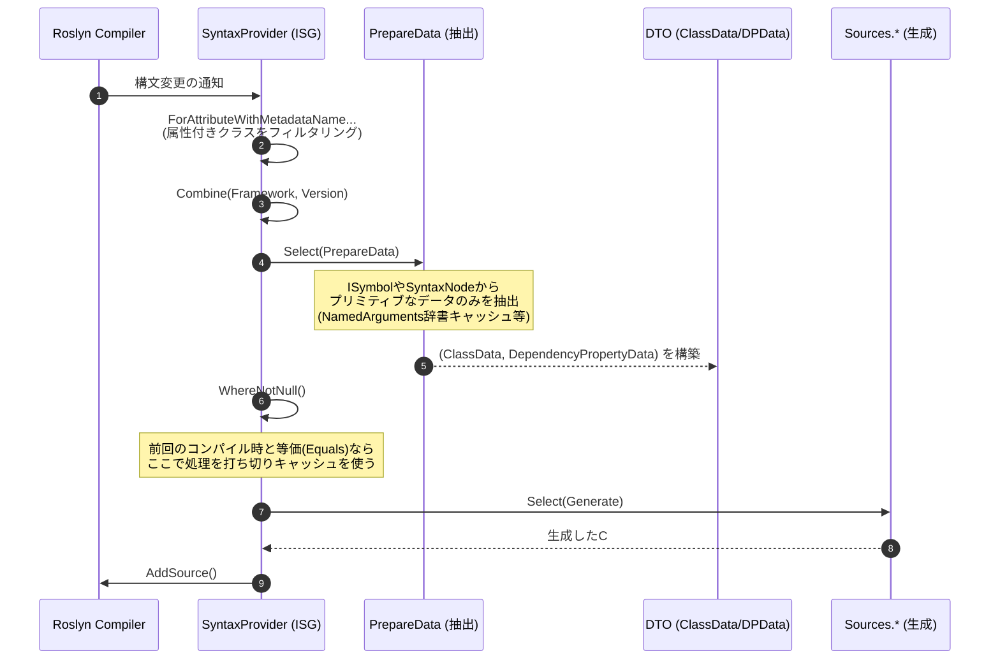
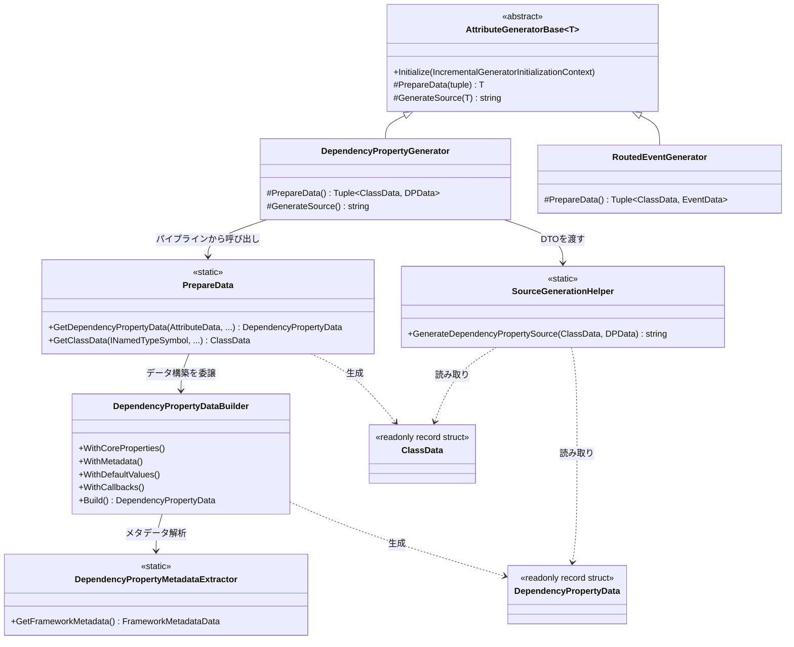
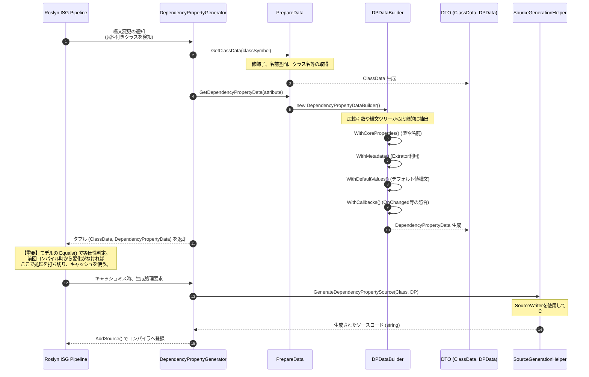

# 02. パイプラインとアーキテクチャ

[English](../en/02_pipeline_architecture.md) | [日本語](./02_pipeline_architecture.md) | [目次](./intro.md)

## Ⅰ. インクリメンタルパイプライン構造

Roslyn Incremental Source Generator (ISG) は、入力である構文ツリーから最終的なソースコード出力までを、LINQのようなパイプラインで処理します。本プロジェクトでは `Kassyi.Generators.Extensions` のヘルパーを利用してパイプラインを簡潔かつ超低アロケーションに構築しています。

### パイプラインの全体フロー

以下の図は、システム全体のパイプライン概念図です。Roslynが提供する `IncrementalValuesProvider<T>` などのAPIを、LINQのように連鎖させていく様子を示しています。なお、生成器の内部で具体的にどのクラスがデータを処理していくのかについては、後述の「第3章 2. 詳細データフロー」で解説します。

### パイプラインの各フェーズ

パイプラインは以下のフェーズで進行します。

1. **構文のフィルタリング (`ForAttributeWithMetadataName`)**
   Roslyn 4.3.0 以降の機能を活用し、特定の属性 (`[DependencyProperty]`, `[AttachedDependencyProperty]`, `[RoutedEvent]`, `[WeakEvent]` など) を付与したクラスやレコードの構文のみを抽出します。
2. **データの抽出 (`PrepareData` / `DependencyPropertyDataBuilder`)**
   抽出した `AttributeData` や `INamedTypeSymbol` から、生成に必要なすべてのメタデータ（型名、デフォルト値、フラグ類）を抽出し、構造化します。この抽出プロセスは `PrepareData.cs` および `DependencyPropertyDataBuilder` が集約して担当します。属性の NamedArguments 解決では辞書のキャッシュ化や重複構文ルックアップの排除を行い、抽出パフォーマンスを最大化しています。
3. **等価性の評価とキャッシュ**
   RoslynのISG基盤は、`Select` の出力が前回と同一（`Equals` が `true`）である場合、後続のパイプライン処理をスキップしてキャッシュを利用します。
4. **ソースコードの生成 (`Sources.*`)**
   キャッシュミスが発生した場合にのみ呼び出され、DTOをもとに最終的な `.g.cs` コード文字列を生成します。`SourceWriter` のスコープ管理機構により、ゼロアロケーションかつ安全に出力します。

---

## Ⅱ. モデルの等価性キャッシュ戦略

インクリメンタルジェネレーターにおいて最も重要なパフォーマンス指標はキャッシュヒット率です。
本プロジェクトでは、ジェネレーター内のデータモデル (`DependencyPropertyData`, `ClassData`, `EventData`, および各種サブモデル) において、以下の設計を徹底しています。

### `readonly record struct` による値の比較

すべてのモデルを `readonly record struct` として定義しています。これにより、C#コンパイラがすべてのプロパティに対する `Equals()` メソッドと `GetHashCode()` を自動生成し、プロパティの「値」に基づく厳密な等価性比較を行います。

### コレクションの等価性担保 (`EquatableArray<T>`)

Roslynパイプラインにおいて、標準の配列 `T[]` や `ImmutableArray<T>` は「参照」で比較されます。そのため、中身が同じであっても参照が異なれば `Equals` が `false` になり、キャッシュが無効化されてしまいます。

これを防ぐため、コレクションデータ（`BindEvents` など）は必ず `EquatableArray<T>` でラップします。

- **実装箇所**: `BindEvents: bindEvents.AsEquatableArray()`
- **効果**: 配列の要素同士を深く比較 (SequenceEqual) します。要素が同じであれば等価とみなすことで、余計なコード再生成を抑制します。

---

## Ⅲ. クラス関係と詳細データフロー

このセクションでは、ジェネレーターにおける**具体的なクラス群の役割・関係性**と、Roslyn パイプライン上を**どのようにデータが流れていくか**を解説します。

### 1. 全体アーキテクチャとクラス関係

ジェネレーターの主要な構成要素は大きく分けて以下の4つの層に分類されます。

1. **Generators (ジェネレーター層)**: Roslynのパイプラインに登録され、全体のフローを制御する。
2. **Data Extraction (データ抽出層)**: 構文(Syntax)と意味モデル(Symbol)から必要なメタデータのみを抽出する。
3. **Models (モデル・DTO層)**: 抽出されたデータを保持する。比較（Equatable）可能な値型レコード。
4. **Sources (ソース生成層)**: DTOを受け取り、実際のC#ソースコード文字列を出力する。

#### 各層の主要クラスの役割

- **`AttributeGeneratorBase<T>`**: インクリメンタルジェネレーターの基盤。パイプラインの `ForAttributeWithMetadataName` によるフィルタリングから、キャッシュ処理、ソース出力までの共通ロジックをカプセル化しています。
- **`PrepareData`**: ジェネレーター層から呼ばれる抽出処理のエントリーポイント。Roslynの `INamedTypeSymbol` や `AttributeData` といった複雑なオブジェクトから、純粋なデータを取り出す拡張メソッド群を提供します。
- **`DependencyPropertyDataBuilder`**: 依存関係プロパティ特有の複雑な抽出（コールバックのシグネチャ照合、デフォルト値の解析、XMLドキュメント抽出など）を段階的に行うビルダー。
- **`ClassData` / `DependencyPropertyData`**: 抽出結果を格納するモデル。インクリメンタルジェネレーターのパフォーマンス（キャッシュヒット率）を最大化するため、すべて `readonly record struct` で実装され、値の等価性が担保されています。
- **`SourceGenerationHelper`**: データモデルを入力として受け取り、`SourceWriter` を利用して `partial class` や `DependencyProperty.Register(...)` のC#ソースコードを組み立てる静的ヘルパー群です。

---

### 2. 詳細なデータフローと内部メソッドの呼び出し

第1章の概念図ではRoslyn APIの連鎖に注目しましたが、こちらの図では視点を変えて、ジェネレーター内部の具体的な実装に着目します。あるクラスに `[DependencyProperty]` 属性が付与されていることを検知してから最終的なC#コードが生成されるまでに、どのクラスがインスタンス化され、どのメソッドが呼ばれるのかという詳細なシーケンスを追っていきます。

### 3. この設計の意図 (なぜこのようなデータフローなのか)

1. **Roslyn型（Symbol/Syntax）の早期切り離し**
   Roslynの構文ツリー(`SyntaxNode`)や意味モデル(`ISymbol`)は巨大なオブジェクトであり、メモリリークの原因になるだけでなく、コンパイラの等価性比較（キャッシュ判定）を阻害します。そのため、`PrepareData` と `Builder` の層で**素早く純粋なC#のプリミティブ型（string, bool 等の DTO）に変換**して切り離しています。
2. **ゼロ・アロケーションへの配慮**
   `SourceGenerationHelper` へデータが渡された後は、Roslynの解析処理は一切行わず、与えられたDTOのデータを元に `StringBuilder` (SourceWriter) で高速にテキストを出力するだけの純粋な関数として動くよう分離されています。
3. **拡張性と単一責任の分離**
   WPF, UWP, Avalonia など複数フレームワークへの対応ロジック（`DependencyPropertyDataBuilder`内）と、ソース生成のロジック（`SourceGenerationHelper`）を分けることで、どちらかが複雑化しても影響を与えないアーキテクチャになっています。
