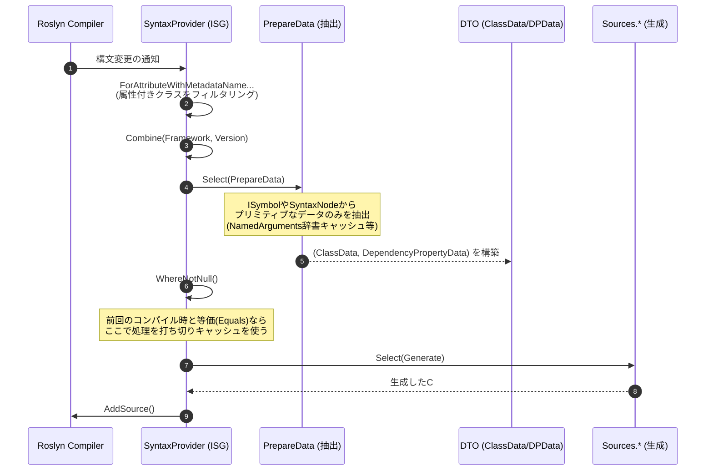

# 02. パイプラインとアーキテクチャ

[English](../en/02_pipeline_architecture.md) | [日本語](./02_pipeline_architecture.md) | [目次 (Intro)](./intro.md)

## Ⅰ. インクリメンタルパイプライン構造

Roslyn Incremental Source Generator (ISG) は、入力である構文ツリーから最終的なソースコード出力までを、LINQのようなパイプラインで処理します。本プロジェクトでは `Kassyi.Generators.Extensions` のヘルパーを利用してパイプラインを簡潔かつ超低アロケーションに構築しています。

### パイプラインフロー

### パイプラインの各フェーズ

パイプラインは以下のフェーズで進行します。

1. **構文のフィルタリング (`ForAttributeWithMetadataName`)**
   Roslyn 4.3.0 以降の機能を活用し、特定の属性 (`[DependencyProperty]`, `[AttachedDependencyProperty]`, `[RoutedEvent]`, `[WeakEvent]` など) を付与したクラスやレコードの構文のみを抽出します。
2. **データの抽出 (`PrepareData` / `DependencyPropertyDataBuilder`)**
   抽出した `AttributeData` や `INamedTypeSymbol` から、生成に必要なすべてのメタデータ（型名、デフォルト値、フラグ類）を抽出し、構造化します。この抽出プロセスは `PrepareData.cs` および `DependencyPropertyDataBuilder` が集約して担当します。属性の NamedArguments 解決では辞書のキャッシュ化や重複構文ルックアップの排除を行い、抽出パフォーマンスを最大化しています。
3. **等価性の評価とキャッシュ**
   RoslynのISG基盤は、`Select` の出力が前回と同一（`Equals` が `true`）である場合、後続のパイプライン処理をスキップしてキャッシュを利用します。
4. **ソースコードの生成 (`Sources.*`)**
   キャッシュミスが発生した場合にのみ呼び出され、DTOをもとに最終的な `.g.cs` コード文字列を生成します。`SourceWriter` のスコープ管理機構により、ゼロアロケーションかつ安全に出力します。

---

## Ⅱ. モデルの等価性キャッシュ戦略

インクリメンタルジェネレーターにおいて最も重要なパフォーマンス指標はキャッシュヒット率です。
本プロジェクトでは、ジェネレーター内のデータモデル (`DependencyPropertyData`, `ClassData`, `EventData`, および各種サブモデル) において、以下の設計を徹底しています。

### `readonly record struct` による値の比較
すべてのモデルを `readonly record struct` として定義しています。これにより、C#コンパイラがすべてのプロパティに対する `Equals()` メソッドと `GetHashCode()` を自動生成し、プロパティの「値」に基づく厳密な等価性比較を行います。

### コレクションの等価性担保 (`EquatableArray<T>`)
Roslynパイプラインにおいて、標準の配列 `T[]` や `ImmutableArray<T>` は「参照」で比較されます。そのため、中身が同じであっても参照が異なれば `Equals` が `false` になり、キャッシュが無効化されてしまいます。

これを防ぐため、コレクションデータ（`BindEvents` など）は必ず `EquatableArray<T>` でラップします。
- **実装箇所**: `BindEvents: bindEvents.AsEquatableArray()`
- **効果**: 配列の要素同士を深く比較 (SequenceEqual) します。要素が同じであれば等価とみなすことで、余計なコード再生成を抑制します。
