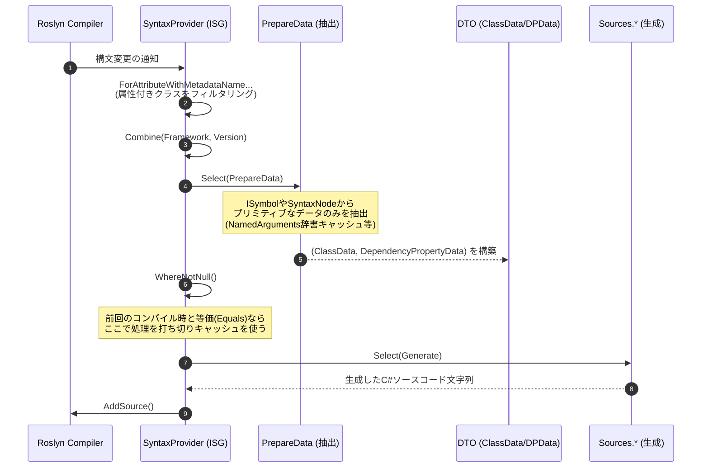
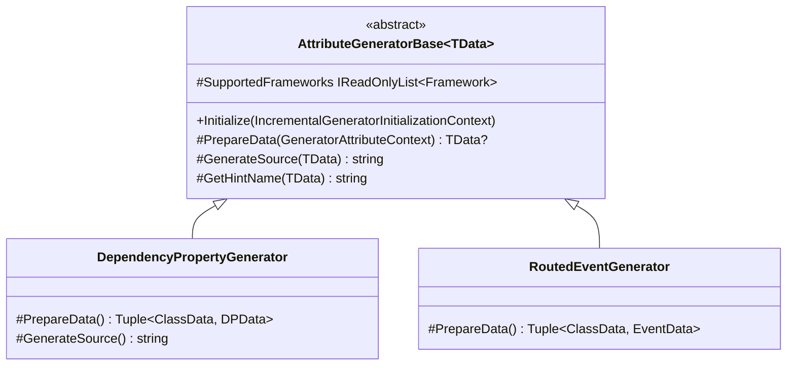
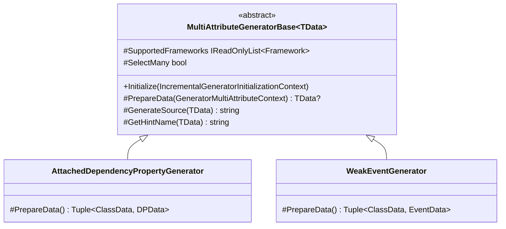
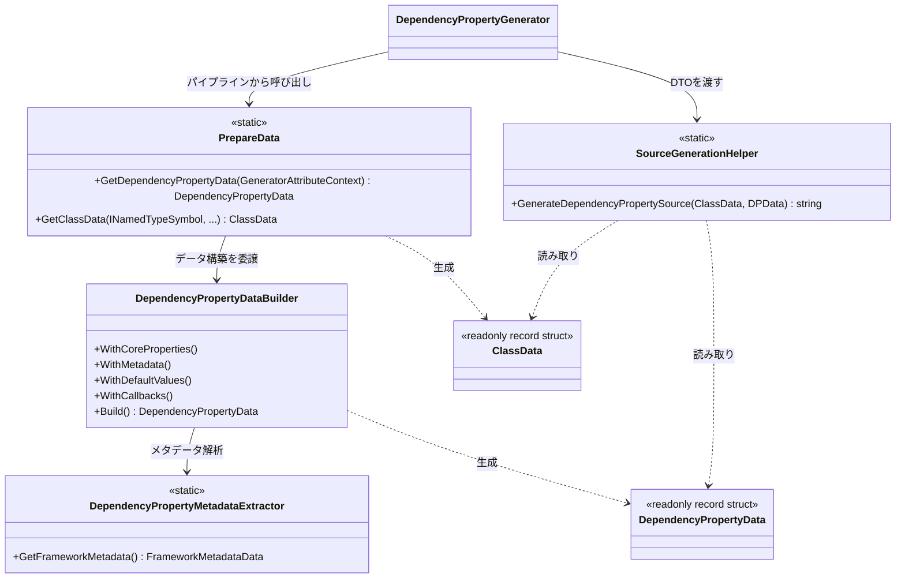
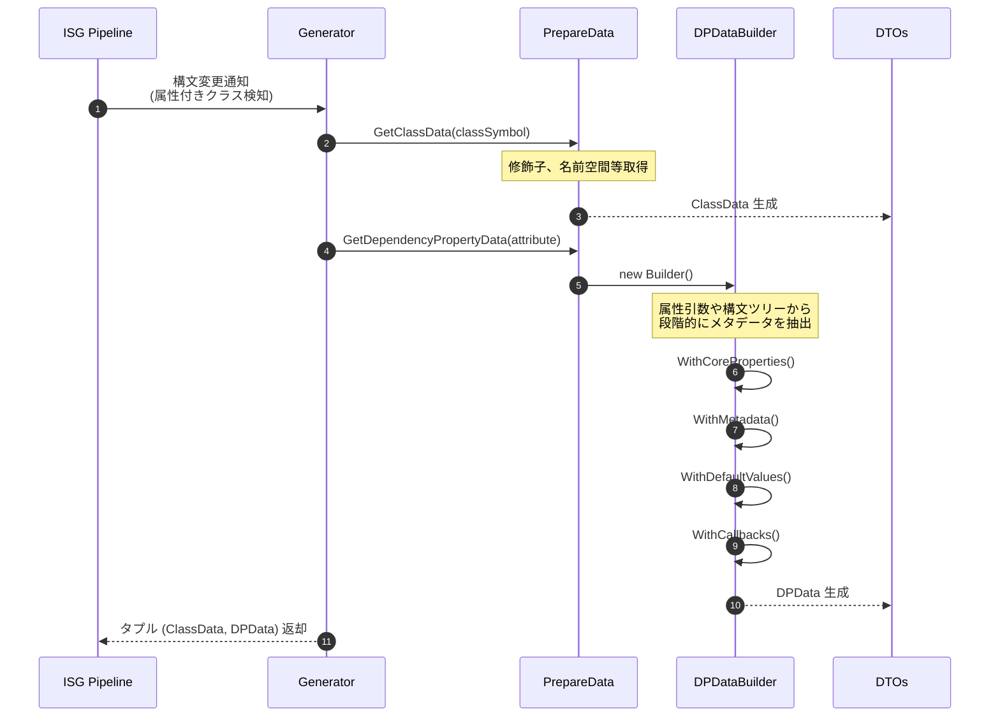
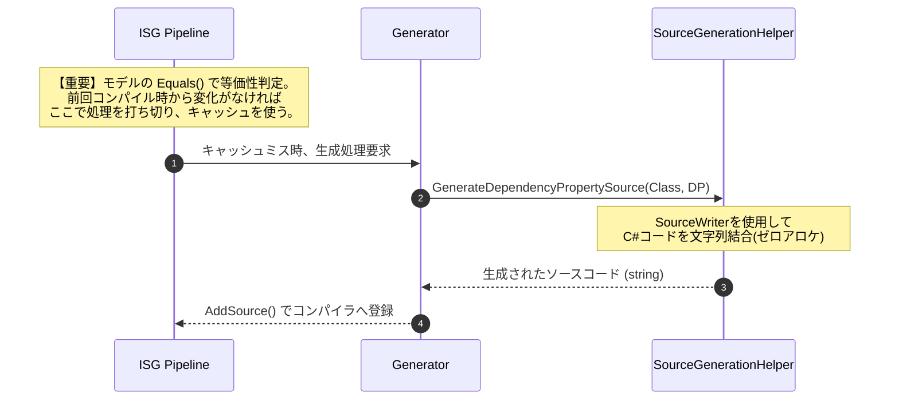

# 03. パイプラインとアーキテクチャ

[English](../en/03_pipeline_architecture.md) | [日本語](./03_pipeline_architecture.md) | [目次](./intro.md)

## Ⅰ. インクリメンタルパイプライン構造

Roslyn Incremental Source Generator (ISG) は、コンパイラからのイベントを入力として受け取り、LINQ のようなパイプラインを介してソースコードを出力へと変換する。本アーキテクチャは `Kassyi.Generators.Extensions` のパイプラインヘルパーを利用し、スリムかつゼロアロケーションの変換を強制する。

### パイプラインの全体フロー

以下のシーケンス図は、システム全体のパイプライン構成を示す。Roslyn が提供する `IncrementalValuesProvider<T>` API の連鎖を図示している。クラス間の具体的な相互作用の詳細については、本章の「Ⅲ. クラス関係と詳細データフロー」を参照のこと。

### パイプラインの各フェーズ

パイプラインの実行は、以下のフェーズに厳密に従って進行する。

1. **構文のフィルタリング:** パイプラインは Roslyn 4.3.0 以降の API (`ForAttributeWithMetadataName`) を活用し、特定の属性が付与されたクラスおよびレコード宣言のみを厳密にフィルタリングする。
2. **データの抽出:** `PrepareData.cs` および `DependencyPropertyDataBuilder` コンポーネントが、生の `AttributeData` や `INamedTypeSymbol` インスタンスを構造化された DTO へと投影する。このフェーズでは、辞書ルックアップによる `NamedArguments` のキャッシュ化や構文検索の重複排除を行い、抽出速度を最大化する。
3. **等価性の評価とキャッシュ:** Roslyn ISG ドライバーは `Select` フェーズの出力を評価する。出力が前回のコンパイルステップと厳密に一致する場合（`Equals` が `true` を返す場合）、後続のソース生成処理をバイパスし、インクリメンタルキャッシュを利用する。
4. **ソースコードの生成:** ジェネレーターはキャッシュミスが発生した場合にのみこのフェーズを呼び出す。DTO を `.g.cs` のソース文字列へと変換する際、`SourceWriter` のスコープ管理を利用してゼロアロケーションのフォーマットを強制する。

---

## Ⅱ. モデルの等価性キャッシュ戦略

インクリメンタルジェネレーターにおける最重要パフォーマンス指標は、インクリメンタルキャッシュのヒット率である。このヒット率を最適化するため、データモデル（`DependencyPropertyData`, `ClassData`, `EventData` およびサブレコード）には厳格な値の等価性セマンティクスが強制される。

> [!IMPORTANT]
> **`readonly record struct` によるディープバリュー比較**
> すべてのモデルは `readonly record struct` として宣言される。これにより、C# コンパイラは基礎となるすべてのフィールドを比較する値ベースの `Equals()` および `GetHashCode()` 実装を自動生成し、厳密な値の等価性が保証される。

> [!WARNING]
> **`EquatableArray<T>` によるコレクションの構造的等価性**
> Roslyn パイプラインにおいて、標準の配列（`T[]`）や `ImmutableArray<T>` は参照による等価性評価を行う。同一のアイテムを持つ新しい配列インスタンスを生成すると、参照等価性チェックが失敗し、コンパイラキャッシュが無効化される。

キャッシュの無効化を回避するため、コレクションは必ず `EquatableArray<T>` でラップされなければならない。

- **実装箇所**: `BindEvents: bindEvents.AsEquatableArray()`
- **効果**: このラッパーは要素ごとのディープな等価性（`SequenceEqual`）を強制する。基盤となるデータが意味的に同一である場合、不要なソース再生成を完全に抑制する。

---

## Ⅲ. クラス関係と詳細データフロー

このセクションでは、ジェネレーターの内部クラスの具体的な責務を規定し、Roslyn パイプラインを通るデータフローの制約を定義する。

### 1. 全体アーキテクチャとクラス関係

ジェネレーターの内部アーキテクチャは、以下の4つの主要なレイヤーに分割される。

1. **Generators (ジェネレーター層):** 実行フローを調整するため Roslyn パイプラインに登録される。
2. **Data Extraction (データ抽出層):** Syntax および Semantic モデルから必要不可欠なメタデータのみを抽出する責務を負う。
3. **Models (モデル・DTO層):** 抽出されたデータを永続化する、等価性を持つ値型レコード。
4. **Sources (ソース生成層):** DTO を受け取り、合成された C# ソースコード文字列を出力する。

#### 1. 単一属性ジェネレーター基底と具象実装 (`AttributeGeneratorBase`)

#### 2. 複数属性ジェネレーター基底と具象実装 (`MultiAttributeGeneratorBase`)

#### 3. データ抽出・モデル (DTO)・ソース生成ヘルパー連携

### 各層の主要クラスの役割

- **`AttributeGeneratorBase<TData>` / `MultiAttributeGeneratorBase<TData>`:** インクリメンタルジェネレーターのコア基盤。構文フィルタリング、ターゲットフレームワークの事前検証（`SupportedFrameworks`）、コンテキストのカプセル化（`GeneratorAttributeContext`）、およびソース出力を含む標準ロジックをカプセル化する。
- **`PrepareData`:** 抽出プロセスのエントリーポイント。`INamedTypeSymbol` などの複雑な Roslyn オブジェクトから純粋なデータを分離するための拡張メソッドを公開する。
- **`DependencyPropertyDataBuilder`:** 依存関係プロパティ特有の抽出（コールバックシグネチャの照合や XML ドキュメントの抽出など）を段階的に実行する内部ビルダー。
- **`ClassData` / `DependencyPropertyData`:** 抽出されたメタデータを永続化するデータモデル。キャッシュパフォーマンスを最大化するため、構造的に `readonly record struct` として実装される。
- **`SourceGenerationHelper`:** データモデルを消費し、`SourceWriter` を利用して最終的な C# ソースコードを組み立てる静的ヘルパー。

---

### 2. 詳細なデータフローと内部メソッドの呼び出し

以下のシーケンス図は、内部の具体的な実行フローをトレースする。`[DependencyProperty]` 属性を検知してから最終的な C# コードが生成されるまでの順序を示し、インスタンス化されるクラスと呼び出されるメソッドを明示的に詳述する。

#### 1. データ抽出フェーズ (Extraction)

#### 2. キャッシュ判定とコード生成フェーズ (Generation)

### 3. アーキテクチャの設計意図

> [!CAUTION]
> **Roslyn 型（Symbol/Syntax）の早期切り離し**
> Roslyn の構文ツリー (`SyntaxNode`) と意味モデル (`ISymbol`) は巨大なオブジェクトである。これらを保持すると深刻なメモリリークが発生し、コンパイラのインクリメンタルキャッシュが根本的に破壊される。`PrepareData` レイヤーはこれらを強制的に C# プリミティブ型 (DTO) に変換し、直ちに切り離さなければならない。

> [!TIP]
> **ゼロアロケーション生成フェーズ**
> 抽出フェーズがデータを `SourceGenerationHelper` に渡した後、すべての Roslyn 解析処理は停止しなければならない。生成フェーズは、提供された DTO のみに基づいて `SourceWriter` を介してテキストを高速に合成する純粋な関数として機能する。

**拡張性と関心事の分離**
フレームワーク固有のマッピングロジック（`DependencyPropertyDataBuilder` 内）をソース生成ロジック（`SourceGenerationHelper`）から隔離することで、パースロジックの変更がゼロアロケーションの生成レイヤーを汚染しないアーキテクチャが保証される。

