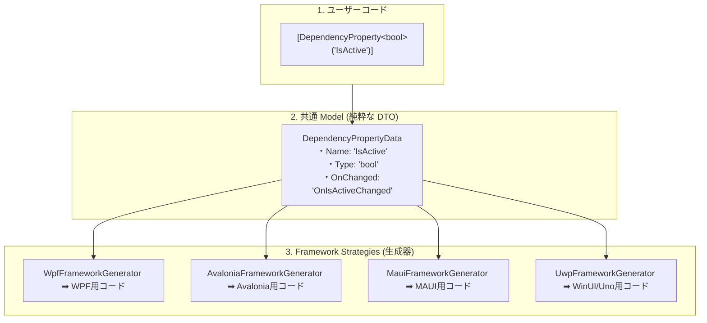

# 04. フレームワーク別生成マッピング仕様

DependencyPropertyGenerator は、単一の `[DependencyProperty]` 属性から、ターゲットとする UI フレームワーク（WPF、UWP、WinUI、Uno、Avalonia、MAUI）に最適化されたボイラープレートコードを動的に生成する。

本文書は、特定のフレームワーク固有のバグを修正したり新機能を追加したりする際に、API マッピングを規定するための正とすべき公式定義として機能する。プラットフォーム間のすべてのアーキテクチャ上の差異は、`Sources/Strategies/` ディレクトリに配置された `IFrameworkGeneratorStrategy` 実装クラス群によって完全に抽象化されている。

---

## I. 統合 DTO と Strategy パターン（Write Once, Run Everywhere）

本ジェネレーターの最大の価値は、「1つの `[DependencyProperty]` 属性を書くだけで、あらゆる XAML UI フレームワーク向けのネイティブコードを自動生成できる」ことにあります。このクロスプラットフォーム性は、データ抽出（解析）とコード出力（生成）を完全に分離するアーキテクチャによって実現されています。

1. **抽出 (Model)**: Roslyn パイプラインは属性を解析し、フレームワークに依存しない純粋な値型 DTO（例: `DependencyPropertyData`）に変換します。
2. **出力 (Strategy)**: `IFrameworkGeneratorStrategy` クラス群は共通 DTO を受け取り、ターゲットプラットフォーム固有のボイラープレートを合成します。

---

## Ⅱ. プロパティ登録 API マッピング

### WPF (`WpfFrameworkGenerator`)

WPF はプロパティシステムの基盤として `System.Windows.DependencyProperty` と `DependencyPropertyKey` を使用する。

- **登録**: `DependencyProperty.Register` または `RegisterAttached` を呼び出す。
- **読み取り専用**: `RegisterReadOnly` および `RegisterAttachedReadOnly` を使用する。
- **メタデータ**: `System.Windows.FrameworkPropertyMetadata` または `PropertyMetadata` を介して管理される。
- **コールバック**: `PropertyChangedCallback`、`CoerceValueCallback`、`ValidateValueCallback` といった専用のデリゲート型を使用して結線される。

> [!NOTE]
> WPF のメタデータ（`FrameworkPropertyMetadata`）は、レイアウト制御やデータバインディング向けの非常に豊富なフラグ（`AffectsMeasure` や `BindsTwoWayByDefault` など）を内包している。ジェネレーターはこれらの WPF 固有のフラグを安全に出力するため、`FrameworkMetadataData` のフィールドを最優先で活用する。

### Avalonia (`AvaloniaFrameworkGenerator`)

Avalonia は `Avalonia.AvaloniaProperty` に基づいて構築され、通常は `StyledProperty<T>`、`AttachedProperty<T>`、または `DirectProperty<T>` としてプロパティを定義する。

- **登録**: `AvaloniaProperty.Register` または `RegisterAttached` を呼び出す。
- **Direct Properties**: `IsDirect` フラグが有効な場合、ジェネレーターはフィールドベースの高速なプロパティアクセス用に専用のジェネリックメソッド `RegisterDirect` を出力する。
- **メタデータ**: 登録メソッドの引数として直接渡されるか、Avalonia 固有のメタデータ機能を使用して管理される。
- **コールバック**: Observable や `AvaloniaPropertyChanged` などのイベントベースのサブスクリプションモデルを介してルーティングされる。

### MAUI (`MauiFrameworkGenerator`)

MAUI は、従来の DependencyProperty ではなく `Microsoft.Maui.Controls.BindableProperty` および `BindablePropertyKey` を利用した独自の型システムを採用している。

- **登録**: `BindableProperty.Create` または `CreateAttached` を介して実行される。
- **読み取り専用**: `CreateReadOnly` または `CreateAttachedReadOnly` を利用する。
- **メタデータ**: 専用のクラスにカプセル化されるのではなく、API の引数としてフラットに渡される。
- **コールバック**: 特定のデリゲート（`BindingPropertyChangedDelegate`、`CoerceValueDelegate`、`ValidateValueDelegate`）にマッピングされる。

### UWP、WinUI、および Uno (`UwpFrameworkGenerator`)

UWP と Uno は `Windows.UI.Xaml.DependencyProperty` に依存するが、WinUI 3 は `Microsoft.UI.Xaml.DependencyProperty` を使用する。

- **登録**: `DependencyProperty.Register` および `RegisterAttached` に厳密に制限される。
- **メタデータ**: `PropertyMetadata` を使用して処理される。
- **コールバック**: `PropertyChangedCallback` のみをネイティブに提供する。

> [!WARNING]
> これらのプラットフォームは、強制補正 (Coerce) や検証 (Validate) 用のネイティブ API を備えていない。ジェネレーターは、プロパティの getter/setter や PropertyChanged イベント自体の内部で手動で値をクランプまたは補正する、専用のフォールバック実装を出力して振る舞いを模倣しなければならない。

---

## Ⅱ. ストラテジーの拡張方針

新しい UI フレームワークのサポートを追加する場合、または破壊的な API の変更（Avalonia v12 など）に対処する場合は、以下のアーキテクチャ原則に厳密に従わなければならない。

> [!IMPORTANT]
> **1. DTO の保護**
> 共有 DTO モデル（`DependencyPropertyData` など）を決して変異させてはならない。プラットフォーム固有のすべての違いは、`Sources/Strategies/` の下にある対応するジェネレータークラス（`XxxFrameworkGenerator.cs` など）のメソッドをオーバーライドすることによって、積極的に隔離および吸収されなければならない。

> [!TIP]
> **2. シグネチャの差異を吸収するためのメソッド抽出**
> メソッド抽出を活用して API シグネチャの差異を解決する。例えば、`GenerateRegisterMethodArguments` メソッドを使用して `Register` メソッドに渡される引数の正確な文字列を構築し、さまざまな引数構成に柔軟に対応する。

> [!NOTE]
> **3. ゼロアロケーション生成規則**
> 文字列生成パス（`SourceWriter`）内での LINQ や不要な `string.Join` の禁止など、厳格なパフォーマンス最適化ルールについては、**[05. コード生成とパフォーマンス最適化 (Ⅳ. パフォーマンス最適化ルール)](./05_synthesis_and_performance.md#ⅳ-パフォーマンス最適化ルール)** を参照のこと。

---

## Ⅲ. フレームワーク自動検出とフォールバック仕様

Roslyn パイプラインの初期化中、ジェネレーターは以下の厳格な優先カスケードを利用してターゲット UI フレームワークを自動的に解決する。

1. **高精度なシンボル検査 (`Compilation.TryRecognizeFramework`)**
   コンパイルコンテキスト内に存在するコアフレームワークの型シンボルを検査する。
    - `Microsoft.Maui.Controls.BindableObject` $\rightarrow$ `Framework.Maui`
    - `Avalonia.AvaloniaObject` $\rightarrow$ `Framework.Avalonia`
    - `Uno.UI.FeatureConfiguration` $\rightarrow$ `Framework.Uno` / `Framework.UnoWinUi`
    - `Microsoft.UI.Xaml.DependencyObject` $\rightarrow$ `Framework.WinUi`
    - `Windows.UI.Xaml.DependencyObject` $\rightarrow$ `Framework.Uwp`
    - `System.Windows.DependencyObject` $\rightarrow$ `Framework.Wpf`

2. **MSBuild プロパティ / コンパイル定数のフォールバック (`AnalyzerConfigOptionsProvider`)**
   シンボルを解決できない場合は、プロジェクトファイル内の `DefineConstants`（`HAS_WPF`、`HAS_WINUI`、`HAS_UWP`、`HAS_UNO`、`HAS_UNO_WINUI`、`HAS_AVALONIA`、`HAS_MAUI`）または `UseMaui` プロパティを検査する。

3. **未認識フレームワークのフォールバック (`Framework.None`)**
   どのフレームワークも一致しない場合、ジェネレーターは安全に `Framework.None` を割り当てる。この状態では、プラットフォーム固有の `using` インポートと登録を選択的にスキップしながら、診断 `DPG0000`（Framework is not recognized）を発行する。コンパイルの失敗を完全に防ぐために、生の属性定義のみを安全に出力する。
   （※ `DPG0000` の発生原因とプロジェクト設定での解決手順については **[08. 診断エラーコード一覧 (DPG0000)](./08_diagnostics_reference.md#dpg0000-framework-is-not-recognized)** を参照）
