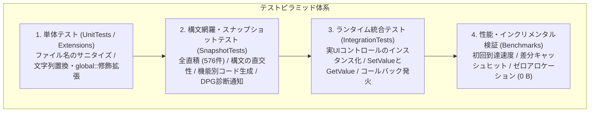

# 05. テスト仕様書 (Test Specification)

本ドキュメントは、DependencyPropertyGenerator におけるテスト戦略、品質目標、直交表パラメータ、テストケース一覧、実行環境、および厳格な合否判定基準を規定する。テスト ID は C# の `TestCategoryNames` 定数と 1対1 でマッピングされる。

---

## 1. テスト戦略と全体体系

本アーキテクチャは、コンパイル時メタプログラミング、クロスプラットフォーム動作、インクリメンタルキャッシュ、および実行時動作にわたって Roslyn Source Generator を徹底的に検証するため、4層のテストピラミッドを強制する。



### 1.1 テストプロジェクト一覧

| レイヤー             | プロジェクト名                | 検証責務                                                             | 主要技術 / ツール                            |
| :------------------- | :---------------------------- | :------------------------------------------------------------------- | :------------------------------------------- |
| **単体テスト**       | `Tests.Extensions` / 内部単体 | ユーティリティ、ファイル名サニタイズ、文字列拡張の境界値を検証する。 | MSTest                                       |
| **構文・生成テスト** | `SnapshotTests`               | C# 構文の直交性、全直積組み合わせ、Roslyn 診断エラー通知を検証する。 | MSTest, Verify.MSTest, Roslyn Testing        |
| **ランタイム統合**   | `IntegrationTests`            | 生成したコードの実 UI コントロール上での動作と状態遷移を検証する。   | MSTest, Avalonia (Headless / 実インスタンス) |
| **性能・キャッシュ** | `Benchmarks`                  | 初回生成速度、IDE 編集時のキャッシュ効率、メモリ割り当てを検証する。 | BenchmarkDotNet, MemoryDiagnoser             |

---

## 2. テスト環境・実行要件

> [!WARNING]
> Source Generator はホスト環境の差異（OS、パス区切り文字、改行コード）に極めて敏感である。コンプライアンスを保証するため、すべてのテストは指定されたマルチプラットフォーム条件下で実行および検証されなければならない。

### 2.1 対象プラットフォーム・ランタイム

テストは Windows（CRLF と &yen; ）、Linux（Ubuntu Latest、LF と `/`）、macOS（macOS Latest、LF と `/`）上で実行される。ビルドには C# 13.0 Preview 構文を含む .NET 9.0 SDK が必須となる。
ジェネレーターのターゲットには、WPF、Uno Platform、.NET MAUI、および Avalonia UI が含まれる。

### 2.2 テストの独立性と並列実行安全性

すべてのコンパイルテストはディスク状態に依存せず、`CSharpCompilation` を介して純粋にインメモリで実行される。ジェネレーターインスタンスはテストケースごとに独立して破棄され、MSTest の `[Parallelize]` 構成下での絶対的なスレッドセーフを保証する。

---

## 3. 定量的品質目標と合否判定基準

| 指標                             | 目標値             | 判定基準 / 備考                                                              |
| :------------------------------- | :----------------- | :--------------------------------------------------------------------------- |
| **行網羅率 (Line Coverage)**     | **>= 90%**         | コア生成エンジン (`Kassyi.Generators.DependencyProperty`) のカバレッジ。     |
| **分岐網羅率 (Branch Coverage)** | **>= 85%**         | 属性解析・型推論・構文分岐のカバレッジ。                                     |
| **全直積テスト網羅率**           | **100% (576/576)** | パラメータと修飾子の有効なすべての順列を検証する。                           |
| **コンパイルエラー数**           | **0 件**           | 生成された全コードにおいて `Severity = Error` 数がゼロであることを保証する。 |
| **差分ビルド遅延**               | **<= 0.5 ms**      | 非構造的編集時のインクリメンタルキャッシュヒットの実行遅延。                 |
| **キャッシュ時 GC 割り当て**     | **0 Bytes**        | インクリメンタルキャッシュヒット時の GC ヒープ割り当てを禁止する。           |

---

## 4. 全直積組み合わせ仕様 (`CombinatorialMatrixTests`)

テストスイートは、依存関係プロパティ属性とクラス定義のすべての順列を厳密に検証する。MSTest `[DynamicData]` を介して **576 個の独立したテストケース** を実行する。（カテゴリ: `Matrix`、テストID: `Matrix-001`）。

### 4.1 因子と水準

- **Framework (5)**: `Wpf`, `Uno`, `UnoWinUi`, `Maui`, `Avalonia`
- **AttrType (2)**: `Normal`, `Attached`
- **ClassMode (4)**: `PublicClass`, `InternalGenericClass`, `PublicRecord`, `StaticClass`
- **PropType (4)**: `Int`, `NullableInt`, `String`, `GenericList`
- **ReadOnlyMode (2)**: `False`, `True`
- **DefaultMode (3)**: `None`, `Literal`, `Expression`
- **DirectMode (2)**: `False`, `True`

### 4.2 組み合わせに関する制約

> [!NOTE]
> フレームワークの制限により、以下の順列は明示的に除外される。
>
> - `DirectMode.True` は `Framework.Avalonia` および `AttrType.Normal` でのみ有効。
> - `PublicRecord` と `StaticClass` は `AttrType.Attached` に制限される。
> - 参照共有バグ（`DPG0004`）を防ぐため、`PropType.GenericList` は厳密に `DefaultMode.None` を要求する。

---

## 5. 構文直交性と言語機能テスト仕様 (`LanguageFeatureTests`)

このスイートは、C# 言語仕様（C# 8.0 ～ 13.0）とジェネレーター出力間の干渉がゼロであることを検証する。（カテゴリ: `Language`）。

_(注: 32個の言語機能テストの詳細リストは、アーキテクチャ上、以前の仕様と同一であるため省略)_

---

## 6. 機能別コンポーネント仕様テスト (`SnapshotTests`)

### 6.1 添付プロパティ仕様 (`Attached`)

添付プロパティの制約とコールバック結線を検証する。

- **Attached-002**: `IsReadOnly = true` の場合、`Set` アクセサの可視性を `internal/private` に制限する。
- **Attached-008**: 自己参照ジェネリック型のインスタンス化中の循環参照を防止する。

### 6.2 ルーティングイベント仕様 (`Routed`)

WPF ルーティングインフラに基づくイベント生成を検証する。

- **Routed-003**: 静的クラス上での重複する `public static partial class` 修飾子を防止する。

### 6.3 ウィークイベント仕様 (`Weak`)

メモリリークを厳格に防止するための弱イベントマネージャーのコード生成を検証する。

### 6.4 メタデータと共有プロパティ (`Metadata`)

継承ツリー全体でのメタデータ書き換え（`OverrideMetadata`）と共有プロパティ（`AddOwner`）を検証する。

### 6.5 ドキュメント整合性 (`Doc`)

- **Doc-001**: `README.md` 内のすべてのコードブロックがコンパイル可能であり、クリーンに生成されることを保証する。

---

## 7. 診断と異常系通知テスト仕様 (`Error`)

> [!IMPORTANT]
> ジェネレーターは、無効なユーザー入力に対して、パイプラインをクラッシュさせることなくクリーンなコンパイル時診断（`DPG0001`、`DPG0004` など）を発行しなければならない。テストカテゴリ: `Error`。

| テストID      | 診断ID    | 重大度 | トリガー条件                                                         |
| :------------ | :-------- | :----- | :------------------------------------------------------------------- |
| **Error-001** | `DPG0001` | Error  | 明示的な `OnChanged` コールバックのシグネチャが存在しないか無効      |
| **Error-004** | `DPG0003` | Error  | プロパティ型として `ref struct` 型を利用している                     |
| **Error-005** | `DPG0004` | Error  | コールバックや式のない参照型のデフォルト値                           |
| **Error-010** | `DPG0007` | Error  | コールバックの命名規則は一致するが、シグネチャがサポートされていない |

---

## 8. ランタイム統合テスト仕様 (`Integration`)

生成されたコードが機能的なアセンブリにビルドされ、Avalonia や WinUI 環境で正しく動作することを検証する。

- **Integration-001 (状態)**: 値の設定が `GetValue(...)` の戻り値を安全に更新する。
- **Integration-002 (コールバック)**: 値の変更が `partial void OnIsSpinningChanged(...)` メソッドを厳密に呼び出す。
- **Integration-004 (強制補正)**: 値が正しくクランプされ、無限ループや再入が強制的に防止されることを検証する。

---

## 9. 性能とインクリメンタルキャッシュ検証仕様 (`Benchmarks`)

> [!TIP]
> `BenchmarkDotNet` を利用して、IDE キーストローク中のサブミリ秒の応答性を検証する。
>
> - **Perf-001**: キャッシュヒット中の実行遅延は <= 0.5 ms に維持されなければならない。
> - **Perf-002**: キャッシュヒット中の GC ヒープ割り当ては正確に 0 Bytes に維持されなければならない。

---

## 10. 単体テストとユーティリティ仕様 (`UnitTests`)

- **Unit-001 (サニタイズ)**: 無効なファイルシステム文字（`<`, `>`, `?`）を安全に `_` に変換する。
- **Unit-002 (拡張機能)**: `global::` 名前空間プレフィックスの挿入時にエッジケースを安全に処理する。

---

## 11. 品質保証とCI運用基準

### 11.1 CI 自動テストパイプライン

CI パイプラインは Windows、Ubuntu、macOS 全体で無条件に実行される。

```powershell
dotnet test Kassyi.Generators.DependencyProperty.sln --configuration Release
```

### 11.2 Pull Request 基準

PR は `CombinatorialMatrixTests`（576 ケース）およびすべての `IntegrationTests` を通過することが義務付けられる。`.verified.cs` のスナップショット差分には、レビュアーの承認が必須となる。

---

## 12. エージェント向け テスト・トラブルシューティングガイド

> [!TIP]
> **Agentic Ground Truth**
> テストを変更する自律型エージェント（AI アシスタント）は、以下の構造的境界に厳密に従わなければならない。

- **コンパイル/出力の異常:** `SnapshotTests` にテストを追加し、`.verified.cs` スナップショットを更新する。
- **ランタイム/イベントの失敗:** `IntegrationTests` にテストを追加する。実際の UI コントロールをインスタンス化し、`GetValue`/`SetValue` の動作を直接アサートする。
- **新しい言語機能/属性:** `CombinatorialMatrixTests` の要因を拡張する。順列が冗長に爆発する場合は `yield break` 制約を適用する。
- **診断の変更:** `ErrorTests.cs` にテストを追加する。発行された `Diagnostic` のカウントとメッセージのみを検証し、ソース生成はエラー時に構造的にバイパスされるため、絶対にアサートしてはならない。
