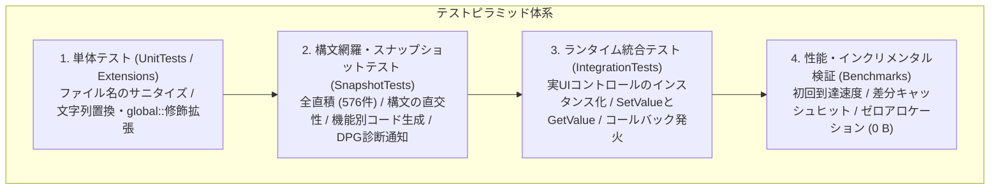

# 07. テスト仕様書 (Test Specification)

本ドキュメントは、DependencyPropertyGenerator におけるテスト戦略、品質目標、直交表パラメータ、テストケース一覧、実行環境、および合否判定基準を定義した正式なテスト仕様書です。テストIDはコード側の `TestCategoryNames` 定数と1対1で対応しています。

---

## 1. テスト戦略と全体体系

本プロジェクトでは、Roslyn Source Generator の特性（コンパイル時メタプログラミング、クロスプラットフォーム動作、インクリメンタルキャッシュ、実行時動作）を包括的に検証するため、4層からなるテストピラミッドを採用しています。



### 1.1 テストプロジェクト一覧

| レイヤー             | プロジェクト名                | 検証責務                                                               | 主要技術 / ツール                            |
| :------------------- | :---------------------------- | :--------------------------------------------------------------------- | :------------------------------------------- |
| **単体テスト**       | `Tests.Extensions` / 内部単体 | ユーティリティ、ファイル名サニタイズ、文字列拡張の境界値を検証します。 | MSTest                                       |
| **構文・生成テスト** | `SnapshotTests`               | C# 構文の直交性、全直積組み合わせ、Roslyn 診断エラー通知を検証します。 | MSTest, Verify.MSTest, Roslyn Testing        |
| **ランタイム統合**   | `IntegrationTests`            | 生成したコードの実 UI コントロール上での動作と状態遷移を検証します。   | MSTest, Avalonia (Headless / 実インスタンス) |
| **性能・キャッシュ** | `Benchmarks`                  | 初回生成速度、IDE 編集時のキャッシュ効率、メモリ割り当てを検証します。 | BenchmarkDotNet, MemoryDiagnoser             |

---

## 2. テスト環境・実行要件

Source Generator はホスト環境の差異（OS、ファイルパス区切り文字、改行コード）に影響を受けやすいため、以下の環境でテストを実行して動作を保証します。

### 2.1 対象プラットフォーム・ランタイム

ホスト OS として、Windows（Windows Server / Windows 11、`CRLF`、`\` パス区切り）、Linux（Ubuntu Latest、`LF`、`/` パス区切り）、macOS（macOS Latest、`LF`、`/` パス区切り）を対象とします。
.NET SDK は、C# 13.0 Preview 構文を含む .NET 9.0 SDK を使用します。
対象の UI フレームワークは以下の通りです。

- WPF (.NET Framework 4.8 / .NET Core 3.1 / .NET 5–9)
- Uno Platform (UWP / WinUI モード)
- .NET MAUI (.NET 7.0+)
- Avalonia UI (StyledProperty / DirectProperty, 11.0+)

### 2.2 テストの独立性と並列実行安全性

全てのコンパイルテストはインメモリ (`CSharpCompilation`) で完結し、ディスク上のファイル状態や共有グローバル変数に依存しません。MSTest の `[Parallelize]` 設定下で競合が発生しないよう、ジェネレーターインスタンスおよびコンパイルツリーはテストケースごとに完全に独立して生成および破棄されます。

---

## 3. 定量的品質目標と合否判定基準

| 指標                             | 目標値             | 判定基準 / 備考                                                                      |
| :------------------------------- | :----------------- | :----------------------------------------------------------------------------------- |
| **行網羅率 (Line Coverage)**     | **90% 以上**       | コア生成ロジック (`Kassyi.Generators.DependencyProperty`) のカバレッジを満たします。 |
| **分岐網羅率 (Branch Coverage)** | **85% 以上**       | 属性解析・型推論・構文分岐を網羅します。                                             |
| **全直積テスト網羅率**           | **100% (576/576)** | 属性引数・型・修飾子の有効な全組み合わせを検証します。                               |
| **コンパイルエラー数**           | **0 件**           | 生成コードを含むコンパイル結果で `Severity = Error` が 0 件であることを確認します。  |
| **差分ビルド遅延**               | **0.5 ms 以下**    | 無関係なコード変更時のインクリメンタルキャッシュヒット時間を測定します。             |
| **キャッシュ時 GC 割り当て**     | **0 Bytes**        | インクリメンタルキャッシュ有効時のヒープアロケーションを防ぎます。                   |

---

## 4. 全直積組み合わせ仕様 (`CombinatorialMatrixTests`)

属性引数および型定義の全直積パターン（**576 ケース**）を動的データ駆動テストとして網羅します。カテゴリ名は `Matrix`、テストIDは `Matrix-001` と定義します。

### 4.1 因子と水準

- **Framework (5)**: `Wpf`, `Uno`, `UnoWinUi`, `Maui`, `Avalonia`
- **AttrType (2)**: `Normal` (通常プロパティ), `Attached` (添付プロパティ)
- **ClassMode (4)**: `PublicClass`, `InternalGenericClass`, `PublicRecord`, `StaticClass`
- **PropType (4)**: `Int` (値型), `NullableInt` (Null許容値型), `String` (参照型), `GenericList` (コレクション)
- **ReadOnlyMode (2)**: `False` (読み書き可能), `True` (読み取り専用)
- **DefaultMode (3)**: `None` (デフォルト値なし), `Literal` (リテラル初期値), `Expression` (式による初期値)
- **DirectMode (2)**: `False`, `True` (Avalonia 固有の DirectProperty)

### 4.2 組み合わせに関する制約

いくつかの組み合わせは言語仕様やフレームワークの制約により除外します。`DirectMode.True` は `Framework.Avalonia` かつ `AttrType.Normal` の場合にのみ適用します。`PublicRecord` および `StaticClass` はコントロール基底クラスを継承できないため、`AttrType.Attached` のみに適用します。
また、参照共有バグ（DPG0004）を防ぐため、`PropType.GenericList` には `DefaultMode.None` のみを適用します。単純な値型である `PropType.Int` などは `DefaultMode.Expression` を除外してテストします。

---

## 5. 構文直交性と言語機能テスト仕様 (`LanguageFeatureTests`)

C# 言語仕様（C# 8.0 〜 C# 13.0）の構文的なコンテキストが、ジェネレーターの `partial` クラス復元やプロパティ定義に干渉しないことを検証します。カテゴリ名は `Language` を使用します。

| テストID         | 検証カテゴリ       | 入力構文・因子条件                                        | 期待される検証結果                                                            |
| :--------------- | :----------------- | :-------------------------------------------------------- | :---------------------------------------------------------------------------- |
| **Language-001** | 基本宣言           | ブロックスコープ名前空間 × `public partial class`         | 標準的なプロパティ宣言と静的登録コードを生成します。                          |
| **Language-002** | 名前空間           | C# 10 ファイルスコープ名前空間 × `internal` 修飾子        | `internal partial class` として名前空間内に展開します。                       |
| **Language-003** | レコード型         | `public partial record` × ジェネリクス `<T>`              | レコード構文を崩さずに `partial record` として生成します。                    |
| **Language-004** | グローバル空間     | グローバル名前空間 × 複数型引数 `<T1, T2>`                | グローバルスコープで全型引数を持つクラス定義を生成します。                    |
| **Language-005** | ジェネリクス       | 型制約 (`where T : class, new()`)                         | 生成側の `partial class` にすべての `where` 制約を完全に伝播します。          |
| **Language-006** | C# 13 構文         | アンチコンストレイント (`where T : allows ref struct`)    | C# 13 の `allows ref struct` 制約を欠落なく保持します。                       |
| **Language-007** | 型引数数 (Arity)   | 同一名前空間内の同名クラス (`TestClass` / `TestClass<T>`) | 型引数の数（Arity）に応じてファイル名・定義が衝突しないように分離生成します。 |
| **Language-008** | ネスト構造         | 非ジェネリック親 × ジェネリック内部クラス                 | 親クラス修飾を含め、多重の `partial class` スコープを正しく復元します。       |
| **Language-009** | ネスト構造         | ジェネリック親 × 非ジェネリック内部クラス                 | 親の型引数宣言を正しく外側クラスに付与します。                                |
| **Language-010** | ネスト構造         | ジェネリックレコード親 × ジェネリッククラス子             | `partial record` 内に `partial class` を入れ子で展開します。                  |
| **Language-011** | 深いネスト         | グローバル空間内の 3 階層ネスト (Level1 > 2 > 3)          | 3 重の `partial class` スコープを完全に復元します。                           |
| **Language-012** | C# 12 構文         | プライマリコンストラクタ `class MyControl(int id)`        | コンストラクタ引数とシグネチャの競合を防ぎます。                              |
| **Language-013** | C# 13 構文         | 手動定義の `public partial string MyProp { get; set; }`   | 既存の partial property 宣言と競合させずに実装部を結合します。                |
| **Language-014** | C# 11 構文         | `required` 修飾子および `init` アクセサを持つプロパティ   | `required/init` の初期化規則に干渉せずにプロパティを生成します。              |
| **Language-015** | C# 12 構文         | `DefaultValueExpression = "[]"` (コレクション式)          | 初期値式として `[]` をそのまま正しく出力します。                              |
| **Language-016** | C# 9 構文          | `DefaultValueExpression = "new()"` (型推論 new)           | ターゲット型推論式をコンパイルエラーなく評価します。                          |
| **Language-017** | 型システム         | タプル型 `(int Id, string Name)?`                         | タプル要素名および Null 許容情報を正確に保持します。                          |
| **Language-018** | 型システム         | 複雑な配列型 `List<int?>?[]`                              | 多重ネストされた Nullable 配列型を正確に出力します。                          |
| **Language-019** | 識別子エスケープ   | 予約語プロパティ名 (`@event`, `@class`)                   | `@` プレフィックスを適切に処理・エスケープします。                            |
| **Language-020** | 構文ゆらぎ         | 修飾子順序 (`sealed public partial class`)                | 修飾子の記述順序に依存せず、一貫したクラス宣言を出力します。                  |
| **Language-021** | メタデータ属性     | `[Category]`, `[Description]`, `[TypeConverter]`          | メタデータ属性を生成プロパティプロキシへ欠落なくコピーします。                |
| **Language-022** | 継承エッジケース   | 親クラスプロパティの `new` 修飾子による隠蔽               | `new` キーワードを付与したプロパティの安全な上書き登録を行います。            |
| **Language-023** | コールバック       | `Validate = true`, `Coerce = true` の共存                 | バリデーション及び値補正シグネチャを正常に生成します。                        |
| **Language-024** | 添付コールバック   | 添付プロパティでの `Validate = true`, `Coerce = true`     | 添付プロパティ用のバリデーション及び値補正シグネチャを正常に生成します。      |
| **Language-025** | Avalonia 固有      | `AffectsRender`, `AffectsMeasure`, `AffectsArrange`       | 静的コンストラクタによる描画・配置無効化フックを登録します。                  |
| **Language-026** | イベント購読       | `BindEvents` 指定時の静的イベントハンドラ結線             | コントロールイベントとプロパティ変更通知を自動で結線します。                  |
| **Language-027** | 多次元配列         | `int[,,]` 多次元配列型プロパティ                          | 複雑な多次元配列型シグネチャを完全に復元します。                              |
| **Language-028** | Nullable           | Nullable 有効コンテキストでの Record 型                   | Nullable アノテーションを欠落なく保持します。                                 |
| **Language-029** | 静的クラス         | 静的クラスへの添付プロパティ付与                          | 静的クラスの修飾子を重複させずに生成します。                                  |
| **Language-030** | 名前空間分離       | 異なる名前空間における同名クラス定義                      | 名前空間ごとにプロパティ生成を分離し、衝突を回避します。                      |
| **Language-031** | partial プロパティ | `required` かつ `init` の partial プロパティ              | C# 13 partial property 実装と完全に結合します。                               |
| **Language-032** | 関数ポインタ       | 関数ポインタ (`delegate* unmanaged<int, void>`)           | アンマネージ関数ポインタ型をプロパティの型として正しく生成します。            |

---

## 6. 機能別コンポーネント仕様テスト (`SnapshotTests`)

### 6.1 添付プロパティ仕様 (`Attached`)

添付プロパティの基本的な型制約やコールバック結線を検証します。

- **Attached-001**: Enum 型プロパティとコールバックメソッド（`OnModeChanged`）を生成します。
- **Attached-002**: `IsReadOnly = true` を指定した際、`Set` アクセサを `internal/private` に制限します。
- **Attached-003**: `BrowsableForType` を指定した際、`Set[Name](TargetType element, ...)` の引数型を正しく制約します。
- **Attached-004**: `BindEvent` を指定した際、UI イベント購読コードとハンドラ結線を生成します。
- **Attached-005**: 第2型引数を省略した際、基底の `DependencyObject` を対象とした汎用的な添付プロパティを生成します。
- **Attached-006**: 改行を含む複数行 XML ドキュメントや Description を構文エラーなく出力します。
- **Attached-007**: カスタム `OnChanged` メソッド結線と静的コンストラクタを生成します。
- **Attached-008**: 同一クラスを型引数として渡した際に発生する循環参照を回避します。
- **Attached-009**: 継承先クラスに添付プロパティを正しく付与します。
- **Attached-010**: `DependencyPropertyChangedEventArgs` を受け取るコールバック結線を検証します。

### 6.2 ルーティングイベント仕様 (`Routed`)

WPF などのルーティングイベントインフラストラクチャに基づいたイベント定義を検証します。

- **Routed-001**: 標準的なバブリングルーティングイベント（`EventManager.RegisterRoutedEvent`）とラッパーを生成します。
- **Routed-002**: `IsAttached = true` の添付ルーティングイベント（静的 `Add/RemoveHandler`）を生成します。
- **Routed-003**: 静的クラスへ付与する際、`public static partial class` 修飾子が重複するのを防ぎます。
- **Routed-004**: カスタムジェネリックデリゲートを指定した際、`global::` プレフィックスの二重付与を防ぎます。
- **Routed-006**: 同名型が衝突した際、`CS0436` 診断サプレッサーが選択的に抑制動作を行うことを確認します。

### 6.3 ウィークイベント仕様 (`Weak`)

メモリリークを防ぐための弱参照イベントマネージャーのコード生成を検証します。

- **Weak-001**: 標準 `EventHandler` によるウィークイベントマネージャーおよび購読コードを生成します。
- **Weak-002**: 型安全な引数を持つ `EventHandler<T>` のウィークイベントを生成します。
- **Weak-003**: `IsStatic = true` を指定した際、静的ウィークイベントマネージャーを生成します。
- **Weak-004**: 静的型安全 `EventHandler<T>` ウィークイベントを生成します。
- **Weak-005**: `System.EventArgs` を指定したウィークイベント生成を検証します。

### 6.4 メタデータオーバーライドとプロパティ共有 (`Metadata`)

継承ツリー内でのメタデータの書き換えと共有プロパティ動作を検証します。

- **Metadata-001**: デフォルト値のオーバーライドを生成します（WPF では `OverrideMetadata`、他では `RegisterPropertyChangedCallback` を使用します）。
- **Metadata-002**: 読み取り専用プロパティのメタデータオーバーライドを検証します。
- **Metadata-003**: 既存プロパティの `AddOwner` メソッド呼び出しを通じてプロパティ共有登録を行います。
- **Metadata-004**: `AddOwner` を使用して異なる型間でプロパティを共有します。

### 6.5 ドキュメント整合性 (`Doc`)

ユーザー向けドキュメントに記載されているコード片が常に動作することを検証します。

- **Doc-001**: `README.md` に記載されているすべてのサンプルコードブロックが、最新ジェネレーターでエラーなく生成されることを確認します。
- **Doc-002**: XML ドキュメントのコメントタグ（`<see cref="..."/>` など）が、生成コードに欠落なく伝播することを確認します。

---

## 7. 診断と異常系通知テスト仕様 (`Error`)

無効なユーザー入力に対して、Roslyn パイプラインをクラッシュさせずに正確な診断通知（Diagnostics）を発行することを検証します。カテゴリ名は `Error` です。

| テストID      | 診断ID    | 重大度     | トリガー条件 (無効コード)                                       | 期待される診断メッセージフォーマット                                                                                                               |
| :------------ | :-------- | :--------- | :-------------------------------------------------------------- | :------------------------------------------------------------------------------------------------------------------------------------------------- |
| **Error-001** | `DPG0001` | Error      | 不正シグネチャの `OnChanged` メソッドを明示指定                 | `The specified OnChanged method '{0}' was not found or has an unsupported signature on '{1}'`                                                      |
| **Error-002** | `DPG0001` | Error      | 添付プロパティで存在しない `OnChanged` メソッド名を指定         | `The specified OnChanged method '{0}' was not found or has an unsupported signature on '{1}'`                                                      |
| **Error-003** | `DPG0002` | Error      | `file` スコープ修飾子を持つローカルクラスへの属性付与           | `File scoped types are not supported by Source Generators ('{0}')`                                                                                 |
| **Error-004** | `DPG0003` | Error      | `ref struct` 型をプロパティ型に指定                             | `The property type '{0}' is a ref struct and cannot be used as a DependencyProperty`                                                               |
| **Error-005** | `DPG0004` | Error      | 参照型にファクトリコールバックなしで `DefaultValue` を指定      | `Default value '{0}' is a reference type and will be shared across all instances. Use CreateDefaultValueCallback = true instead.`                  |
| **Error-006** | `DPG0004` | Error      | 複合構造体内の参照型デフォルト値の指定                          | `Default value '{0}' is a reference type and will be shared across all instances. Use CreateDefaultValueCallback = true instead.`                  |
| **Error-007** | `DPG0005` | Error      | 旧値非サポート環境（UWP/WinUI/Uno等）での `OldAndNewValue` 指定 | `The OldAndNewValue signature is not supported for OverrideMetadata in {0} because RegisterPropertyChangedCallback does not provide the old value` |
| **Error-008** | `DPG0008` | Error      | 不正な `DefaultValueExpression` 構文の指定                      | `The DefaultValueExpression '{0}' contains invalid syntax and could not be parsed`                                                                 |
| **Error-009** | `DPG0000` | Error/Info | UIフレームワーク未認識（`Framework.None`）時の動作              | `Framework is not recognized`（属性定義のみをフォールバック生成）                                                                                  |
| **Error-010** | `DPG0007` | Error      | メソッド名は一致するがシグネチャが不正なコールバック            | `Method '{0}' matches the naming convention but has an unsupported signature`                                                                      |

---

## 8. ランタイム統合テスト仕様 (`Integration`)

生成したコードが実アセンブリに組み込まれ、Avalonia および WinUI (Uno) 環境などの実行時（Runtime）に正しく動作することを検証します。カテゴリ名は `Integration` です。

- **Integration-001 (GetValue / SetValue 状態遷移)**:
  `window.SetValue(MyControl.IsSpinningProperty, false)` 実行後、`window.GetValue(...)` で `false` が取得できることを確認します。
- **Integration-002 (OnChanged コールバック発火)**:
  プロパティ値の変更時に、部分メソッド `partial void OnIsSpinningChanged(...)` が呼び出され、内部状態 `window.IsChanged == true` に更新されることを確認します。
- **Integration-003 (添付プロパティアクセサ)**:
  `TreeViewExtensions.SetSelectedItem(treeView, obj)` で設定したインスタンスが `GetSelectedItem` で正確に取得できることを確認します。
- **Integration-004 (WinUI Runtime Coerce Validation)**:
  無限ループや再入を防ぎ、値が正しくクランプされることを検証します。

---

## 9. 性能とインクリメンタルキャッシュ検証仕様 (`Benchmarks`)

IDE での入力体験を損なわないため、`BenchmarkDotNet` を用いて極限の応答性能を検証します。

- **Perf-001 (差分ビルド遅延)**: コメント追加などの非構造的編集時にインクリメンタルキャッシュがヒットし、実行遅延が 0.5 ms 以下に収まることを検証します。
- **Perf-002 (ゼロアロケーション)**: キャッシュヒット時、ジェネレーターによるヒープアロケーションが 0 Bytes を維持することを確認します。

---

## 10. 単体テストとユーティリティ仕様 (`UnitTests`)

- **Unit-001 (ファイル名サニタイズ)**: クラス名や型引数に含まれる不正文字（`<`, `>`, `,`, `?`, 空白など）を、ファイルシステムで安全な形式（`_` など）に変換するロジックを検証します。
- **Unit-002 (型名拡張・修飾)**: 型名への `global::` 修飾付与および文字列置換ロジックが、特殊な境界値（空文字列、特殊記号など）においても例外を起こさないことを確認します。

---

## 11. 品質保証とCI運用基準

CI環境における自動テストパイプラインとリグレッション防止のための運用ルールを定義します。

### 11.1 CI 自動テストパイプライン

すべてのプラットフォーム（Windows, Ubuntu, macOS）を対象に、全テストを実行してリリース品質を保証します。特定のカテゴリに絞ったフィルタ実行や、カバレッジ計測、Verify によるスナップショット差分検知を組み込みます。

```powershell
# 1. クロスプラットフォームでの全テスト実行 (Windows / Ubuntu / macOS)
dotnet test Kassyi.Generators.DependencyProperty.sln --configuration Release

# 2. カテゴリ別の個別フィルタ実行 (例: Error カテゴリのみ実行)
dotnet test --filter TestCategory=Error
```

### 11.2 リグレッション防止と承認ルール

すべての Pull Request は `CombinatorialMatrixTests` (576件) および全統合テストを Pass する必要があります。`.verified.cs` のスナップショット差分が発生した場合は、レビュアーが生成コードの意図した変更であることを目視で確認し、明示的に承認することを義務付けます。

## 12. エージェント向け テスト・トラブルシューティングガイドライン (Agentic Ground Truth)

外部エージェント（AIアシスタント）が自律的にテストを修正・追加する際は、以下の境界と手順に従って判断してください。

### 12.1 バグ修正時のテスト追加基準 (Snapshot vs Integration)

バグを修正した際、その修正を担保するテストをどこに追加すべきかは「バグの性質」によって決定します。

1. **SnapshotTests (構文生成テスト) に追加すべきケース**
    - **症状**: コンパイルエラーが発生する、生成されるコードの形がおかしい、メソッドのシグネチャが異なる。
    - **理由**: ジェネレーターの出力文字列の正確性を担保するため。
    - **方法**: `Kassyi.Generators.DependencyProperty.SnapshotTests` 内の適切なファイル（`AttachedTests.cs`, `RoutedTests.cs` など）にテストを追加し、`.verified.cs` を更新する。

2. **IntegrationTests (ランタイム統合テスト) に追加すべきケース**
    - **症状**: コードは生成される（コンパイルは通る）が、実際にアプリを動かすとイベントが発火しない、バインディングが機能しない、実行時に例外が出る。
    - **理由**: WPF や Avalonia などの実フレームワークのランタイム挙動を担保するため。
    - **方法**: `Kassyi.Generators.DependencyProperty.IntegrationTests` 内で実際の UI コントロールをインスタンス化し、`GetValue`/`SetValue` やコールバック発火を検証するテストを追加する。

### 12.2 新規言語機能やフレームワークの追加手順

C# 14 などの新しい言語仕様や、全く新しい属性を追加する場合、既存のコード生成に副作用がないことを証明するために、全直積テストマトリクスを拡張する必要があります。

1. **CombinatorialMatrixTests の更新**
    - `tests/Kassyi.Generators.DependencyProperty.SnapshotTests/CombinatorialMatrixTests.cs` の因子（列挙型）を拡張します。
    - 変更によってテストケース数（直積）が爆発的に増加する場合は、意味のない組み合わせを `yield break` 等でフィルタリングする制約ロジックを追加してください。
2. **LanguageFeatureTests への個別登録**
    - 新しい言語仕様（例: 新しい `ref` 制約など）が構文解析器を壊さないかをピンポイントで検証するため、`LanguageFeatureTests.cs` にその機能専用のミニマルなクラス定義テストを追加します。

### 12.3 診断 (Diagnostics) の検証ルール

`DPG0001` などのジェネレーターエラー通知を修正・追加した場合は、必ず `ErrorTests.cs` にテストを追加します。
エラー出力時のジェネレーターは「中途半端なソースコードを生成しない（生成をスキップする）」設計になっているため、テストでは `Diagnostic` の発報件数と内容だけを検証し、ソースコードの生成結果はアサートしません。

